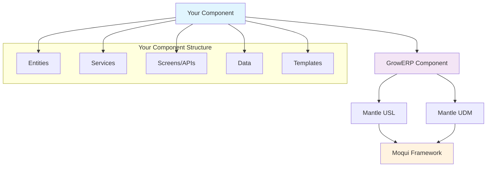

# GrowERP Backend Components Development Guide

## Overview

This guide provides detailed instructions for creating and maintaining Moqui components for GrowERP's backend. Components are self-contained modules that extend the backend functionality through entities, services, screens, and data.

## Table of Contents

1. [Moqui Architecture Overview](#moqui-architecture)
2. [Component Structure](#component-structure)
3. [Development Setup](#development-setup)
4. [Backend URL Selection System](#backend-url-selection)
5. [Creating a New Component](#creating-component)
6. [Entity Development](#entity-development)
7. [Service Development](#service-development)
8. [Screen/API Development](#screen-development)
9. [Data Management](#data-management)
10. [Security and Permissions](#security)
11. [Testing](#testing)
12. [Deployment](#deployment)
13. [Best Practices](#best-practices)

## Moqui Architecture Overview {#moqui-architecture}

### Component Hierarchy



### Core Dependencies

Every GrowERP component should depend on:
- `growerp` - Core GrowERP functionality
- `mantle-udm` - Universal Data Model
- `mantle-usl` - Universal Service Library (optional)

### Framework Features

Moqui provides:
- **Entity Engine** - ORM with automatic CRUD operations
- **Service Engine** - Business logic with transactions
- **Screen Engine** - REST APIs and web interfaces
- **Security** - Authentication and authorization
- **Caching** - Distributed caching support
- **Messaging** - Async messaging and events

## Component Structure {#component-structure}

### Standard Directory Layout

```
my-component/
├── component.xml              # Component definition
├── MoquiConf.xml             # Configuration
├── MoquiProductionConf.xml   # Production overrides
├── README.md                 # Documentation
├── entity/                   # Data model definitions
│   ├── MyEntities.xml
│   └── MyViewEntities.xml
├── service/                  # Business logic
│   ├── MyServices.xml
│   └── my/
│       └── component/
│           └── MyDetailedServices.xml
├── screen/                   # REST APIs and screens
│   ├── rest.xml
│   ├── MyScreens.xml
│   └── my/
│       └── component/
│           └── MyDetailScreens.xml
├── data/                     # Seed and demo data
│   ├── MySecurityData.xml
│   ├── MySeedData.xml
│   └── MyDemoData.xml
├── template/                 # Email and report templates
│   ├── email/
│   │   └── MyEmailTemplates.ftl
│   └── report/
│       └── MyReportTemplates.ftl
└── webapp/                   # Static web resources
    ├── css/
    ├── js/
    └── images/
```

### File Naming Conventions

- **Entities**: `[Domain]Entities.xml` (e.g., `ProductEntities.xml`)
- **Services**: `[Domain]Services.xml` (e.g., `ProductServices.xml`)
- **Screens**: `[Domain]Screens.xml` (e.g., `ProductScreens.xml`)
- **Data**: `[Domain][Type]Data.xml` (e.g., `ProductSeedData.xml`)

## Development Setup {#development-setup}

### Prerequisites

1. Java 11 or higher
2. Gradle 7.0 or higher
3. Git for version control
4. IDE with XML support (IntelliJ IDEA recommended)

### Environment Setup

```bash
# Clone GrowERP repository
git clone https://github.com/growerp/growerp.git
cd growerp/moqui

# Create component directory
mkdir runtime/component/my-component
cd runtime/component/my-component
```

### Development Database

For development, use H2 database (default):

```bash
# Start Moqui with your component
cd growerp/moqui
./gradlew run
```

For production, configure PostgreSQL or MySQL in `MoquiConf.xml`.

## Backend URL Selection System {#backend-url-selection}

GrowERP uses a sophisticated backend URL selection system that allows dynamic discovery and configuration of backend endpoints. This system enables applications to automatically connect to the appropriate backend environment (development, test, or production) based on configuration settings and runtime discovery.

### Architecture Overview

The backend URL selection process involves three main components:

1. **Initial Configuration**: `app_settings.json` files provide bootstrap configuration
2. **Dynamic Discovery**: `get_backend_url.dart` function queries the backend discovery service
3. **Database Storage**: `PartyClassification` entity stores application-backend mappings

### Initial Configuration with app_settings.json

Each Flutter application includes an `app_settings.json` file in `assets/cfg/` that provides the initial configuration loaded at startup. This file serves as the foundation for the backend URL selection process.

#### Structure and Contents

```json
{
  "classificationId": "AppAdmin",
  "databaseUrl": "https://backend.growerp.com",
  "chatUrl": "wss://backend.growerp.com",
  "databaseUrlDebug": "",
  "chatUrlDebug": "",
  "timeout": 20000,
  "apiKey": "",
  "test": false
}
```

#### Key Configuration Fields

- **classificationId**: Unique identifier linking the application to backend configurations (e.g., "AppAdmin", "AppSupport", "AppHealth")
- **databaseUrl**: Production backend URL for REST API calls
- **chatUrl**: Production WebSocket URL for chat functionality
- **databaseUrlDebug**: Development/debug backend URL (empty by default)
- **chatUrlDebug**: Development/debug WebSocket URL (empty by default)
- **timeout**: HTTP request timeout in milliseconds
- **test**: Boolean flag indicating test environment usage

#### Loading Process

The configuration is loaded during application startup using GlobalConfiguration:

```dart
await GlobalConfiguration().loadFromAsset('app_settings');

String classificationId = GlobalConfiguration().get("classificationId");
PackageInfo packageInfo = await PackageInfo.fromPlatform();
```

This provides the initial `classificationId` and default URLs that are then used by the backend URL discovery process.

#### Critical Role in Final Backend URL Settings

**Yes, the `app_settings.json` files have significant influence on the final backend URL settings through multiple mechanisms:**

##### 1. Foundation Configuration Layer
- **Default URLs**: `databaseUrl` and `chatUrl` serve as fallback values if dynamic discovery fails
- **Classification Identity**: `classificationId` is essential for backend discovery service calls
- **Environment-Specific URLs**: `databaseUrlDebug` and `chatUrlDebug` provide debug environment overrides

##### 2. Three-Level Override Hierarchy
```
Level 1: app_settings.json (Bootstrap/Fallback)
Level 2: Dynamic Discovery (Runtime Override)  
Level 3: Manual Override (SharedPreferences)
```

##### 3. Environment-Based URL Resolution
In debug mode, the system uses debug-specific configuration keys:
```dart
if (kDebugMode) {
  // References 'databaseUrlDebug' and 'chatUrlDebug' from app_settings.json
  databaseUrl = 'databaseUrlDebug';
  chatUrl = 'chatUrlDebug';
} else {
  // References 'databaseUrl' and 'chatUrl' from app_settings.json
  databaseUrl = 'databaseUrl';
  chatUrl = 'chatUrl';
}
```

##### 4. Discovery Process Dependencies
The `classificationId` from app_settings.json is **mandatory** for the backend discovery service:
```dart
backendUrl = '$backendBaseUrl/rest/s1/growerp/100/BackendUrl?version=$version&applicationId=$classificationId';
```

##### 5. Final URL Resolution Logic
- **If discovery succeeds**: GlobalConfiguration values are updated with discovered URLs
- **If discovery fails**: Original app_settings.json values remain active
- **Debug environment**: May use `databaseUrlDebug`/`chatUrlDebug` if populated

This makes app_settings.json the **foundational configuration layer** that enables the entire backend URL selection system to function.

### Dynamic Backend URL Discovery

The core backend URL selection logic is implemented in `flutter/packages/growerp_core/lib/src/domains/common/functions/get_backend_url.dart` through the `getBackendUrlOverride()` function.

#### Environment-Based URL Selection

```dart
Future<void> getBackendUrlOverride(String classificationId, String version) async {
  late String backendBaseUrl, backendUrl, databaseUrl, chatUrl, secure;
  
  if (kDebugMode) {
    // Development environment
    bool android = Platform.isAndroid;
    backendBaseUrl = android ? 'http://10.0.2.2:8080' : 'http://localhost:8080';
    databaseUrl = 'databaseUrlDebug';
    chatUrl = 'chatUrlDebug';
    secure = '';
  } else {
    // Production environment
    backendBaseUrl = 'https://backend.growerp.com';
    databaseUrl = 'databaseUrl';
    chatUrl = 'chatUrl';
    secure = 's';
  }
}
```

#### Backend Discovery Service Call

The function calls the backend discovery REST service:

```dart
backendUrl = '$backendBaseUrl/rest/s1/growerp/100/BackendUrl?version=$version&applicationId=$classificationId';
response = await http.get(Uri.parse(backendUrl));

String? appBackendUrl = jsonDecode(response.body)['backendUrl'];
if (response.statusCode == 200 && appBackendUrl != null) {
  GlobalConfiguration().updateValue(databaseUrl, "http$secure://$appBackendUrl");
  GlobalConfiguration().updateValue(chatUrl, "ws$secure://$appBackendUrl");
  GlobalConfiguration().updateValue("test", true);
}
```

This call queries the `growerp.100.GeneralServices100.get#BackendUrl` service with:
- **version**: Application version from `package_info_plus`
- **applicationId**: The `classificationId` from app_settings.json

### Database Storage: PartyClassification Entity

The backend URL mappings are stored in the `mantle.party.PartyClassification` entity, which links applications to their corresponding backend URLs.

#### Entity Structure

```xml
<entity entity-name="PartyClassification" package="mantle.party">
    <field name="partyId" type="id" is-pk="true"/>
    <field name="partyClassificationId" type="id" is-pk="true"/>
    <field name="classificationTypeEnumId" type="id"/>
    <field name="standardCode" type="text-medium"/>
    <field name="fromDate" type="date-time" is-pk="true"/>
    <field name="thruDate" type="date-time"/>
    <!-- Additional fields... -->
</entity>
```

#### Backend URL Storage Logic

The `standardCode` field contains the backend URL and version-based routing logic:

```
standardCode: "backend1.growerp.com" 
standardCode: "backend2.growerp.com;version>1.9.0"
```

The format allows for:
- **Simple URL**: Direct backend URL assignment
- **Version-based routing**: URL with version constraints for test vs production environments

#### Service Implementation

The `growerp.100.GeneralServices100.get#BackendUrl` service:

1. Queries `PartyClassification` using the provided `applicationId` (classificationId)
2. Evaluates version constraints in the `standardCode` field
3. Returns the appropriate backend URL based on application version
4. Enables dynamic routing between test and production environments

### Frontend Management: ApplicationList Screen

The Flutter application provides a management interface through the `ApplicationList` screen, typically accessed via:
- **ApplicationDialog**: UI component for configuring backend URLs
- **Application management screens**: Allow runtime updates to backend configurations
- **Debug interface**: Long-press functionality on app titles for backend URL overrides

#### Runtime Configuration Updates

```dart
SharedPreferences prefs = await SharedPreferences.getInstance();
String ip = prefs.getString('ip') ?? '';
String chat = prefs.getString('chat') ?? '';

if (ip.isNotEmpty) {
  GlobalConfiguration().updateValue('databaseUrl', ip);
  GlobalConfiguration().updateValue('chatUrl', chat);
}
```

### Integration with Testing Infrastructure

For automated testing, the system includes:

```bash
# flutter/test/set_app_settings.sh
sed -i -e 's"databaseUrlDebug": "","databaseUrlDebug": "http://moqui",g' assets/cfg/app_settings.json
sed -i -e 's"chatUrlDebug": "","chatUrlDebug": "ws://moqui/chat",g' assets/cfg/app_settings.json
```

This script configures debug URLs for Docker-based testing environments.

### Configuration Flow Summary

1. **Startup**: `app_settings.json` loaded via `GlobalConfiguration().loadFromAsset()`
2. **Bootstrap**: Initial `classificationId`, `databaseUrl`, and `chatUrl` values set
3. **Discovery**: `getBackendUrlOverride()` calls backend service with `classificationId` and version
4. **Backend Query**: Service queries `PartyClassification` entity using `standardCode` field
5. **URL Resolution**: Backend returns appropriate URL based on version and environment
6. **Configuration Update**: `GlobalConfiguration` values updated with discovered URLs
7. **Runtime Override**: Optional manual override via application management screens

This multi-layered approach ensures robust backend URL management across development, testing, and production environments while providing flexibility for manual configuration when needed.

## Creating a New Component {#creating-component}

### Step 1: Component Definition

```xml
<!-- component.xml -->
<?xml version="1.0" encoding="UTF-8"?>
<component xmlns:xsi="http://www.w3.org/2001/XMLSchema-instance"
        xsi:noNamespaceSchemaLocation="http://moqui.org/xsd/moqui-conf-2.1.xsd"
        name="my-component" version="1.0.0">
    
    <description>My Custom Component for GrowERP</description>
    
    <!-- Dependencies -->
    <depends-on name="growerp"/>
    <depends-on name="mantle-udm"/>
    <depends-on name="mantle-usl"/>
    
    <!-- Optional: Load order -->
    <depends-on name="other-component" optional="true"/>
</component>
```

### Step 2: Configuration

```xml
<!-- MoquiConf.xml -->
<?xml version="1.0" encoding="UTF-8"?>
<moqui-conf xmlns:xsi="http://www.w3.org/2001/XMLSchema-instance"
        xsi:noNamespaceSchemaLocation="http://moqui.org/xsd/moqui-conf-2.1.xsd">
    
    <!-- Database Configuration -->
    <entity-facade>
        <!-- Use separate schema for component -->
        <datasource group-name="transactional" 
                   database-conf-name="h2" 
                   schema-name="my_component"/>
        
        <!-- Custom field types -->
        <field-type type-name="my-id" sql-type="VARCHAR(20)" java-type="String"/>
    </entity-facade>
    
    <!-- Service Configuration -->
    <service-facade>
        <!-- Service location mapping -->
        <service-location name="my.component" 
                         location="component://my-component/service"/>
        
        <!-- Service job configuration -->
        <service-job name="MyScheduledJob" 
                    service-name="my.component.MyServices.scheduledTask"
                    cron-expression="0 0 2 * * ?"/>
    </service-facade>
    
    <!-- Screen Configuration -->
    <screen-facade>
        <screen-location name="my.component" 
                        location="component://my-component/screen"/>
    </screen-facade>
    
    <!-- Cache Configuration -->
    <cache-facade>
        <cache name="my.component.cache" 
               expire-time-idle="1800" 
               expire-time-live="3600"/>
    </cache-facade>
    
    <!-- Security Configuration -->
    <user-facade>
        <!-- Custom user groups -->
        <password-policy name="MyPolicy" 
                        min-length="8" 
                        require-digits="true"/>
    </user-facade>
    
</moqui-conf>
```

### Step 3: Production Configuration

```xml
<!-- MoquiProductionConf.xml -->
<?xml version="1.0" encoding="UTF-8"?>
<moqui-conf xmlns:xsi="http://www.w3.org/2001/XMLSchema-instance"
        xsi:noNamespaceSchemaLocation="http://moqui.org/xsd/moqui-conf-2.1.xsd">
    
    <!-- Production Database -->
    <entity-facade>
        <datasource group-name="transactional" 
                   database-conf-name="postgres" 
                   schema-name="my_component_prod"/>
    </entity-facade>
    
    <!-- Production Caching -->
    <cache-facade>
        <cache name="my.component.cache" 
               expire-time-idle="3600" 
               expire-time-live="7200"/>
    </cache-facade>
    
</moqui-conf>
```

## Entity Development {#entity-development}

### Basic Entity Definition

```xml
<!-- entity/MyEntities.xml -->
<?xml version="1.0" encoding="UTF-8"?>
<entities xmlns:xsi="http://www.w3.org/2001/XMLSchema-instance"
        xsi:noNamespaceSchemaLocation="http://moqui.org/xsd/entity-definition-2.1.xsd">

    <!-- Main Entity -->
    <entity entity-name="MyEntity" package="my.component">
        <description>My custom entity</description>
        
        <!-- Primary Key -->
        <field name="myEntityId" type="id" is-pk="true">
            <description>Unique identifier</description>
        </field>
        
        <!-- Basic Fields -->
        <field name="name" type="text-medium">
            <description>Entity name</description>
        </field>
        <field name="description" type="text-long">
            <description>Entity description</description>
        </field>
        <field name="statusId" type="id">
            <description>Current status</description>
        </field>
        <field name="typeEnumId" type="id">
            <description>Entity type</description>
        </field>
        
        <!-- Monetary Fields -->
        <field name="amount" type="currency-amount">
            <description>Monetary amount</description>
        </field>
        <field name="currencyUomId" type="id">
            <description>Currency</description>
        </field>
        
        <!-- Date Fields -->
        <field name="effectiveDate" type="date-time">
            <description>When this becomes effective</description>
        </field>
        <field name="expirationDate" type="date-time">
            <description>When this expires</description>
        </field>
        
        <!-- Audit Fields -->
        <field name="createdDate" type="date-time">
            <description>When created</description>
        </field>
        <field name="createdByUserId" type="id">
            <description>Who created</description>
        </field>
        <field name="lastUpdatedStamp" type="date-time">
            <description>Last update timestamp</description>
        </field>
        
        <!-- Foreign Keys -->
        <field name="partyId" type="id">
            <description>Related party</description>
        </field>
        <field name="facilityId" type="id">
            <description>Related facility</description>
        </field>
        
        <!-- Relationships -->
        <relationship type="one" related="moqui.basic.StatusItem">
            <key-map field-name="statusId"/>
        </relationship>
        <relationship type="one" related="moqui.basic.Enumeration" short-alias="type">
            <key-map field-name="typeEnumId" related="enumId"/>
        </relationship>
        <relationship type="one" related="mantle.party.Party">
            <key-map field-name="partyId"/>
        </relationship>
        <relationship type="one" related="mantle.facility.Facility">
            <key-map field-name="facilityId"/>
        </relationship>
        <relationship type="one" related="moqui.basic.Uom" short-alias="currencyUom">
            <key-map field-name="currencyUomId" related="uomId"/>
        </relationship>
        
        <!-- One-to-Many Relationships -->
        <relationship type="many" related="my.component.MyEntityItem">
            <key-map field-name="myEntityId"/>
        </relationship>
        
        <!-- Indexes -->
        <index name="MY_ENTITY_NAME" unique="false">
            <index-field name="name"/>
        </index>
        <index name="MY_ENTITY_STATUS" unique="false">
            <index-field name="statusId"/>
        </index>
        <index name="MY_ENTITY_PARTY" unique="false">
            <index-field name="partyId"/>
        </index>
        
        <!-- Constraints -->
        <index name="MY_ENTITY_UNIQUE_NAME" unique="true">
            <index-field name="name"/>
            <index-field name="partyId"/>
        </index>
    </entity>

    <!-- Child Entity -->
    <entity entity-name="MyEntityItem" package="my.component">
        <description>Items belonging to MyEntity</description>
        
        <field name="myEntityId" type="id" is-pk="true"/>
        <field name="itemSeqId" type="id" is-pk="true"/>
        <field name="productId" type="id"/>
        <field name="quantity" type="number-decimal"/>
        <field name="unitPrice" type="currency-amount"/>
        
        <relationship type="one" related="my.component.MyEntity">
            <key-map field-name="myEntityId"/>
        </relationship>
        <relationship type="one" related="mantle.product.Product">
            <key-map field-name="productId"/>
        </relationship>
    </entity>

    <!-- Association Entity (Many-to-Many) -->
    <entity entity-name="MyEntityPartyRole" package="my.component">
        <description>Parties associated with MyEntity</description>
        
        <field name="myEntityId" type="id" is-pk="true"/>
        <field name="partyId" type="id" is-pk="true"/>
        <field name="roleTypeId" type="id" is-pk="true"/>
        <field name="fromDate" type="date-time" is-pk="true"/>
        <field name="thruDate" type="date-time"/>
        
        <relationship type="one" related="my.component.MyEntity">
            <key-map field-name="myEntityId"/>
        </relationship>
        <relationship type="one" related="mantle.party.Party">
            <key-map field-name="partyId"/>
        </relationship>
        <relationship type="one" related="mantle.party.RoleType">
            <key-map field-name="roleTypeId"/>
        </relationship>
    </entity>

</entities>
```

### View Entities

```xml
<!-- entity/MyViewEntities.xml -->
<?xml version="1.0" encoding="UTF-8"?>
<entities xmlns:xsi="http://www.w3.org/2001/XMLSchema-instance"
        xsi:noNamespaceSchemaLocation="http://moqui.org/xsd/entity-definition-2.1.xsd">

    <!-- View Entity for Reporting -->
    <view-entity entity-name="MyEntityDetail" package="my.component">
        <description>MyEntity with related information</description>
        
        <!-- Member Entities -->
        <member-entity entity-alias="ME" entity-name="my.component.MyEntity"/>
        <member-entity entity-alias="ST" entity-name="moqui.basic.StatusItem" 
                      join-from-alias="ME">
            <key-map field-name="statusId"/>
        </member-entity>
        <member-entity entity-alias="PT" entity-name="mantle.party.Party" 
                      join-from-alias="ME" join-optional="true">
            <key-map field-name="partyId"/>
        </member-entity>
        <member-entity entity-alias="PN" entity-name="mantle.party.Person" 
                      join-from-alias="PT" join-optional="true">
            <key-map field-name="partyId"/>
        </member-entity>
        <member-entity entity-alias="ORG" entity-name="mantle.party.Organization" 
                      join-from-alias="PT" join-optional="true">
            <key-map field-name="partyId"/>
        </member-entity>
        
        <!-- Field Aliases -->
        <alias-all entity-alias="ME"/>
        <alias entity-alias="ST" name="statusDescription" field="description"/>
        <alias entity-alias="PT" name="partyTypeEnumId"/>
        <alias entity-alias="PN" name="firstName"/>
        <alias entity-alias="PN" name="lastName"/>
        <alias entity-alias="ORG" name="organizationName"/>
        
        <!-- Calculated Fields -->
        <alias name="partyName" type="text-medium">
            <complex-alias operator="+">
                <complex-alias-field entity-alias="PN" field="firstName"/>
                <complex-alias-field entity-alias="PN" field="lastName" default-value=""/>
            </complex-alias>
        </alias>
        
        <!-- Aggregate Functions -->
        <alias name="itemCount" entity-alias="MEI" field="itemSeqId" function="count-distinct"/>
        <member-entity entity-alias="MEI" entity-name="my.component.MyEntityItem" 
                      join-from-alias="ME" join-optional="true">
            <key-map field-name="myEntityId"/>
        </member-entity>
    </view-entity>

    <!-- Summary View -->
    <view-entity entity-name="MyEntitySummary" package="my.component">
        <description>Summary statistics for MyEntity</description>
        
        <member-entity entity-alias="ME" entity-name="my.component.MyEntity"/>
        
        <alias entity-alias="ME" name="statusId"/>
        <alias entity-alias="ME" name="partyId"/>
        <alias name="entityCount" entity-alias="ME" field="myEntityId" function="count"/>
        <alias name="totalAmount" entity-alias="ME" field="amount" function="sum"/>
        <alias name="avgAmount" entity-alias="ME" field="amount" function="avg"/>
        <alias name="minAmount" entity-alias="ME" field="amount" function="min"/>
        <alias name="maxAmount" entity-alias="ME" field="amount" function="max"/>
    </view-entity>

</entities>
```

### Entity Extensions

```xml
<!-- Extend existing entities -->
<extend-entity entity-name="mantle.party.Party" package="mantle.party">
    <field name="myCustomField" type="text-medium"/>
    <field name="myComponentStatusId" type="id"/>
    
    <relationship type="one" related="moqui.basic.StatusItem" short-alias="myComponentStatus">
        <key-map field-name="myComponentStatusId" related="statusId"/>
    </relationship>
</extend-entity>
```

## Service Development {#service-development}

### Basic Service Definition

```xml
<!-- service/MyServices.xml -->
<?xml version="1.0" encoding="UTF-8"?>
<services xmlns:xsi="http://www.w3.org/2001/XMLSchema-instance"
        xsi:noNamespaceSchemaLocation="http://moqui.org/xsd/service-definition-2.1.xsd">

    <!-- Create Service -->
    <service verb="create" noun="MyEntity">
        <description>Create a new MyEntity</description>
        <in-parameters>
            <parameter name="name" required="true"/>
            <parameter name="description"/>
            <parameter name="statusId" default-value="MY_ENTITY_ACTIVE"/>
            <parameter name="typeEnumId"/>
            <parameter name="amount" type="BigDecimal"/>
            <parameter name="currencyUomId" default-value="USD"/>
            <parameter name="partyId"/>
            <parameter name="facilityId"/>
            <parameter name="effectiveDate" type="Timestamp" default="ec.user.nowTimestamp"/>
        </in-parameters>
        <out-parameters>
            <parameter name="myEntityId"/>
        </out-parameters>
        <actions>
            <!-- Input Validation -->
            <if condition="!name">
                <return error="true" message="Name is required"/>
            </if>
            <if condition="name.length() > 255">
                <return error="true" message="Name cannot exceed 255 characters"/>
            </if>
            
            <!-- Business Logic Validation -->
            <if condition="amount != null &amp;&amp; amount &lt; 0">
                <return error="true" message="Amount cannot be negative"/>
            </if>
            
            <!-- Check for duplicates -->
            <entity-find entity-name="my.component.MyEntity" list="existingEntities">
                <econdition field-name="name" from="name"/>
                <econdition field-name="partyId" from="partyId"/>
            </entity-find>
            <if condition="existingEntities">
                <return error="true" message="Entity with this name already exists for this party"/>
            </if>
            
            <!-- Generate ID -->
            <set field="myEntityId" from="ec.entity.sequencedIdPrimary"/>
            
            <!-- Create Entity -->
            <service-call name="create#my.component.MyEntity" out-map="context">
                <field-map field-name="myEntityId" from="myEntityId"/>
                <field-map field-name="name" from="name"/>
                <field-map field-name="description" from="description"/>
                <field-map field-name="statusId" from="statusId"/>
                <field-map field-name="typeEnumId" from="typeEnumId"/>
                <field-map field-name="amount" from="amount"/>
                <field-map field-name="currencyUomId" from="currencyUomId"/>
                <field-map field-name="partyId" from="partyId"/>
                <field-map field-name="facilityId" from="facilityId"/>
                <field-map field-name="effectiveDate" from="effectiveDate"/>
                <field-map field-name="createdDate" from="ec.user.nowTimestamp"/>
                <field-map field-name="createdByUserId" from="ec.user.userId"/>
            </service-call>
            
            <!-- Create Activity Log -->
            <service-call name="growerp.100.GeneralServices100.createActivity">
                <field-map field-name="activityTypeEnumId" value="MY_ENTITY_CREATED"/>
                <field-map field-name="description" value="Created MyEntity: ${name}"/>
                <field-map field-name="partyId" from="partyId"/>
                <field-map field-name="workEffortId" from="myEntityId"/>
            </service-call>
            
            <!-- Send Notification -->
            <if condition="partyId">
                <service-call name="my.component.MyServices.send#MyEntityNotification" async="true">
                    <field-map field-name="myEntityId" from="myEntityId"/>
                    <field-map field-name="notificationType" value="CREATED"/>
                </service-call>
            </if>
        </actions>
    </service>

    <!-- Update Service -->
    <service verb="update" noun="MyEntity">
        <description>Update an existing MyEntity</description>
        <in-parameters>
            <parameter name="myEntityId" required="true"/>
            <parameter name="name"/>
            <parameter name="description"/>
            <parameter name="statusId"/>
            <parameter name="typeEnumId"/>
            <parameter name="amount" type="BigDecimal"/>
            <parameter name="currencyUomId"/>
            <parameter name="effectiveDate" type="Timestamp"/>
            <parameter name="expirationDate" type="Timestamp"/>
        </in-parameters>
        <actions>
            <!-- Get existing entity -->
            <entity-find-one entity-name="my.component.MyEntity" value-field="myEntity">
                <field-map field-name="myEntityId" from="myEntityId"/>
            </entity-find-one>
            <if condition="!myEntity">
                <return error="true" message="MyEntity not found with ID ${myEntityId}"/>
            </if>
            
            <!-- Check permissions -->
            <if condition="!ec.user.hasPermission('MY_ENTITY_UPDATE')">
                <return error="true" message="Permission denied"/>
            </if>
            
            <!-- Validate status transition -->
            <if condition="statusId &amp;&amp; statusId != myEntity.statusId">
                <service-call name="my.component.MyServices.validate#StatusTransition">
                    <field-map field-name="fromStatusId" from="myEntity.statusId"/>
                    <field-map field-name="toStatusId" from="statusId"/>
                </service-call>
            </if>
            
            <!-- Update entity -->
            <service-call name="update#my.component.MyEntity">
                <field-map field-name="myEntityId" from="myEntityId"/>
                <field-map field-name="name" from="name"/>
                <field-map field-name="description" from="description"/>
                <field-map field-name="statusId" from="statusId"/>
                <field-map field-name="typeEnumId" from="typeEnumId"/>
                <field-map field-name="amount" from="amount"/>
                <field-map field-name="currencyUomId" from="currencyUomId"/>
                <field-map field-name="effectiveDate" from="effectiveDate"/>
                <field-map field-name="expirationDate" from="expirationDate"/>
            </service-call>
            
            <!-- Log changes -->
            <service-call name="growerp.100.GeneralServices100.createActivity">
                <field-map field-name="activityTypeEnumId" value="MY_ENTITY_UPDATED"/>
                <field-map field-name="description" value="Updated MyEntity: ${myEntity.name}"/>
                <field-map field-name="workEffortId" from="myEntityId"/>
            </service-call>
        </actions>
    </service>

    <!-- Delete Service -->
    <service verb="delete" noun="MyEntity">
        <description>Delete a MyEntity (soft delete)</description>
        <in-parameters>
            <parameter name="myEntityId" required="true"/>
        </in-parameters>
        <actions>
            <!-- Check permissions -->
            <if condition="!ec.user.hasPermission('MY_ENTITY_DELETE')">
                <return error="true" message="Permission denied"/>
            </if>
            
            <!-- Get entity -->
            <entity-find-one entity-name="my.component.MyEntity" value-field="myEntity">
                <field-map field-name="myEntityId" from="myEntityId"/>
            </entity-find-one>
            <if condition="!myEntity">
                <return error="true" message="MyEntity not found"/>
            </if>
            
            <!-- Check if can be deleted -->
            <entity-find entity-name="my.component.MyEntityItem" list="items">
                <econdition field-name="myEntityId" from="myEntityId"/>
            </entity-find>
            <if condition="items">
                <return error="true" message="Cannot delete MyEntity with existing items"/>
            </if>
            
            <!-- Soft delete -->
            <service-call name="update#my.component.MyEntity">
                <field-map field-name="myEntityId" from="myEntityId"/>
                <field-map field-name="statusId" value="MY_ENTITY_DELETED"/>
            </service-call>
            
            <!-- Log deletion -->
            <service-call name="growerp.100.GeneralServices100.createActivity">
                <field-map field-name="activityTypeEnumId" value="MY_ENTITY_DELETED"/>
                <field-map field-name="description" value="Deleted MyEntity: ${myEntity.name}"/>
                <field-map field-name="workEffortId" from="myEntityId"/>
            </service-call>
        </actions>
    </service>

    <!-- Get Service with Filtering -->
    <service verb="get" noun="MyEntityList">
        <description>Get list of MyEntity with filtering and pagination</description>
        <in-parameters>
            <parameter name="statusId"/>
            <parameter name="typeEnumId"/>
            <parameter name="partyId"/>
            <parameter name="facilityId"/>
            <parameter name="searchTerm"/>
            <parameter name="orderByField" default-value="name"/>
            <parameter name="pageIndex" type="Integer" default="0"/>
            <parameter name="pageSize" type="Integer" default="20"/>
            <parameter name="pageMaxSize" type="Integer" default="200"/>
        </in-parameters>
        <out-parameters>
            <parameter name="myEntityList" type="List"/>
            <parameter name="myEntityListCount" type="Integer"/>
            <parameter name="myEntityListPageIndex" type="Integer"/>
            <parameter name="myEntityListPageSize" type="Integer"/>
            <parameter name="myEntityListPageMaxIndex" type="Integer"/>
            <parameter name="myEntityListPageRangeLow" type="Integer"/>
            <parameter name="myEntityListPageRangeHigh" type="Integer"/>
        </out-parameters>
        <actions>
            <!-- Build entity find -->
            <entity-find entity-name="my.component.MyEntityDetail" list="myEntityList">
                <!-- Conditions -->
                <econdition field-name="statusId" from="statusId" ignore-if-empty="true"/>
                <econdition field-name="typeEnumId" from="typeEnumId" ignore-if-empty="true"/>
                <econdition field-name="partyId" from="partyId" ignore-if-empty="true"/>
                <econdition field-name="facilityId" from="facilityId" ignore-if-empty="true"/>
                
                <!-- Search -->
                <econditions combine="or" ignore-if-empty="true">
                    <econdition field-name="name" operator="like" from="'%' + searchTerm + '%'" ignore-case="true"/>
                    <econdition field-name="description" operator="like" from="'%' + searchTerm + '%'" ignore-case="true"/>
                </econditions>
                
                <!-- Exclude deleted -->
                <econdition field-name="statusId" operator="not-equals" value="MY_ENTITY_DELETED"/>
                
                <!-- Ordering -->
                <order-by field-name="${orderByField}"/>
                
                <!-- Pagination -->
                <offset>${pageIndex * pageSize}</offset>
                <limit>${pageSize}</limit>
            </entity-find>
            
            <!-- Get count -->
            <entity-find entity-name="my.component.MyEntityDetail" list="myEntityListAll">
                <econdition field-name="statusId" from="statusId" ignore-if-empty="true"/>
                <econdition field-name="typeEnumId" from="typeEnumId" ignore-if-empty="true"/>
                <econdition field-name="partyId" from="partyId" ignore-if-empty="true"/>
                <econdition field-name="facilityId" from="facilityId" ignore-if-empty="true"/>
                <econditions combine="or" ignore-if-empty="true">
                    <econdition field-name="name" operator="like" from="'%' + searchTerm + '%'" ignore-case="true"/>
                    <econdition field-name="description" operator="like" from="'%' + searchTerm + '%'" ignore-case="true"/>
                </econditions>
                <econdition field-name="statusId" operator="not-equals" value="MY_ENTITY_DELETED"/>
            </entity-find>
            <set field="myEntityListCount" from="myEntityListAll.size()"/>
            
            <!-- Calculate pagination info -->
            <set field="myEntityListPageIndex" from="pageIndex"/>
            <set field="myEntityListPageSize" from="pageSize"/>
            <set field="myEntityListPageMaxIndex" from="(myEntityListCount / pageSize).intValue()"/>
            <set field="myEntityListPageRangeLow" from="(pageIndex * pageSize) + 1"/>
            <set field="myEntityListPageRangeHigh" from="myEntityListPageRangeLow + myEntityList.size() - 1"/>
        </actions>
    </service>

    <!-- Complex Business Logic Service -->
    <service verb="process" noun="MyEntityWorkflow">
        <description>Process MyEntity through workflow</description>
        <in-parameters>
            <parameter name="myEntityId" required="true"/>
            <parameter name="action" required="true"/>
            <parameter name="comments"/>
        </in-parameters>
        <out-parameters>
            <parameter name="newStatusId"/>
        </out-parameters>
        <actions>
            <!-- Get entity -->
            <entity-find-one entity-name="my.component.MyEntity" value-field="myEntity">
                <field-map field-name="myEntityId" from="myEntityId"/>
            </entity-find-one>
            <if condition="!myEntity">
                <return error="true" message="MyEntity not found"/>
            </if>
            
            <!-- Determine new status based on action -->
            <if condition="action == 'approve'">
                <set field="newStatusId" value="MY_ENTITY_APPROVED"/>
            <else-if condition="action == 'reject'">
                <set field="newStatusId" value="MY_ENTITY_REJECTED"/>
            <else-if condition="action == 'complete'">
                <set field="newStatusId" value="MY_ENTITY_COMPLETED"/>
            <else>
                <return error="true" message="Invalid action: ${action}"/>
            </else-if>
            </if>
            
            <!-- Validate transition -->
            <service-call name="my.component.MyServices.validate#StatusTransition">
                <field-map field-name="fromStatusId" from="myEntity.statusId"/>
                <field-map field-name="toStatusId" from="newStatusId"/>
            </service-call>
            
            <!-- Update status -->
            <service-call name="update#my.component.MyEntity">
                <field-map field-name="myEntityId" from="myEntityId"/>
                <field-map field-name="statusId" from="newStatusId"/>
            </service-call>
            
            <!-- Create workflow history -->
            <service-call name="create#my.component.MyEntityWorkflowHistory">
                <field-map field-name="myEntityId" from="myEntityId"/>
                <field-map field-name="fromStatusId" from="myEntity.statusId"/>
                <field-map field-name="toStatusId" from="newStatusId"/>
                <field-map field-name="action" from="action"/>
                <field-map field-name="comments" from="comments"/>
                <field-map field-name="userId" from="ec.user.userId"/>
                <field-map field-name="transitionDate" from="ec.user.nowTimestamp"/>
            </service-call>
        </actions>
    </service>

</services>
```

### Advanced Service Patterns

```xml
<!-- service/my/component/MyAdvancedServices.xml -->
<?xml version="1.0" encoding="UTF-8"?>
<services xmlns:xsi="http://www.w3.org/2001/XMLSchema-instance"
        xsi:noNamespaceSchemaLocation="http://moqui.org/xsd/service-definition-2.1.xsd">

    <!-- Async Service -->
    <service verb="send" noun="MyEntityNotification" type="async">
        <description>Send notification about MyEntity changes</description>
        <in-parameters>
            <parameter name="myEntityId" required="true"/>
            <parameter name="notificationType" required="true"/>
        </in-parameters>
        <actions>
            <!-- Get entity details -->
            <entity-find-one entity-name="my.component.MyEntityDetail" value-field="myEntity">
                <field-map field-name="myEntityId" from="myEntityId"/>
            </entity-find-one>
            
            <!-- Send email notification -->
            <service-call name="org.moqui.impl.EmailServices.send#EmailTemplate">
                <field-map field-name="emailTemplateId" value="MY_ENTITY_NOTIFICATION"/>
                <field-map field-name="toAddresses" from="myEntity.emailAddress"/>
                <field-map field-name="bodyParameters" from="[myEntity: myEntity, notificationType: notificationType]"/>
            </service-call>
            
            <!-- Create system notification -->
            <service-call name="growerp.100.GeneralServices100.createNotification">
                <field-map field-name="userId" from="myEntity.createdByUserId"/>
                <field-map field-name="message" value="MyEntity ${myEntity.name} has been ${notificationType.toLowerCase()}"/>
                <field-map field-name="notificationType" value="INFO"/>
            </service-call>
        </actions>
    </service>

    <!-- Scheduled Service -->
    <service verb="process" noun="MyEntityScheduledTask">
        <description>Scheduled task for MyEntity maintenance</description>
        <actions>
            <!-- Find expired entities -->
            <entity-find entity-name="my.component.MyEntity" list="expiredEntities">
                <econdition field-name="expirationDate" operator="less" from="ec.user.nowTimestamp"/>
                <econdition field-name="statusId" operator="not-equals" value="MY_ENTITY_EXPIRED"/>
            </entity-find>
            
            <!-- Update expired entities -->
            <iterate list="expiredEntities" entry="entity">
                <service-call name="update#my.component.MyEntity">
                    <field-map field-name="myEntityId" from="entity.myEntityId"/>
                    <field-map field-name="statusId" value="MY_ENTITY_EXPIRED"/>
                </service-call>
                
                <!-- Log expiration -->
                <service-call name="growerp.100.GeneralServices100.createActivity">
                    <field-map field-name="activityTypeEnumId" value="MY_ENTITY_EXPIRED"/>
                    <field-map field-name="description" value="MyEntity ${entity.name} expired"/>
                    <field-map field-name="workEffortId" from="entity.myEntityId"/>
                </service-call>
            </iterate>
            
            <log level="info" message="Processed ${expiredEntities.size()} expired MyEntity records"/>
        </actions>
    </service>

    <!-- Transaction Service -->
    <service verb="transfer" noun="MyEntityOwnership" use-transaction="true">
        <description>Transfer ownership of MyEntity</description>
        <in-parameters>
            <parameter name="myEntityId" required="true"/>
            <parameter name="fromPartyId" required="true"/>
            <parameter name="toPartyId" required="true"/>
            <parameter name="transferDate" type="Timestamp" default="ec.user.nowTimestamp"/>
        </in-parameters>
        <actions>
            <!-- Validate entities exist -->
            <entity-find-one entity-name="my.component.MyEntity" value-field="myEntity">
                <field-map field-name="myEntityId" from="myEntityId"/>
            </entity-find-one>
            <if condition="!myEntity">
                <return error="true" message="MyEntity not found"/>
            </if>
            
            <!-- Validate current ownership -->
            <if condition="myEntity.partyId != fromPartyId">
                <return error="true" message="MyEntity is not owned by specified party"/>
            </if>
            
            <!-- Update ownership -->
            <service-call name="update#my.component.MyEntity">
                <field-map field-name="myEntityId" from="myEntityId"/>
                <field-map field-name="partyId" from="toPartyId"/>
            </service-call>
            
            <!-- Create ownership history -->
            <service-call name="create#my.component.MyEntityOwnershipHistory">
                <field-map field-name="myEntityId" from="myEntityId"/>
                <field-map field-name="fromPartyId" from="fromPartyId"/>
                <field-map field-name="toPartyId" from="toPartyId"/>
                <field-map field-name="transferDate" from="transferDate"/>
                <field-map field-name="transferredByUserId" from="ec.user.userId"/>
            </service-call>
            
            <!-- Update related records -->
            <entity-find entity-name="my.component.MyEntityItem" list="items">
                <econdition field-name="myEntityId" from="myEntityId"/>
            </entity-find>
            <iterate list="items" entry="item">
                <service-call name="my.component.MyServices.update#MyEntityItemOwnership">
                    <field-map field-name="myEntityId" from="item.myEntityId"/>
                    <field-map field-name="itemSeqId" from="item.itemSeqId"/>
                    <field-map field-name="newPartyId" from="toPartyId"/>
                </service-call>
            </iterate>
        </actions>
    </service>

</services>
```

## Screen/API Development {#screen-development}

### REST API Structure

```xml
<!-- screen/rest.xml -->
<?xml version="1.0" encoding="UTF-8"?>
<screen xmlns:xsi="http://www.w3.org/2001/XMLSchema-instance"
        xsi:noNamespaceSchemaLocation="http://moqui.org/xsd/xml-screen-2.1.xsd"
        require-authentication="true" allow-extra-path="true">

    <subscreens default-item="MyEntities"/>

    <subscreen name="MyEntities" location="component://my-component/screen/MyEntities.xml"/>
    <subscreen name="MyEntityItems" location="component://my-component/screen/MyEntityItems.xml"/>

</screen>
```

### Entity REST Endpoints

```xml
<!-- screen/MyEntities.xml -->
<?xml version="1.0" encoding="UTF-8"?>
<screen xmlns:xsi="http://www.w3.org/2001/XMLSchema-instance"
        xsi:noNamespaceSchemaLocation="http://moqui.org/xsd/xml-screen-2.1.xsd"
        require-authentication="true" allow-extra-path="true">

    <parameter name="myEntityId"/>

    <!-- Create MyEntity -->
    <transition name="createMyEntity" method="post">
        <service-call name="my.component.MyServices.create#MyEntity"/>
        <default-response type="screen-path" save-parameters="true"/>
        <error-response type="screen-path" save-parameters="true"/>
    </transition>

    <!-- Update MyEntity -->
    <transition name="updateMyEntity" method="put">
        <service-call name="my.component.MyServices.update#MyEntity"/>
        <default-response type="screen-path" save-parameters="true"/>
        <error-response type="screen-path" save-parameters="true"/>
    </transition>

    <!-- Delete MyEntity -->
    <transition name="deleteMyEntity" method="delete">
        <service-call name="my.component.MyServices.delete#MyEntity"/>
        <default-response type="screen-path" save-parameters="true"/>
        <error-response type="screen-path" save-parameters="true"/>
    </transition>

    <!-- Process Workflow -->
    <transition name="processWorkflow" method="post">
        <service-call name="my.component.MyServices.process#MyEntityWorkflow"/>
        <default-response type="screen-path" save-parameters="true"/>
        <error-response type="screen-path" save-parameters="true"/>
    </transition>

    <actions>
        <if condition="myEntityId">
            <!-- Get single entity -->
            <entity-find-one entity-name="my.component.MyEntityDetail" value-field="myEntity">
                <field-map field-name="myEntityId" from="myEntityId"/>
            </entity-find-one>
            <if condition="!myEntity">
                <script>ec.web.sendError(404, "MyEntity not found", null)</script>
                <return/>
            </if>
            <script>ec.web.sendJsonResponse(myEntity)</script>
        <else>
            <!-- Get list of entities -->
            <service-call name="my.component.MyServices.get#MyEntityList" out-map="context"/>
            <script>ec.web.sendJsonResponse([
                myEntityList: myEntityList,
                myEntityListCount: myEntityListCount,
                myEntityListPageIndex: myEntityListPageIndex,
                myEntityListPageSize: myEntityListPageSize,
                myEntityListPageMaxIndex: myEntityListPageMaxIndex,
                myEntityListPageRangeLow: myEntityListPageRangeLow,
                myEntityListPageRangeHigh: myEntityListPageRangeHigh
            ])</script>
        </else>
        </if>
    </actions>

</screen>
```

### Custom API Endpoints

```xml
<!-- screen/my/component/MyCustomScreens.xml -->
<?xml version="1.0" encoding="UTF-8"?>
<screen xmlns:xsi="http://www.w3.org/2001/XMLSchema-instance"
        xsi:noNamespaceSchemaLocation="http://moqui.org/xsd/xml-screen-2.1.xsd"
        require-authentication="true" allow-extra-path="true">

    <!-- Dashboard Statistics -->
    <transition name="dashboard" method="get">
        <actions>
            <!-- Get summary statistics -->
            <entity-find entity-name="my.component.MyEntitySummary" list="summaryList">
                <select-field field-name="statusId,entityCount,totalAmount,avgAmount"/>
            </entity-find>
            
            <!-- Get recent activity -->
            <entity-find entity-name="growerp.Activity" list="recentActivity">
                <econdition field-name="activityTypeEnumId" operator="like" value="MY_ENTITY_%"/>
                <order-by field-name="-createdDate"/>
                <limit>10</limit>
            </entity-find>
            
            <!-- Get top entities -->
            <entity-find entity-name="my.component.MyEntityDetail" list="topEntities">
                <econdition field-name="statusId" operator="not-equals" value="MY_ENTITY_DELETED"/>
                <order-by field-name="-amount"/>
                <limit>5</limit>
            </entity-find>
            
            <script>ec.web.sendJsonResponse([
                summary: summaryList,
                recentActivity: recentActivity,
                topEntities: topEntities
            ])</script>
        </actions>
    </transition>

    <!-- Export Data -->
    <transition name="export" method="get">
        <parameter name="format" default-value="csv"/>
        <actions>
            <!-- Get data -->
            <service-call name="my.component.MyServices.get#MyEntityList" out-map="context">
                <field-map field-name="pageSize" value="1000"/>
            </service-call>
            
            <if condition="format == 'csv'">
                <!-- Generate CSV -->
                <script><![CDATA[
                    import org.moqui.util.StringUtilities
                    
                    def csv = new StringBuilder()
                    csv.append("ID,Name,Description,Status,Amount,Created Date\n")
                    
                    for (entity in myEntityList) {
                        csv.append("${entity.myEntityId},")
                        csv.append("\"${StringUtilities.cleanStringForJavaName(entity.name)}\",")
                        csv.append("\"${StringUtilities.cleanStringForJavaName(entity.description ?: '')}\",")
                        csv.append("${entity.statusDescription},")
                        csv.append("${entity.amount ?: 0},")
                        csv.append("${entity.createdDate}\n")
                    }
                    
                    ec.web.response.setContentType("text/csv")
                    ec.web.response.setHeader("Content-Disposition", "attachment; filename=my-entities.csv")
                    ec.web.response.writer.write(csv.toString())
                ]]></script>
            <else>
                <!-- Return JSON -->
                <script>ec.web.sendJsonResponse(myEntityList)</script>
            </else>
            </if>
        </actions>
    </transition>

    <!-- Bulk Operations -->
    <transition name="bulkUpdate" method="post">
        <parameter name="entityIds" type="List"/>
        <parameter name="updateData" type="Map"/>
        <actions>
            <if condition="!entityIds || entityIds.isEmpty()">
                <script>ec.web.sendError(400, "No entities specified", null)</script>
                <return/>
            </if>
            
            <set field="updatedCount" value="0"/>
            <set field="errors" from="[]"/>
            
            <iterate list="entityIds" entry="entityId">
                <try>
                    <service-call name="my.component.MyServices.update#MyEntity">
                        <field-map field-name="myEntityId" from="entityId"/>
                        <field-map field-name="statusId" from="updateData.statusId"/>
                        <field-map field-name="typeEnumId" from="updateData.typeEnumId"/>
                    </service-call>
                    <set field="updatedCount" from="updatedCount + 1"/>
                    <catch>
                        <script>errors.add([entityId: entityId, error: exception.message])</script>
                    </catch>
                </try>
            </iterate>
            
            <script>ec.web.sendJsonResponse([
                updatedCount: updatedCount,
                totalCount: entityIds.size(),
                errors: errors
            ])</script>
        </actions>
    </transition>

</screen>
```

## Data Management {#data-management}

### Seed Data

```xml
<!-- data/MySeedData.xml -->
<?xml version="1.0" encoding="UTF-8"?>
<entity-facade-xml type="seed">

    <!-- Status Items -->
    <moqui.basic.StatusType statusTypeId="MY_ENTITY" description="MyEntity Status"/>
    <moqui.basic.StatusItem statusId="MY_ENTITY_ACTIVE" statusTypeId="MY_ENTITY" 
                           sequenceNum="1" description="Active"/>
    <moqui.basic.StatusItem statusId="MY_ENTITY_INACTIVE" statusTypeId="MY_ENTITY" 
                           sequenceNum="2" description="Inactive"/>
    <moqui.basic.StatusItem statusId="MY_ENTITY_PENDING" statusTypeId="MY_ENTITY" 
                           sequenceNum="3" description="Pending"/>
    <moqui.basic.StatusItem statusId="MY_ENTITY_APPROVED" statusTypeId="MY_ENTITY" 
                           sequenceNum="4" description="Approved"/>
    <moqui.basic.StatusItem statusId="MY_ENTITY_REJECTED" statusTypeId="MY_ENTITY" 
                           sequenceNum="5" description="Rejected"/>
    <moqui.basic.StatusItem statusId="MY_ENTITY_COMPLETED" statusTypeId="MY_ENTITY" 
                           sequenceNum="6" description="Completed"/>
    <moqui.basic.StatusItem statusId="MY_ENTITY_EXPIRED" statusTypeId="MY_ENTITY" 
                           sequenceNum="7" description="Expired"/>
    <moqui.basic.StatusItem statusId="MY_ENTITY_DELETED" statusTypeId="MY_ENTITY" 
                           sequenceNum="99" description="Deleted"/>

    <!-- Status Transitions -->
    <moqui.basic.StatusFlowTransition statusFlowId="MY_ENTITY_FLOW" 
                                     statusId="MY_ENTITY_PENDING" toStatusId="MY_ENTITY_ACTIVE"/>
    <moqui.basic.StatusFlowTransition statusFlowId="MY_ENTITY_FLOW" 
                                     statusId="MY_ENTITY_PENDING" toStatusId="MY_ENTITY_REJECTED"/>
    <moqui.basic.StatusFlowTransition statusFlowId="MY_ENTITY_FLOW" 
                                     statusId="MY_ENTITY_ACTIVE" toStatusId="MY_ENTITY_APPROVED"/>
    <moqui.basic.StatusFlowTransition statusFlowId="MY_ENTITY_FLOW" 
                                     statusId="MY_ENTITY_APPROVED" toStatusId="MY_ENTITY_COMPLETED"/>
    <moqui.basic.StatusFlowTransition statusFlowId="MY_ENTITY_FLOW" 
                                     statusId="MY_ENTITY_ACTIVE" toStatusId="MY_ENTITY_INACTIVE"/>

    <!-- Enumerations -->
    <moqui.basic.EnumerationType enumTypeId="MY_ENTITY_TYPE" description="MyEntity Type"/>
    <moqui.basic.Enumeration enumId="MY_ENTITY_TYPE_A" enumTypeId="MY_ENTITY_TYPE" 
                            sequenceNum="1" description="Type A"/>
    <moqui.basic.Enumeration enumId="MY_ENTITY_TYPE_B" enumTypeId="MY_ENTITY_TYPE" 
                            sequenceNum="2" description="Type B"/>
    <moqui.basic.Enumeration enumId="MY_ENTITY_TYPE_C" enumTypeId="MY_ENTITY_TYPE" 
                            sequenceNum="3" description="Type C"/>

    <!-- Activity Types -->
    <moqui.basic.EnumerationType enumTypeId="ACTIVITY_TYPE" description="Activity Type"/>
    <moqui.basic.Enumeration enumId="MY_ENTITY_CREATED" enumTypeId="ACTIVITY_TYPE" 
                            description="MyEntity Created"/>
    <moqui.basic.Enumeration enumId="MY_ENTITY_UPDATED" enumTypeId="ACTIVITY_TYPE" 
                            description="MyEntity Updated"/>
    <moqui.basic.Enumeration enumId="MY_ENTITY_DELETED" enumTypeId="ACTIVITY_TYPE" 
                            description="MyEntity Deleted"/>
    <moqui.basic.Enumeration enumId="MY_ENTITY_EXPIRED" enumTypeId="ACTIVITY_TYPE" 
                            description="MyEntity Expired"/>

</entity-facade-xml>
```

### Security Data

```xml
<!-- data/MySecurityData.xml -->
<?xml version="1.0" encoding="UTF-8"?>
<entity-facade-xml type="seed">

    <!-- User Groups -->
    <moqui.security.UserGroup userGroupId="MY_COMPONENT_ADMIN" 
                             description="MyComponent Administrator"/>
    <moqui.security.UserGroup userGroupId="MY_COMPONENT_USER" 
                             description="MyComponent User"/>

    <!-- Permissions -->
    <moqui.security.ArtifactGroup artifactGroupId="MY_ENTITY_ALL" 
                                 description="MyEntity All Operations"/>
    <moqui.security.ArtifactGroup artifactGroupId="MY_ENTITY_VIEW" 
                                 description="MyEntity View Only"/>

    <!-- Service Permissions -->
    <moqui.security.ArtifactGroupMember artifactGroupId="MY_ENTITY_ALL" 
                                       artifactName="my.component.MyServices.*" 
                                       nameIsPattern="Y" artifactTypeEnumId="AT_SERVICE"/>
    <moqui.security.ArtifactGroupMember artifactGroupId="MY_ENTITY_VIEW" 
                                       artifactName="my.component.MyServices.get#*" 
                                       nameIsPattern="Y" artifactTypeEnumId="AT_SERVICE"/>

    <!-- Screen Permissions -->
    <moqui.security.ArtifactGroupMember artifactGroupId="MY_ENTITY_ALL" 
                                       artifactName="my-component/rest/MyEntities" 
                                       artifactTypeEnumId="AT_REST_PATH"/>
    <moqui.security.ArtifactGroupMember artifactGroupId="MY_ENTITY_VIEW" 
                                       artifactName="my-component/rest/MyEntities" 
                                       artifactTypeEnumId="AT_REST_PATH"/>

    <!-- User Group Permissions -->
    <moqui.security.ArtifactTarpitCheckView artifactGroupId="MY_ENTITY_ALL" 
                                           userGroupId="MY_COMPONENT_ADMIN" 
                                           authzActionEnumId="AUTHZA_ALL"/>
    <moqui.security.ArtifactTarpitCheckView artifactGroupId="MY_ENTITY_VIEW" 
                                           userGroupId="MY_COMPONENT_USER" 
                                           authzActionEnumId="AUTHZA_VIEW"/>

</entity-facade-xml>
```

### Demo Data

```xml
<!-- data/MyDemoData.xml -->
<?xml version="1.0" encoding="UTF-8"?>
<entity-facade-xml type="demo">

    <!-- Sample Entities -->
    <my.component.MyEntity myEntityId="DEMO_001" name="Demo Entity 1" 
                          description="First demo entity" statusId="MY_ENTITY_ACTIVE" 
                          typeEnumId="MY_ENTITY_TYPE_A" amount="100.00" 
                          currencyUomId="USD" createdDate="2023-01-01 10:00:00"/>
    
    <my.component.MyEntity myEntityId="DEMO_002" name="Demo Entity 2" 
                          description="Second demo entity" statusId="MY_ENTITY_PENDING" 
                          typeEnumId="MY_ENTITY_TYPE_B" amount="250.50" 
                          currencyUomId="USD" createdDate="2023-01-02 14:30:00"/>

    <!-- Sample Items -->
    <my.component.MyEntityItem myEntityId="DEMO_001" itemSeqId="001" 
                              productId="DEMO_PRODUCT_1" quantity="5" unitPrice="20.00"/>
    <my.component.MyEntityItem myEntityId="DEMO_001" itemSeqId="002" 
                              productId="DEMO_PRODUCT_2" quantity="3" unitPrice="15.00"/>

</entity-facade-xml>
```

## Security and Permissions {#security}

### Permission Checking in Services

```xml
<service verb="update" noun="MyEntity">
    <in-parameters>
        <parameter name="myEntityId" required="true"/>
        <!-- other parameters -->
    </in-parameters>
    <actions>
        <!-- Check basic permission -->
        <if condition="!ec.user.hasPermission('MY_ENTITY_UPDATE')">
            <return error="true" message="Permission denied"/>
        </if>
        
        <!-- Check ownership -->
        <entity-find-one entity-name="my.component.MyEntity" value-field="myEntity">
            <field-map field-name="myEntityId" from="myEntityId"/>
        </entity-find-one>
        
        <!-- Allow admin or owner -->
        <if condition="!ec.user.isInGroup('MY_COMPONENT_ADMIN') &amp;&amp; 
                      myEntity.createdByUserId != ec.user.userId">
            <return error="true" message="Can only update your own entities"/>
        </if>
        
        <!-- Continue with update logic -->
    </actions>
</service>
```

### Row-Level Security

```xml
<!-- Add to service that gets entity list -->
<service verb="get" noun="MyEntityList">
    <actions>
        <entity-find entity-name="my.component.MyEntityDetail" list="myEntityList">
            <!-- Apply security filter -->
            <if condition="!ec.user.isInGroup('MY_COMPONENT_ADMIN')">
                <!-- Non-admin users can only see their own entities -->
                <econdition field-name="createdByUserId" from="ec.user.userId"/>
            </if>
            
            <!-- Other conditions -->
            <econdition field-name="statusId" from="statusId" ignore-if-empty="true"/>
            <!-- ... -->
        </entity-find>
    </actions>
</service>
```

## Testing {#testing}

### Service Tests

```xml
<!-- test/MyServiceTests.xml -->
<?xml version="1.0" encoding="UTF-8"?>
<entity-facade-xml type="test">

    <!-- Test data -->
    <my.component.MyEntity myEntityId="TEST_001" name="Test Entity" 
                          description="Test Description" statusId="MY_ENTITY_ACTIVE"/>

    <!-- Test create service -->
    <test-case name="testCreateMyEntity">
        <test-service service="my.component.MyServices.create#MyEntity">
            <field-map field-name="name" value="New Test Entity"/>
            <field-map field-name="description" value="New Test Description"/>
            <field-map field-name="amount" value="100.00"/>
        </test-service>
        <assert field="myEntityId" operator="not-empty"/>
    </test-case>

    <!-- Test update service -->
    <test-case name="testUpdateMyEntity">
        <test-service service="my.component.MyServices.update#MyEntity">
            <field-map field-name="myEntityId" value="TEST_001"/>
            <field-map field-name="description" value="Updated Description"/>
        </test-service>
        
        <!-- Verify update -->
        <entity-find-one entity-name="my.component.MyEntity" value-field="updatedEntity">
            <field-map field-name="myEntityId" value="TEST_001"/>
        </entity-find-one>
        <assert field="updatedEntity.description" value="Updated Description"/>
    </test-case>

    <!-- Test validation -->
    <test-case name="testCreateMyEntityValidation">
        <test-service service="my.component.MyServices.create#MyEntity" 
                     expect-failure="true">
            <field-map field-name="description" value="Missing name"/>
        </test-service>
    </test-case>

</entity-facade-xml>
```

### Integration Tests

```groovy
// test/groovy/MyComponentIntegrationTests.groovy
import org.moqui.Moqui
import org.moqui.context.ExecutionContext
import spock.lang.Specification

class MyComponentIntegrationTests extends Specification {
    
    static ExecutionContext ec
    
    def setupSpec() {
        ec = Moqui.getExecutionContext()
    }
    
    def "test create and retrieve MyEntity"() {
        when:
        Map createResult = ec.service.sync().name("my.component.MyServices.create#MyEntity")
                .parameters([name: "Integration Test Entity", description: "Test Description"])
                .call()
        
        then:
        createResult.myEntityId != null
        
        when:
        Map getResult = ec.service.sync().name("my.component.MyServices.get#MyEntityList")
                .parameters([myEntityId: createResult.myEntityId])
                .call()
        
        then:
        getResult.myEntityList.size() == 1
        getResult.myEntityList[0].name == "Integration Test Entity"
    }
    
    def "test MyEntity workflow"() {
        given:
        Map createResult = ec.service.sync().name("my.component.MyServices.create#MyEntity")
                .parameters([name: "Workflow Test", statusId: "MY_ENTITY_PENDING"])
                .call()
        
        when:
        ec.service.sync().name("my.component.MyServices.process#MyEntityWorkflow")
                .parameters([myEntityId: createResult.myEntityId, action: "approve"])
                .call()
        
        then:
        def entity = ec.entity.find("my.component.MyEntity")
                .condition("myEntityId", createResult.myEntityId)
                .one()
        entity.statusId == "MY_ENTITY_APPROVED"
    }
}
```

## Deployment {#deployment
