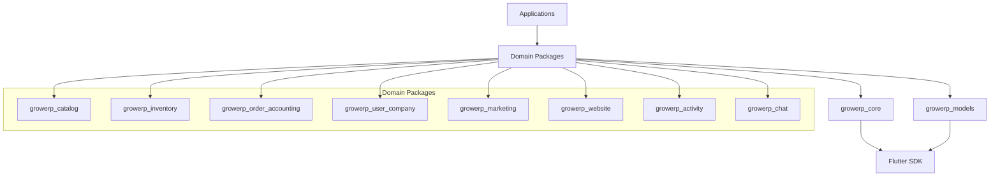

# GrowERP Building Blocks Development Guide

## Overview

This guide provides detailed instructions for creating and maintaining GrowERP building blocks (growerp_* packages). Building blocks are reusable Flutter packages that encapsulate specific business functionality and can be combined to create complete applications.

## Table of Contents

1. [Package Architecture](#package-architecture)
2. [Development Setup](#development-setup)
3. [Creating a New Building Block](#creating-building-block)
4. [Package Structure Deep Dive](#package-structure)
5. [State Management Patterns](#state-management)
6. [API Integration](#api-integration)
7. [UI Components](#ui-components)
8. [Testing](#testing)
9. [Publishing and Versioning](#publishing)
10. [Best Practices](#best-practices)

## Package Architecture {#package-architecture}

### Dependency Hierarchy



### Core Dependencies

Every building block must depend on:
- `growerp_core` - Provides templates, UI components, and shared utilities
- `growerp_models` - Provides data models and API client infrastructure
- `flutter_bloc` - For state management
- `equatable` - For value equality in models and states

### Optional Dependencies

Based on functionality needs:
- `growerp_chat` - If real-time communication is needed
- Other domain packages - Only if there's a legitimate business relationship

## Development Setup {#development-setup}

### Prerequisites

1. Flutter SDK (>=3.2.6)
2. Dart SDK (>=3.2.6)
3. IDE with Flutter support (VS Code, Android Studio, IntelliJ)
4. Git for version control

### Project Structure

```bash
# Clone the main repository
git clone https://github.com/growerp/growerp.git
cd growerp/flutter/packages

# Create new package directory
mkdir growerp_your_domain
cd growerp_your_domain
```

### Melos Configuration

GrowERP uses Melos for monorepo management. Ensure your package is included in the workspace:

```yaml
# flutter/melos.yaml (already configured)
packages:
  - packages/**
```

## Creating a New Building Block {#creating-building-block}

### Step 1: Initialize Package

```bash
# From flutter/packages directory
flutter create --template=package growerp_your_domain
cd growerp_your_domain
```

### Step 2: Configure pubspec.yaml

```yaml
name: growerp_your_domain
description: Your domain functionality for GrowERP
version: 1.0.0
homepage: https://www.growerp.com
repository: https://github.com/growerp/growerp

environment:
  sdk: ">=3.8.0 <4.0.0"
  flutter: ">=3.32.0"

dependencies:
  flutter:
    sdk: flutter
  flutter_localizations:
    sdk: flutter
  
  # Core dependencies (always required)
  growerp_core: ^1.9.0
  growerp_models: ^1.9.0
  
  # State management
  flutter_bloc: ^8.1.4
  equatable: ^2.0.5
  bloc_concurrency: ^0.2.0
  
  # Utilities
  intl: ^0.20.2
  meta: ^1.3.0
  
  # Optional: Add domain-specific dependencies
  # image_picker: ^1.0.4  # For image handling
  # file_picker: ^10.1.2  # For file operations
  # url_launcher: ^6.1.4  # For external links

dev_dependencies:
  flutter_test:
    sdk: flutter
  flutter_lints: ^4.0.0
  test: ^1.16.0

flutter:
  uses-material-design: true
  generate: true
```

### Step 3: Create Directory Structure

```bash
mkdir -p lib/src/{models,views,blocs,services}
touch lib/growerp_your_domain.dart
touch lib/src/models/your_model.dart
touch lib/src/views/your_list.dart
touch lib/src/blocs/your_bloc.dart
touch lib/src/services/your_api_client.dart
```

## Package Structure Deep Dive {#package-structure}

### lib/src/models/

Contains data models and entities specific to your domain.

```dart
// lib/src/models/your_model.dart
import 'package:equatable/equatable.dart';
import 'package:growerp_models/growerp_models.dart';

class YourModel extends Equatable {
  final String id;
  final String name;
  final String description;
  final YourStatus status;
  final DateTime createdDate;
  final DateTime? lastUpdated;

  const YourModel({
    required this.id,
    required this.name,
    required this.description,
    required this.status,
    required this.createdDate,
    this.lastUpdated,
  });

  @override
  List<Object?> get props => [
    id, name, description, status, createdDate, lastUpdated
  ];

  // JSON serialization
  factory YourModel.fromJson(Map<String, dynamic> json) {
    return YourModel(
      id: json['id'] ?? '',
      name: json['name'] ?? '',
      description: json['description'] ?? '',
      status: YourStatus.fromString(json['status'] ?? ''),
      createdDate: DateTime.parse(json['createdDate'] ?? DateTime.now().toIso8601String()),
      lastUpdated: json['lastUpdated'] != null 
          ? DateTime.parse(json['lastUpdated']) 
          : null,
    );
  }

  Map<String, dynamic> toJson() {
    return {
      'id': id,
      'name': name,
      'description': description,
      'status': status.toString(),
      'createdDate': createdDate.toIso8601String(),
      if (lastUpdated != null) 'lastUpdated': lastUpdated!.toIso8601String(),
    };
  }

  // Copy with method for immutable updates
  YourModel copyWith({
    String? id,
    String? name,
    String? description,
    YourStatus? status,
    DateTime? createdDate,
    DateTime? lastUpdated,
  }) {
    return YourModel(
      id: id ?? this.id,
      name: name ?? this.name,
      description: description ?? this.description,
      status: status ?? this.status,
      createdDate: createdDate ?? this.createdDate,
      lastUpdated: lastUpdated ?? this.lastUpdated,
    );
  }

  // Helper methods
  bool get isActive => status == YourStatus.active;
  bool get isNew => DateTime.now().difference(createdDate).inDays < 7;
}

// Enum for status
enum YourStatus {
  active,
  inactive,
  pending,
  archived;

  static YourStatus fromString(String value) {
    return YourStatus.values.firstWhere(
      (status) => status.name == value.toLowerCase(),
      orElse: () => YourStatus.pending,
    );
  }

  @override
  String toString() => name;
}
```

### lib/src/services/

Contains API clients and business logic services.

```dart
// lib/src/services/your_api_client.dart
import 'package:dio/dio.dart';
import 'package:growerp_models/growerp_models.dart';
import '../models/your_model.dart';

class YourApiClient {
  final Dio _dio;
  final String _baseUrl;

  YourApiClient(this._dio, this._baseUrl);

  // Get list with filtering and pagination
  Future<PaginatedResponse<YourModel>> getYourModels({
    String? searchTerm,
    YourStatus? status,
    int pageIndex = 0,
    int pageSize = 20,
  }) async {
    try {
      final response = await _dio.get(
        '$_baseUrl/rest/s1/your-component/YourModels',
        queryParameters: {
          if (searchTerm != null && searchTerm.isNotEmpty) 'search': searchTerm,
          if (status != null) 'status': status.toString(),
          'pageIndex': pageIndex,
          'pageSize': pageSize,
        },
      );

      final data = response.data as Map<String, dynamic>;
      final items = (data['yourModelList'] as List? ?? [])
          .map((item) => YourModel.fromJson(item))
          .toList();
      final totalCount = data['yourModelListCount'] as int? ?? 0;

      return PaginatedResponse<YourModel>(
        items: items,
        totalCount: totalCount,
        pageIndex: pageIndex,
        pageSize: pageSize,
      );
    } catch (e) {
      throw ApiException('Failed to load your models: $e');
    }
  }

  // Get single item
  Future<YourModel> getYourModel(String id) async {
    try {
      final response = await _dio.get(
        '$_baseUrl/rest/s1/your-component/YourModels',
        queryParameters: {'yourModelId': id},
      );

      return YourModel.fromJson(response.data);
    } catch (e) {
      throw ApiException('Failed to load your model: $e');
    }
  }

  // Create new item
  Future<YourModel> createYourModel(YourModel model) async {
    try {
      final response = await _dio.post(
        '$_baseUrl/rest/s1/your-component/YourModels/createYourModel',
        data: model.toJson(),
      );

      return YourModel.fromJson(response.data);
    } catch (e) {
      throw ApiException('Failed to create your model: $e');
    }
  }

  // Update existing item
  Future<YourModel> updateYourModel(YourModel model) async {
    try {
      final response = await _dio.put(
        '$_baseUrl/rest/s1/your-component/YourModels/updateYourModel',
        data: model.toJson(),
      );

      return YourModel.fromJson(response.data);
    } catch (e) {
      throw ApiException('Failed to update your model: $e');
    }
  }

  // Delete item
  Future<void> deleteYourModel(String id) async {
    try {
      await _dio.delete(
        '$_baseUrl/rest/s1/your-component/YourModels/deleteYourModel',
        queryParameters: {'yourModelId': id},
      );
    } catch (e) {
      throw ApiException('Failed to delete your model: $e');
    }
  }

  // Batch operations
  Future<List<YourModel>> batchUpdateYourModels(List<YourModel> models) async {
    try {
      final response = await _dio.post(
        '$_baseUrl/rest/s1/your-component/YourModels/batchUpdate',
        data: {'models': models.map((m) => m.toJson()).toList()},
      );

      final items = (response.data['models'] as List? ?? [])
          .map((item) => YourModel.fromJson(item))
          .toList();

      return items;
    } catch (e) {
      throw ApiException('Failed to batch update your models: $e');
    }
  }
}
```

### lib/src/blocs/

Contains BLoC classes for state management.

```dart
// lib/src/blocs/your_bloc.dart
import 'package:flutter_bloc/flutter_bloc.dart';
import 'package:equatable/equatable.dart';
import 'package:stream_transform/stream_transform.dart';
import 'package:bloc_concurrency/bloc_concurrency.dart';
import 'package:growerp_models/growerp_models.dart';
import '../models/your_model.dart';
import '../services/your_api_client.dart';

// Events
abstract class YourEvent extends Equatable {
  const YourEvent();
  @override
  List<Object?> get props => [];
}

class YourLoad extends YourEvent {
  final bool refresh;
  const YourLoad({this.refresh = false});
  @override
  List<Object?> get props => [refresh];
}

class YourSearch extends YourEvent {
  final String searchTerm;
  const YourSearch(this.searchTerm);
  @override
  List<Object?> get props => [searchTerm];
}

class YourFilter extends YourEvent {
  final YourStatus? status;
  const YourFilter(this.status);
  @override
  List<Object?> get props => [status];
}

class YourCreate extends YourEvent {
  final YourModel model;
  const YourCreate(this.model);
  @override
  List<Object?> get props => [model];
}

class YourUpdate extends YourEvent {
  final YourModel model;
  const YourUpdate(this.model);
  @override
  List<Object?> get props => [model];
}

class YourDelete extends YourEvent {
  final String id;
  const YourDelete(this.id);
  @override
  List<Object?> get props => [id];
}

class YourLoadMore extends YourEvent {}

// States
abstract class YourState extends Equatable {
  const YourState();
  @override
  List<Object?> get props => [];
}

class YourInitial extends YourState {}

class YourLoading extends YourState {}

class YourLoaded extends YourState {
  final List<YourModel> items;
  final bool hasReachedMax;
  final String? searchTerm;
  final YourStatus? statusFilter;
  final int totalCount;

  const YourLoaded({
    required this.items,
    required this.hasReachedMax,
    this.searchTerm,
    this.statusFilter,
    required this.totalCount,
  });

  @override
  List<Object?> get props => [
    items, hasReachedMax, searchTerm, statusFilter, totalCount
  ];

  YourLoaded copyWith({
    List<YourModel>? items,
    bool? hasReachedMax,
    String? searchTerm,
    YourStatus? statusFilter,
    int? totalCount,
  }) {
    return YourLoaded(
      items: items ?? this.items,
      hasReachedMax: hasReachedMax ?? this.hasReachedMax,
      searchTerm: searchTerm ?? this.searchTerm,
      statusFilter: statusFilter ?? this.statusFilter,
      totalCount: totalCount ?? this.totalCount,
    );
  }
}

class YourError extends YourState {
  final String message;
  const YourError(this.message);
  @override
  List<Object?> get props => [message];
}

// BLoC
class YourBloc extends Bloc<YourEvent, YourState> {
  final YourApiClient _apiClient;
  static const int _pageSize = 20;

  YourBloc(this._apiClient) : super(YourInitial()) {
    on<YourLoad>(_onLoad);
    on<YourSearch>(
      _onSearch,
      transformer: debounce(const Duration(milliseconds: 300)),
    );
    on<YourFilter>(_onFilter);
    on<YourCreate>(_onCreate);
    on<YourUpdate>(_onUpdate);
    on<YourDelete>(_onDelete);
    on<YourLoadMore>(_onLoadMore, transformer: droppable());
  }

  void _onLoad(YourLoad event, Emitter<YourState> emit) async {
    if (event.refresh || state is! YourLoaded) {
      emit(YourLoading());
    }

    try {
      final currentState = state;
      final searchTerm = currentState is YourLoaded ? currentState.searchTerm : null;
      final statusFilter = currentState is YourLoaded ? currentState.statusFilter : null;

      final response = await _apiClient.getYourModels(
        searchTerm: searchTerm,
        status: statusFilter,
        pageIndex: 0,
        pageSize: _pageSize,
      );

      emit(YourLoaded(
        items: response.items,
        hasReachedMax: response.items.length < _pageSize,
        searchTerm: searchTerm,
        statusFilter: statusFilter,
        totalCount: response.totalCount,
      ));
    } catch (e) {
      emit(YourError(e.toString()));
    }
  }

  void _onSearch(YourSearch event, Emitter<YourState> emit) async {
    emit(YourLoading());

    try {
      final currentState = state;
      final statusFilter = currentState is YourLoaded ? currentState.statusFilter : null;

      final response = await _apiClient.getYourModels(
        searchTerm: event.searchTerm.isEmpty ? null : event.searchTerm,
        status: statusFilter,
        pageIndex: 0,
        pageSize: _pageSize,
      );

      emit(YourLoaded(
        items: response.items,
        hasReachedMax: response.items.length < _pageSize,
        searchTerm: event.searchTerm.isEmpty ? null : event.searchTerm,
        statusFilter: statusFilter,
        totalCount: response.totalCount,
      ));
    } catch (e) {
      emit(YourError(e.toString()));
    }
  }

  void _onFilter(YourFilter event, Emitter<YourState> emit) async {
    emit(YourLoading());

    try {
      final currentState = state;
      final searchTerm = currentState is YourLoaded ? currentState.searchTerm : null;

      final response = await _apiClient.getYourModels(
        searchTerm: searchTerm,
        status: event.status,
        pageIndex: 0,
        pageSize: _pageSize,
      );

      emit(YourLoaded(
        items: response.items,
        hasReachedMax: response.items.length < _pageSize,
        searchTerm: searchTerm,
        statusFilter: event.status,
        totalCount: response.totalCount,
      ));
    } catch (e) {
      emit(YourError(e.toString()));
    }
  }

  void _onCreate(YourCreate event, Emitter<YourState> emit) async {
    try {
      final newModel = await _apiClient.createYourModel(event.model);
      
      if (state is YourLoaded) {
        final currentState = state as YourLoaded;
        emit(currentState.copyWith(
          items: [newModel, ...currentState.items],
          totalCount: currentState.totalCount + 1,
        ));
      }
    } catch (e) {
      emit(YourError(e.toString()));
    }
  }

  void _onUpdate(YourUpdate event, Emitter<YourState> emit) async {
    try {
      final updatedModel = await _apiClient.updateYourModel(event.model);
      
      if (state is YourLoaded) {
        final currentState = state as YourLoaded;
        final updatedItems = currentState.items.map((item) {
          return item.id == updatedModel.id ? updatedModel : item;
        }).toList();
        
        emit(currentState.copyWith(items: updatedItems));
      }
    } catch (e) {
      emit(YourError(e.toString()));
    }
  }

  void _onDelete(YourDelete event, Emitter<YourState> emit) async {
    try {
      await _apiClient.deleteYourModel(event.id);
      
      if (state is YourLoaded) {
        final currentState = state as YourLoaded;
        final updatedItems = currentState.items
            .where((item) => item.id != event.id)
            .toList();
        
        emit(currentState.copyWith(
          items: updatedItems,
          totalCount: currentState.totalCount - 1,
        ));
      }
    } catch (e) {
      emit(YourError(e.toString()));
    }
  }

  void _onLoadMore(YourLoadMore event, Emitter<YourState> emit) async {
    if (state is YourLoaded) {
      final currentState = state as YourLoaded;
      
      if (currentState.hasReachedMax) return;

      try {
        final response = await _apiClient.getYourModels(
          searchTerm: currentState.searchTerm,
          status: currentState.statusFilter,
          pageIndex: (currentState.items.length / _pageSize).floor(),
          pageSize: _pageSize,
        );

        emit(currentState.copyWith(
          items: [...currentState.items, ...response.items],
          hasReachedMax: response.items.length < _pageSize,
        ));
      } catch (e) {
        emit(YourError(e.toString()));
      }
    }
  }
}

// Debounce transformer for search
EventTransformer<T> debounce<T>(Duration duration) {
  return (events, mapper) => events.debounce(duration).switchMap(mapper);
}
```

### lib/src/views/

Contains UI components and screens.

```dart
// lib/src/views/your_list.dart
import 'package:flutter/material.dart';
import 'package:flutter_bloc/flutter_bloc.dart';
import 'package:growerp_core/growerp_core.dart';
import '../blocs/your_bloc.dart';
import '../models/your_model.dart';
import 'your_dialog.dart';

class YourList extends StatefulWidget {
  const YourList({Key? key}) : super(key: key);

  @override
  State<YourList> createState() => _YourListState();
}

class _YourListState extends State<YourList> {
  final _scrollController = ScrollController();
  final _searchController = TextEditingController();
  late YourBloc _yourBloc;

  @override
  void initState() {
    super.initState();
    _yourBloc = context.read<YourBloc>();
    _scrollController.addListener(_onScroll);
    
    // Load initial data
    _yourBloc.add(const YourLoad());
  }

  @override
  void dispose() {
    _scrollController.dispose();
    _searchController.dispose();
    super.dispose();
  }

  void _onScroll() {
    if (_isBottom) {
      _yourBloc.add(YourLoadMore());
    }
  }

  bool get _isBottom {
    if (!_scrollController.hasClients) return false;
    final maxScroll = _scrollController.position.maxScrollExtent;
    final currentScroll = _scrollController.offset;
    return currentScroll >= (maxScroll * 0.9);
  }

  @override
  Widget build(BuildContext context) {
    return BlocConsumer<YourBloc, YourState>(
      listener: (context, state) {
        if (state is YourError) {
          HelperFunctions.showMessage(
            context,
            'Error: ${state.message}',
            Colors.red,
          );
        }
      },
      builder: (context, state) {
        return Scaffold(
          body: RefreshIndicator(
            onRefresh: () async {
              _yourBloc.add(const YourLoad(refresh: true));
            },
            child: Column(
              children: [
                _buildSearchAndFilter(),
                Expanded(child: _buildContent(state)),
              ],
            ),
          ),
          floatingActionButton: FloatingActionButton(
            onPressed: () => _showCreateDialog(),
            child: const Icon(Icons.add),
          ),
        );
      },
    );
  }

  Widget _buildSearchAndFilter() {
    return Padding(
      padding: const EdgeInsets.all(16.0),
      child: Column(
        children: [
          // Search field
          TextField(
            controller: _searchController,
            decoration: const InputDecoration(
              labelText: 'Search',
              prefixIcon: Icon(Icons.search),
              border: OutlineInputBorder(),
            ),
            onChanged: (value) {
              _yourBloc.add(YourSearch(value));
            },
          ),
          const SizedBox(height: 8),
          
          // Status filter
          BlocBuilder<YourBloc, YourState>(
            builder: (context, state) {
              final currentFilter = state is YourLoaded ? state.statusFilter : null;
              
              return SingleChildScrollView(
                scrollDirection: Axis.horizontal,
                child: Row(
                  children: [
                    FilterChip(
                      label: const Text('All'),
                      selected: currentFilter == null,
                      onSelected: (_) => _yourBloc.add(const YourFilter(null)),
                    ),
                    const SizedBox(width: 8),
                    ...YourStatus.values.map((status) => Padding(
                      padding: const EdgeInsets.only(right: 8.0),
                      child: FilterChip(
                        label: Text(status.name.toUpperCase()),
                        selected: currentFilter == status,
                        onSelected: (_) => _yourBloc.add(YourFilter(status)),
                      ),
                    )),
                  ],
                ),
              );
            },
          ),
        ],
      ),
    );
  }

  Widget _buildContent(YourState state) {
    if (state is YourLoading) {
      return const LoadingIndicator();
    }

    if (state is YourError) {
      return Center(
        child: Column(
          mainAxisAlignment: MainAxisAlignment.center,
          children: [
            Icon(Icons.error, size: 64, color: Colors.red[300]),
            const SizedBox(height: 16),
            Text('Error: ${state.message}'),
            const SizedBox(height: 16),
            ElevatedButton(
              onPressed: () => _yourBloc.add(const YourLoad()),
              child: const Text('Retry'),
            ),
          ],
        ),
      );
    }

    if (state is YourLoaded) {
      if (state.items.isEmpty) {
        return const Center(
          child: Column(
            mainAxisAlignment: MainAxisAlignment.center,
            children: [
              Icon(Icons.inbox, size: 64, color: Colors.grey),
              SizedBox(height: 16),
              Text('No items found'),
            ],
          ),
        );
      }

      return ListView.builder(
        controller: _scrollController,
        itemCount: state.hasReachedMax 
            ? state.items.length 
            : state.items.length + 1,
        itemBuilder: (context, index) {
          if (index >= state.items.length) {
            return const Padding(
              padding: EdgeInsets.all(16.0),
              child: Center(child: CircularProgressIndicator()),
            );
          }

          final item = state.items[index];
          return _buildListItem(item);
        },
      );
    }

    return const SizedBox();
  }

  Widget _buildListItem(YourModel item) {
    return Card(
      margin: const EdgeInsets.symmetric(horizontal: 16, vertical: 4),
      child: ListTile(
        leading: CircleAvatar(
          backgroundColor: _getStatusColor(item.status),
          child: Text(
            item.name.isNotEmpty ? item.name[0].toUpperCase() : '?',
            style: const TextStyle(color: Colors.white, fontWeight: FontWeight.bold),
          ),
        ),
        title: Text(
          item.name,
          style: const TextStyle(fontWeight: FontWeight.w500),
        ),
        subtitle: Column(
          crossAxisAlignment: CrossAxisAlignment.start,
          children: [
            if (item.description.isNotEmpty) 
              Text(
                item.description,
                maxLines: 2,
                overflow: TextOverflow.ellipsis,
              ),
            const SizedBox(height: 4),
            Row(
              children: [
                Chip(
                  label: Text(
                    item.status.name.toUpperCase(),
                    style: const TextStyle(fontSize: 10),
                  ),
                  backgroundColor: _getStatusColor(item.status).withOpacity(0.2),
                  materialTapTargetSize: MaterialTapTargetSize.shrinkWrap,
                ),
                const SizedBox(width: 8),
                if (item.isNew)
                  const Chip(
                    label: Text('NEW', style: TextStyle(fontSize: 10)),
                    backgroundColor: Colors.green,
                  ),
              ],
            ),
          ],
        ),
        trailing: PopupMenuButton<String>(
          onSelected: (value) => _handleMenuAction(value, item),
          itemBuilder: (context) => [
            const PopupMenuItem(
              value: 'edit',
              child: ListTile(
                leading: Icon(Icons.edit),
                title: Text('Edit'),
                contentPadding: EdgeInsets.zero,
              ),
            ),
            const PopupMenuItem(
              value: 'delete',
              child: ListTile(
                leading: Icon(Icons.delete, color: Colors.red),
                title: Text('Delete', style: TextStyle(color: Colors.red)),
                contentPadding: EdgeInsets.zero,
              ),
            ),
          ],
        ),
        onTap: () => _showEditDialog(item),
      ),
    );
  }

  Color _getStatusColor(YourStatus status) {
    switch (status) {
      case YourStatus.active:
        return Colors.green;
      case YourStatus.inactive:
        return Colors.grey;
      case YourStatus.pending:
        return Colors.orange;
      case YourStatus.archived:
        return Colors.red;
    }
  }

  void _handleMenuAction(String action, YourModel item) {
    switch (action) {
      case 'edit':
        _showEditDialog(item);
        break;
      case 'delete':
        _showDeleteConfirmation(item);
        break;
    }
  }

  void _showCreateDialog() {
    showDialog(
      context: context,
      builder: (context) => YourDialog(
        onSave: (model) {
          _yourBloc.add(YourCreate(model));
          Navigator.of(context).pop();
        },
      ),
    );
  }

  void _showEditDialog(YourModel item) {
    showDialog(
      context: context,
      builder: (context) => YourDialog(
        model: item,
        onSave: (model) {
          _yourBloc.add(YourUpdate(model));
          Navigator.of(context).pop();
        },
      ),
    );
  }

  void _showDeleteConfirmation(YourModel item) {
    showDialog(
      context: context,
      builder: (context) => AlertDialog(
        title: const Text('Delete Item'),
        content: Text('Are you sure you want to delete "${item.name}"?'),
        actions: [
          TextButton(
            onPressed: () => Navigator.of(context).pop(),
            child: const Text('Cancel'),
          ),
          TextButton(
            onPressed: () {
              _yourBloc.add(YourDelete(item.id));
              Navigator.of(context).pop();
            },
            style: TextButton.styleFrom(foregroundColor: Colors.red),
            child: const Text('Delete'),
          ),
        ],
      ),
    );
  }
}
```

### lib/growerp_your_domain.dart

The main export file for your package:

```dart
// lib/growerp_your_domain.dart
library growerp_your_domain;

// Models
export 'src/models/your_model.dart';

// BLoCs
export 'src/blocs/your_bloc.dart';

// Views
export 'src/views/your_list.dart';
export 'src/views/your_dialog.dart';

// Services (only if needed by other packages)
export 'src/services/your_api_client.dart';
```

## State Management Patterns {#state-management}

### Repository Pattern

Create a repository layer to abstract API calls:

```dart
// lib/src/repositories/your_repository.dart
import '../models/your_model.dart';
import '../services/your_api_client.dart';

class YourRepository {
  final YourApiClient _apiClient;
  
  YourRepository(this._apiClient);
  
  Future<List<YourModel>> getItems({
    String? searchTerm,
    YourStatus? status,
    int pageIndex = 0,
    int pageSize = 20,
  }) async {
    final response = await _apiClient.getYourModels(
      searchTerm: searchTerm,
      status: status,
      pageIndex: pageIndex,
      pageSize: pageSize,
    );
    return response.items;
  }
  
  Future<YourModel> createItem(YourModel item) => _apiClient.createYourModel(item);
  Future<YourModel> updateItem(YourModel item) => _apiClient.updateYourModel(item);
  Future<void> deleteItem(String id) => _apiClient.deleteYourModel(id);
}
```

### Dependency Injection

Use GetIt or Provider for dependency injection:

```dart
// lib/src/injection/injection.dart
import 'package:get_it/get_it.dart';
import 'package:dio/dio.dart';
import '../services/your_api_client.dart';
import '../repositories/your_repository.dart';
import '../blocs/your_bloc.dart';

final getIt = GetIt.instance;

void setupDependencies() {
  // API Client
  getIt.registerLazySingleton<YourApiClient>(
    () => YourApiClient(getIt<Dio>(), getIt<String>()),
  );
  
  // Repository
  getIt.registerLazySingleton<YourRepository>(
    () => YourRepository(getIt<YourApiClient>()),
  );
  
  // BLoC
  getIt.registerFactory<YourBloc>(
    () => YourBloc(getIt<YourRepository>()),
  );
}
```

## API Integration {#api-integration}

### Error Handling

Implement comprehensive error handling:

```dart
// lib/src/exceptions/your_exceptions.dart
class YourException implements Exception {
  final String message;
  final String? code;
  final dynamic originalError;
  
  YourException(this.message, {this.code, this.originalError});
  
  @override
  String toString() => 'YourException: $message';
}

class YourValidationException extends YourException {
  final Map<String, List<String>> fieldErrors;
  
  YourValidationException(String message, this.fieldErrors) : super(message);
}

class YourNetworkException extends YourException {
  YourNetworkException(String message, {String? code, dynamic originalError})
      : super(message, code: code, originalError: originalError);
}
```

### API Response Models

Create response wrapper models:

```dart
// lib/src/models/api_response.dart
class ApiResponse<T> {
  final bool success;
  final T? data;
  final String? message;
  final List<String>? errors;
  
  ApiResponse({
    required this.success,
    this.data,
    this.message,
    this.errors,
  });
  
  factory ApiResponse.fromJson(
    Map<String, dynamic> json,
    T Function(dynamic) fromJsonT,
  ) {
    return ApiResponse<T>(
      success: json['success'] ?? false,
      data: json['data'] != null ? fromJsonT(json['data']) : null,
      message: json['message'],
      errors: json['errors']?.cast<String>(),
    );
  }
}
```

## UI Components {#ui-components}

### Reusable Widgets

Create reusable UI components:

```dart
// lib/src/widgets/your_card.dart
import 'package:flutter/material.dart';
import '../models/your_model.dart';

class YourCard extends StatelessWidget {
  final YourModel item;
  final VoidCallback? onTap;
  final VoidCallback? onEdit;
  final VoidCallback? onDelete;
  
  const YourCard({
    Key? key,
    required this.item,
    this.onTap,
    this.onEdit,
    this.onDelete,
  }) : super(key: key);
  
  @override
  Widget build(BuildContext context) {
    return Card(
      elevation: 2,
      margin: const EdgeInsets.symmetric(horizontal: 16, vertical: 8),
      child: InkWell(
        onTap: onTap,
        borderRadius: BorderRadius.circular(8),
        child: Padding(
          padding: const EdgeInsets.all(16),
          child: Column(
            crossAxisAlignment: CrossAxisAlignment.start,
            children: [
              Row(
                children: [
                  Expanded(
                    child: Text(
                      item.name,
                      style: Theme.of(context).textTheme.titleMedium,
                    ),
                  ),
                  _buildStatusChip(context),
                ],
              ),
              if (item.description.isNotEmpty) ...[
                const SizedBox(height: 8),
                Text(
                  item.description,
                  style: Theme.of(context).textTheme.bodyMedium,
                  maxLines: 2,
                  overflow: TextOverflow.ellipsis,
                ),
              ],
              const SizedBox(height: 8),
              Row(
                mainAxisAlignment: MainAxisAlignment.spaceBetween,
                children: [
                  Text(
                    'Created: ${_formatDate(item.createdDate)}',
                    style: Theme.of(context).textTheme.bodySmall,
                  ),
                  Row(
                    mainAxisSize: MainAxisSize.min,
                    children: [
                      if (onEdit != null)
                        IconButton(
                          icon: const Icon(Icons.edit),
                          onPressed: onEdit,
                          iconSize: 20,
                        ),
                      if (onDelete != null)
                        IconButton(
                          icon: const Icon(Icons.delete, color: Colors.red),
                          onPressed: onDelete,
                          iconSize: 20,
                        ),
                    ],
                  ),
                ],
              ),
            ],
          ),
        ),
      ),
    );
  }
  
  Widget _buildStatusChip(BuildContext context) {
    Color color;
    switch (item.status) {
      case YourStatus.active:
        color = Colors.green;
        break;
      case YourStatus.inactive:
        color = Colors.grey;
        break;
      case YourStatus.pending:
        color = Colors.orange;
        break;
      case YourStatus.archived:
        color = Colors.red;
        break;
    }
    
    return Chip(
      label: Text(
        item.status.name.toUpperCase(),
        style: const TextStyle(fontSize: 10, fontWeight: FontWeight.bold),
      ),
      backgroundColor: color.withOpacity(0.2),
      side: BorderSide(color: color),
      materialTapTargetSize: MaterialTapTargetSize.shrinkWrap,
    );
  }
  
  String _formatDate(DateTime date) {
    return '${date.day}/${date.month}/${date.year}';
  }
}
```

## Testing {#testing}

### Unit Tests

```dart
// test/models/your_model_test.dart
import 'package:flutter_test/flutter_test.dart';
import 'package:growerp_your_domain/growerp_your_domain.dart';

void main() {
  group('YourModel', () {
    test('should create instance from JSON', () {
      final json = {
        'id': '123',
        'name': 'Test Item',
        'description': 'Test Description',
        'status': 'active',
        'createdDate': '2023-01-01T00:00:00.000Z',
      };
      
      final model = YourModel.fromJson(json);
      
      expect(model.id, '123');
      expect(model.name, 'Test Item');
      expect(model.status, YourStatus.active);
    });
    
    test('should convert to JSON', () {
      final model = YourModel(
        id: '123',
        name: 'Test Item',
        description: 'Test Description',
        status: YourStatus.active,
        createdDate: DateTime(2023, 1, 1),
      );
      
      final json = model.toJson();
      
      expect(json['id'], '123');
      expect(json['name'], 'Test Item');
      expect(json['status'], 'active');
    });
  });
}
```

### BLoC Tests

```dart
// test/blocs/your_bloc_test.dart
import 'package:bloc_test/bloc_test.dart';
import 'package:flutter_test/flutter_test.dart';
import 'package:mocktail/mocktail.dart';
import 'package:growerp_your_domain/growerp_your_domain.dart';

class MockYourRepository extends Mock implements YourRepository {}

void main() {
  group('YourBloc', () {
    late YourRepository mockRepository;
    late YourBloc yourBloc;
    
    setUp(() {
      mockRepository = MockYourRepository();
      yourBloc = YourBloc(mockRepository);
    });
    
    tearDown(() {
      yourBloc.close();
    });
    
    test('initial state is YourInitial', () {
      expect(yourBloc.state, YourInitial());
    });
    
    blocTest<YourBloc, YourState>(
      'emits [YourLoading, YourLoaded] when YourLoad is added',
      build: () {
        when(() => mockRepository.getItems()).thenAnswer(
          (_) async => [testYourModel],
        );
        return yourBloc;
      },
      act: (bloc) => bloc.add(const YourLoad()),
      expect: () => [
        YourLoading(),
        const YourLoaded(
          items: [testYourModel],
          hasReachedMax: true,
          totalCount: 1,
        ),
      ],
    );
  });
}

final testYourModel = YourModel(
  id: '1',
  name: 'Test Item',
  description: 'Test Description',
  status: YourStatus.active,
  createdDate: DateTime(2023, 1, 1),
);
```

### Widget Tests

```dart
// test/widgets/your_card_test.dart
import 'package:flutter/material.dart';
import 'package:flutter_test/flutter_test.dart';
import 'package:growerp_your_domain/growerp_your_domain.dart';

void main() {
  group('YourCard', () {
    testWidgets('displays item information', (tester) async {
      final item = YourModel(
        id: '1',
        name: 'Test Item',
        description: 'Test Description',
        status: YourStatus.active,
        createdDate: DateTime(2023, 1, 1),
      );
      
      await tester.pumpWidget(
        MaterialApp(
          home: Scaffold(
            body: YourCard(item: item),
          ),
        ),
      );
      
      expect(find.text('Test Item'), findsOneWidget);
      expect(find.text('Test Description'), findsOneWidget);
      expect(find.text('ACTIVE'), findsOneWidget);
    });
    
    testWidgets('calls onTap when tapped', (tester) async {
      bool tapped = false;
      final item = YourModel(
        id: '1',
        name: 'Test Item',
        description: 'Test Description',
        status: YourStatus.active,
        createdDate: DateTime(2023, 1, 1),
      );
      
      await tester.pumpWidget(
        MaterialApp(
          home: Scaffold(
            body: YourCard(
              item: item,
              onTap: () => tapped = true,
            ),
          ),
        ),
      );
      
      await tester.tap(find.byType(YourCard));
      expect(tapped, true);
    });
  });
}
```

## Publishing and Versioning {#publishing}

### Version Management

Follow semantic versioning:
- **Major** (1.0.0): Breaking changes
- **Minor** (1.1.0): New features, backward compatible
- **Patch** (1.1.1): Bug fixes, backward compatible

### Publishing Checklist

1. Update version in `pubspec.yaml`
2. Update `CHANGELOG.md`
3. Run tests: `flutter test`
4. Check formatting: `dart format .`
5. Analyze code: `flutter analyze`
6. Update documentation
7. Create git tag: `git tag v1.0.0`
8. Push changes: `git push --tags`

### Documentation

Include comprehensive README.md:

```markdown
# growerp_your_domain

Your domain functionality for GrowERP.

## Features

- Feature 1
- Feature 2
- Feature 3

## Getting Started

Add this to your package's `pubspec.yaml` file:

```yaml
dependencies:
  growerp_your_domain: ^1.0.0
```

## Usage

```dart
import 'package:growerp_your_domain/growerp_your_domain.dart';

// Example usage
```

## API Reference

### Models

#### YourModel

Represents a your domain entity.

### BLoCs

#### YourBloc

Manages state for your domain entities.

### Widgets

#### YourList

Displays a list of your domain entities.
```

## Best Practices {#best-practices}

### Code Organization

1. **Single Responsibility**: Each class should have one reason to change
2. **Dependency Inversion**: Depend on abstractions, not concretions
3. **Consistent Naming**: Use clear, descriptive names
4. **Documentation**: Document public APIs and complex logic

### Performance

1. **Lazy Loading**: Load data on demand
2. **Pagination**: Implement proper pagination for large lists
3. **Caching**: Cache frequently accessed data
4. **Debouncing**: Debounce search and filter operations

### Security

1. **Input Validation**: Validate all user inputs
2. **Error Handling**: Don't expose sensitive information in errors
3. **Authentication**: Respect authentication requirements
4. **Permissions**: Check permissions before operations

### Accessibility

1. **Semantic Labels**: Provide meaningful labels for screen readers
2. **Focus Management**: Ensure proper focus navigation
3. **Color Contrast**: Use sufficient color contrast
4. **Touch Targets**: Ensure touch targets are large enough

### Internationalization

1. **Text Externalization**: Externalize all user-facing text
2. **Date/Number Formatting**: Use locale-appropriate formatting
3. **RTL Support**: Support right-to-left languages
4. **Cultural Considerations**: Consider cultural differences

## Conclusion

Building blocks are the foundation of GrowERP's extensibility. By following these patterns and best practices, you can create robust, reusable packages that integrate seamlessly with the GrowERP ecosystem.

Remember to:
- Follow the established patterns
- Write comprehensive tests
- Document your APIs
- Consider performance and accessibility
- Maintain backward compatibility

For more information, refer to the main [GrowERP Extensibility Guide](./GrowERP_Extensibility_Guide.md).
