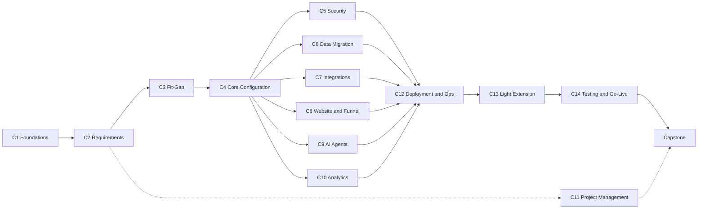

# ERP Implementation Engineer — Curriculum Proposal

**Status:** Initial proposal (draft) · **Date:** 2026-09-25 · **Target system:** GrowERP (Flutter + Moqui)

This proposal defines the training curriculum for the **GrowERP ERP Implementation Engineer**. It is the
basis for a package of courses that will later be authored and published through the GrowERP course
module (`growerp_courses`). The structure (course → module → lesson) maps directly onto the course data
model (`growerp.course.Course`, `CourseModule`, `CourseLesson`), so each course here can be converted into
seed data in the style of `backend/data/GrowerpCourseData.xml`.

---

## 1. Purpose and audience

### The role

An ERP Implementation Engineer takes a customer from **signed agreement to a live, supported GrowERP
system**. They:

- gather and document the customer's requirements and map their business processes onto GrowERP;
- plan and run the implementation project (scope, schedule, risks, change control, reporting);
- configure the system: company, users, security, catalog, orders, inventory, accounting, website, AI agents;
- migrate the customer's data and connect external services (payments, email, social platforms);
- set up the dashboards, reports and KPIs the customer uses to run the business;
- install, deploy and operate the system, and make light extensions (seed data, localization, new verticals via the CLI);
- test, train end users, lead go-live and provide hypercare.

### Positioning against other tracks

| Track | Focus | Relationship to this curriculum |
|---|---|---|
| End-user training | Using one application day to day | Implementation engineers deliver this training (Course 14) |
| **Implementation Engineer** (this document) | Requirements, configuration, data, deployment, light extension, project delivery | — |
| Developer track (separate, future) | Flutter building blocks, Moqui services/entities, REST APIs, CI | Takes over where Course 13 (light extension) stops |

The profile is **hybrid**: mostly functional and operational, with enough technical depth to deploy the
system, move data, read logs and make configuration-level extensions without writing Flutter or Moqui code.

---

## 2. Prerequisites

| Area | Expected level |
|---|---|
| Business processes | Understands order-to-cash, procure-to-pay and basic inventory flows |
| Accounting | Knows double-entry bookkeeping, chart of accounts, P&L versus balance sheet |
| IT basics | Linux shell, Git clone/pull, Docker and Docker Compose basics |
| Data formats | Can read and edit CSV, JSON and XML |
| Soft skills | Can run a meeting with business stakeholders and write clear documents |

An **entry self-assessment** (built with the GrowERP assessment application) places candidates and points
them to catch-up material where needed.

---

## 3. Competency model

| # | Competency | Foundation | Practitioner | Expert |
|---|---|---|---|---|
| 1 | Requirements gathering | Runs structured interviews using templates | Leads workshops, writes user stories with acceptance criteria | Owns traceability from requirement to test to sign-off |
| 2 | Business process analysis | Describes as-is processes | Produces a to-be design and fit-gap per vertical | Designs gap resolutions balancing cost and risk |
| 3 | Project management | Keeps task and issue logs | Plans phases, estimates and reports status | Manages scope change, budget and multiple projects |
| 4 | System configuration | Configures a single module | Configures a complete tenant end to end | Designs configuration for complex, multi-company setups |
| 5 | Data migration | Imports clean CSV files | Builds and validates migration sets | Plans and runs production cut-over |
| 6 | Security and access | Creates users and assigns groups | Designs roles and menu access per customer | Audits access and diagnoses 403 errors |
| 7 | Integrations | Enables standard integrations | Configures payments, email and social platforms | Inspects data through the REST API and MCP to troubleshoot |
| 8 | Business analytics and reporting | Reads standard reports | Defines KPIs and configures dashboards | Designs a reporting model and exports for external BI |
| 9 | Deployment, operations and extension | Installs a local system | Deploys, backs up and upgrades production | Extends with seed data, localization and new verticals |
| 10 | Go-live and support | Runs test scripts | Plans UAT, trains users | Leads go-live and hypercare |

---

## 4. Course package

Summary of the 14 courses and the capstone:

| # | Course | Level | Hours |
|---|---|---|---|
| C1 | GrowERP Foundations | Foundation | 6 |
| C2 | Requirements Gathering for ERP | Foundation | 8 |
| C3 | Business Process Mapping and Fit-Gap Analysis | Foundation | 8 |
| C4 | Core Configuration | Practitioner | 16 |
| C5 | Security, Users and Menus | Practitioner | 6 |
| C6 | Data Migration | Practitioner | 10 |
| C7 | Integrations | Practitioner | 8 |
| C8 | Website, Store and Assessment Funnel | Practitioner | 6 |
| C9 | AI Agents and Automation | Practitioner | 8 |
| C10 | Business Analytics and Reporting | Practitioner | 8 |
| C11 | ERP Project Management | Practitioner | 10 |
| C12 | Deployment and Operations | Practitioner | 12 |
| C13 | Light Extension | Expert | 10 |
| C14 | Testing, Training and Go-Live | Expert | 8 |
| — | Capstone implementation project | Expert | 20 |
| | **Total** | | **144** |

### Recommended sequence

Course 11 (project management) runs **in parallel** from Course 2 onwards: its assignments use the
requirements and designs the learner produces in the other courses.

Each course below lists its goal, modules with lesson titles, a hands-on lab, the assessment and the
existing documentation it draws on. Lesson content is not written yet; titles define scope.

---

### C1 — GrowERP Foundations

**Goal:** Understand what GrowERP is, how it is built and which application fits which customer.

- **M1 Platform overview** — Open source ERP and its licence; Multi-platform delivery (web, mobile, desktop); SaaS multi-tenant versus single-company installations
- **M2 Architecture for implementers** — Flutter frontend and Moqui backend; REST communication; Building blocks versus applications; Where configuration lives (database, seed data, app settings)
- **M3 The application family** — Admin, Hotel, Freelance, Rental, Marketing, Support, Agents, Assessment; Choosing an application for a customer
- **M4 Core data model** — Parties, companies, persons and roles (B2B and B2C); Tenants and `ownerPartyId`; Products, orders, invoices, payments, ledger

**Lab:** Log in to a demo tenant with demo data and follow one sales order from order to ledger posting.
**Assessment:** 20-question quiz.
**Sources:** `GrowERP_Features.md`, `GrowERP_Package_Organization.md`, `B2C_B2B_Party_Model_Documentation.md`, `basic_explanation_of_the_frontend_REST_Backend_data_models.md`

---

### C2 — Requirements Gathering for ERP

**Goal:** Collect, structure and get sign-off on what the customer needs, before anything is configured.

- **M1 Discovery preparation** — Stakeholder identification and analysis; Discovery questionnaire per business area; Using the GrowERP assessment app as a pre-discovery tool
- **M2 Running discovery** — Interview techniques; Facilitating requirement workshops; Collecting sample documents (invoices, orders, reports) and data extracts
- **M3 Capturing the current state** — As-is process documentation (swimlanes, BPMN-light); Pain points and their business impact; Volumes, users, locations and currencies
- **M4 Writing requirements** — Functional and non-functional requirements; User stories and acceptance criteria; Reporting and KPI requirements (feeds C10)
- **M5 Prioritisation and sign-off** — MoSCoW prioritisation; Requirements traceability matrix; Formal sign-off and baseline

**Lab:** From a recorded (role-played) customer interview, write a requirements document with at least 15 user stories, acceptance criteria and a traceability matrix.
**Assessment:** Requirements document graded against a rubric (completeness, testability, prioritisation).
**Sources:** Assessment application, `Assessment_Landing_Page_Explanation.md`

---

### C3 — Business Process Mapping and Fit-Gap Analysis

**Goal:** Translate requirements into a to-be design in GrowERP and decide how every gap is handled.

- **M1 Standard GrowERP processes** — Order-to-cash; Procure-to-pay; Inventory and shipments; Manufacturing (BOM, work orders); Rental and hotel reservations; Freelance time and billing; Marketing to sales pipeline
- **M2 To-be design** — Mapping requirements to modules and screens; Designing the to-be process; Documenting configuration decisions
- **M3 Fit-gap analysis** — Classifying gaps: configuration, workaround, extension, out of scope; Estimating gap effort; Presenting the fit-gap to the customer
- **M4 Vertical case studies** — Hotel; Equipment rental; Freelancer / consultancy; Manufacturing (liner panels)

**Lab:** Produce a fit-gap report and to-be process maps for the C2 lab customer.
**Assessment:** Fit-gap report review.
**Sources:** `Hotel_App_User_Guide.md`, `Manufacturing_Lifecycle_Test.md`, `Liner_Panel_Manufacturing_Guide.md`, `GrowERP_User_Manual_Marketing_CRM.md`

---

### C4 — Core Configuration

**Goal:** Configure a complete tenant for a customer, module by module.

- **M1 Company and organisation** — Company details, currency, time zone and locale; Employees, customers, suppliers and contacts
- **M2 Catalog** — Product types (service, physical, rental); Categories and website categories; Prices
- **M3 Orders** — Sales and purchase orders; Quotes; Automatic invoices, payments and shipments
- **M4 Inventory and assets** — Locations and warehouses; Receiving and shipping; Asset management
- **M5 Manufacturing** — Bills of material; Routings and work centres; Work orders
- **M6 Accounting** — Chart of accounts and ledger organisation; Automatic posting rules; Fiscal periods and year closing; Cash book; Invoice scanning with AI
- **M7 Activities and HR** — Tasks, events and reminders; Time entries

**Lab:** Configure a new tenant from the C3 to-be design, then process one full order-to-cash and one procure-to-pay cycle.
**Assessment:** Lab check against a configuration checklist.
**Sources:** `GrowERP_Features.md`, `Invoice_Scan_Documentation.md`, `GrowERP_Timezone_Management_Guide.md`, `GrowERP_Locale_Handling_Guide.md`

---

### C5 — Security, Users and Menus

**Goal:** Give every user exactly the access they need.

- **M1 Security model** — User groups; Menu-driven access; How menu access controls REST access
- **M2 Organisation security screen** — Assigning groups; What to check before changing access
- **M3 Menus per application** — Configuring menus per app; Hiding items per user
- **M4 Troubleshooting** — Diagnosing a 403; Access audits

**Lab:** Design and apply a role matrix for five user types; prove each can reach only their screens.
**Assessment:** Practical check plus a 403-diagnosis scenario.
**Sources:** `GrowERP_Security_Model.md`, `Dynamic_Menu_System_And_Widget_Repository.md`

---

### C6 — Data Migration

**Goal:** Move the customer's master and opening data into GrowERP correctly and repeatably.

- **M1 Migration strategy** — What to migrate (master, open items, balances, history); Source extraction; Data cleansing
- **M2 CSV import and export** — File formats per entity; Using the in-app import/export; Lead upload
- **M3 GrowERP CLI** — `growerp import` / `export`; Import order and dependencies; Importing to a remote system; `growerp finalize` for closing fiscal years
- **M4 Validation** — Reconciling counts and balances; Trial balance check; Sign-off
- **M5 Cut-over** — Mock migrations; Cut-over plan and freeze; Rollback plan

**Lab:** Migrate a prepared legacy data set (customers, products, open invoices, opening balances) and reconcile the trial balance.
**Assessment:** Reconciliation report.
**Sources:** `GrowERP_CLI_Reference.md`, `leads_upload_process.md`, `leads_download_process.md`

---

### C7 — Integrations

**Goal:** Connect GrowERP to the external services a customer uses.

- **M1 Payments** — Stripe setup; Payment flows and reconciliation
- **M2 Email** — Tenant email server configuration; Transactional and welcome emails
- **M3 Social platforms and outreach** — Platform credentials; Outreach campaigns
- **M4 REST API for implementers** — API overview and authentication; Reading data for troubleshooting; Read-only inspection through MCP

**Lab:** Configure Stripe (test mode) and tenant email; take a payment and verify the resulting records.
**Assessment:** Practical check.
**Sources:** `Stripe_Payment_Processing_Documentation.md`, `Outreach_Package_Documentation.md`, `Flutter_Moqui_REST_Backend_Interface.md`, `API_AUTHENTICATION_CONTEXT.md`, `Moqui_MCP_User_Guide.md`

---

### C8 — Website, Store and Assessment Funnel

**Goal:** Set up the customer's public website, web store and lead-capture funnel.

- **M1 Generated website** — Pages and content blocks; Templates and theme; Converting an existing website
- **M2 Web store** — Store categories and products; Checkout and payment
- **M3 Assessment funnel** — Landing page and assessment setup; Lead capture into CRM
- **M4 Website chat** — Enabling the chat widget

**Lab:** Build a website and store for the lab customer, with an assessment that creates leads.
**Assessment:** Website review against a checklist.
**Sources:** `GrowERP_User_Manual_Website_Generator.md`, `Website_Template_Definition.md`, `Assessment_Landing_Page_Explanation.md`, `GrowERP_Chat_Functionality.md`

---

### C9 — AI Agents and Automation

**Goal:** Configure AI agents safely and usefully for a customer.

- **M1 AI in GrowERP** — Where AI is used; LLM providers and API keys
- **M2 Agent Control Center** — Creating and scheduling agents; Human-in-the-loop approvals
- **M3 Agent teams** — Coordinators and specialists; Marketing agent team
- **M4 Governance and cost** — Read-only versus write-capable agents; Monitoring usage and cost

**Lab:** Configure an agent that produces a weekly sales summary, with approval required before sending.
**Assessment:** Practical check plus a governance scenario.
**Sources:** `Agent_Control_Center_User_Guide.md`, `AGENT_CONTROL_CENTER_AND_MCP_GUIDE.md`, `AI_Agent_Teams_Overview.md`, `GrowERP_LLM_And_API_Key_Architecture.md`, `Marketing_Agent_Team_User_Guide.md`

---

### C10 — Business Analytics and Reporting

**Goal:** Give the customer the numbers they need to run the business, and make sure those numbers are right.

- **M1 KPI design** — From reporting requirements (C2) to KPIs; KPI sets per vertical (sales, occupancy, utilisation, production, cash)
- **M2 Dashboards** — Configuring the dashboard; Choosing KPIs per user role
- **M3 Financial reporting** — Profit and loss; Balance sheet; Cash book; Period comparisons
- **M4 Operational analytics** — Sales pipeline and quotes; Marketing and outreach results; Rental and hotel occupancy statistics; Inventory
- **M5 Beyond the standard reports** — Exporting data for external BI tools; Data quality checks that make reports trustworthy

**Lab:** Define eight KPIs for the lab customer, configure the dashboard and verify every figure against source transactions.
**Assessment:** KPI definition sheet and dashboard review.
**Sources:** `GrowERP_Features.md` (dashboard, financial reports, sales analytics), rental statistics in `growerp_rental`

---

### C11 — ERP Project Management

**Goal:** Deliver implementations on time, on budget and with a satisfied customer.

- **M1 Implementation methodology** — Phases: discovery, design, build, test, deploy, hypercare; Deliverables and gates per phase
- **M2 Scoping and estimation** — Statement of work; Estimating from the fit-gap; Fixed-price versus time-and-materials
- **M3 Planning** — Work breakdown and milestones; RACI matrix; Customer resource planning
- **M4 Control** — Risk and issue log; Change control; Status reporting and steering meetings; Budget tracking
- **M5 Running the project in GrowERP** — Tasks and activities; Time entries and billing the customer
- **M6 Closing** — Handover to support; Lessons learned

**Lab:** Produce a project plan, RACI, risk log and a change request for the lab customer; track the capstone in GrowERP itself.
**Assessment:** Project plan review and a change-control scenario.
**Sources:** Activity (`growerp_activity`) and freelance time-billing features

---

### C12 — Deployment and Operations

**Goal:** Install, run, upgrade and troubleshoot GrowERP in production.

- **M1 Installation** — `growerp install`; Docker-based installation; Manual installation
- **M2 Production setup** — Servers, domains and certificates; Multi-tenant versus single-company
- **M3 Running the system** — Backups and restores; Upgrades; Time zones and locales
- **M4 Troubleshooting** — Reading backend logs; Common failures (403s, stale instances, cached web bundles); Inspecting data through the REST API
- **M5 App distribution** — Web, mobile and desktop builds; App store maintenance

**Lab:** Deploy a Docker installation, restore a backup to it, and fix three planted faults.
**Assessment:** Practical fault-finding exam.
**Sources:** `README.md` (repository root), `GrowERP_CLI_Reference.md`, `GrowERP_Timezone_Management_Guide.md`, `GrowERP_CI_Store_Maintenance_Guide.md`, `Backend_URL_Selection_System_Documentation.md`

---

### C13 — Light Extension

**Goal:** Extend GrowERP without writing Flutter or Moqui code.

- **M1 Seed data** — Structure of seed XML files; Loading seed data; Validating XML before loading
- **M2 Localization** — Backend localization rows; Adding a language
- **M3 New verticals** — Creating a vertical from building blocks with `growerp createApp`; AI-assisted vertical creation
- **M4 Packages** — `createPackage`, `exportPackage`, `importPackage`
- **M5 Knowing the limit** — When to hand over to the developer track; Writing a good change specification

**Lab:** Create a new vertical for the lab customer from existing building blocks, with its own menu and localized seed data.
**Assessment:** Working vertical plus change specification.
**Sources:** `Vertical_Development_Guide.md`, `AI_Assisted_Vertical_Creation_Guide.md`, `GrowERP_Extensibility_Guide.md`, `GrowERP_Backend_L10n_Quick_Reference.md`, `GrowERP_CLI_Reference.md`

---

### C14 — Testing, Training and Go-Live

**Goal:** Prove the system works, prepare the users and go live safely.

- **M1 Testing** — UAT scripts from acceptance criteria; Integration tests as regression checks; Headless test runs
- **M2 End-user training** — Training plan per role; Using GrowERP courses for customer training
- **M3 Go-live** — Go/no-go criteria; Cut-over checklist; Go-live day
- **M4 Hypercare and support** — Support application and ticket handling; Transition to steady-state support

**Lab:** Write and run UAT for the lab customer; hold a go/no-go meeting.
**Assessment:** UAT pack and go-live checklist.
**Sources:** `Integration_Test_Guide.md`, `HEADLESS_TESTING_GUIDE.md`

---

### Capstone — Full Implementation Project

The learner implements GrowERP for a fictional customer (default: an equipment-rental SME with a web
store) from start to finish:

1. Requirements document and traceability matrix (C2)
2. Fit-gap report and to-be design (C3)
3. Project plan, RACI and risk log (C11)
4. Configured tenant with security (C4, C5)
5. Migrated and reconciled data (C6)
6. Integrations, website and one AI agent (C7–C9)
7. KPI dashboard (C10)
8. Production deployment with backup (C12)
9. UAT, training material and go-live report (C14)

**Graded on:** configuration correctness, data quality, security, reporting accuracy, documentation, project control and go-live readiness.

---

## 5. Learning paths and certificates

| Certificate | Courses | Hours |
|---|---|---|
| GrowERP Implementation Foundation | C1–C4 | 38 |
| GrowERP Implementation Practitioner | C1–C12 | 106 |
| **Certified GrowERP Implementation Engineer** | C1–C14 + capstone | 144 |
| GrowERP Implementation Consultant (non-technical option) | C1, C2, C3, C10, C11, C14 | 48 |

---

## 6. Lab environment

- Each learner gets a local Docker backend with demo data, or a personal tenant on a shared training server.
- Labs can be reset by rebuilding the database and reloading seed and demo data.
- Learners use the web build of the Admin application; mobile builds are optional.
- A prepared "legacy data" set and a fictional customer brief are shared across C2, C3, C6, C10 and the capstone, so each course builds on the last.

---

## 7. Assessment and certification

- Each course ends with a short knowledge quiz and a practical lab check.
- Written deliverables (requirements, fit-gap, project plan, KPI sheet, UAT pack) are graded against published rubrics.
- The capstone is reviewed by a certified implementer; passing it gives the full certificate.
- Certificates are valid for two years; renewal requires a short update course on new GrowERP releases.

---

## 8. Delivery format

- **Self-paced**, published in the GrowERP course module: lessons with key points, images and video.
- **Optional live cohort**: weekly sessions for workshops (C2, C3, C11) and lab reviews.
- **Promotion**: course media (social posts, newsletters) generated per course through the course media feature.

---

## 9. Mapping to the course package

Suggested identifiers for the later seed data (`difficulty` values and minutes as used by `growerp.course.Course`):

| Course | courseId | productId | difficulty | estimatedDuration (min) |
|---|---|---|---|---|
| C1 Foundations | CourseImplC01 | ProductCourseImplC01 | BEGINNER | 360 |
| C2 Requirements | CourseImplC02 | ProductCourseImplC02 | BEGINNER | 480 |
| C3 Fit-Gap | CourseImplC03 | ProductCourseImplC03 | BEGINNER | 480 |
| C4 Core Configuration | CourseImplC04 | ProductCourseImplC04 | INTERMEDIATE | 960 |
| C5 Security | CourseImplC05 | ProductCourseImplC05 | INTERMEDIATE | 360 |
| C6 Data Migration | CourseImplC06 | ProductCourseImplC06 | INTERMEDIATE | 600 |
| C7 Integrations | CourseImplC07 | ProductCourseImplC07 | INTERMEDIATE | 480 |
| C8 Website and Funnel | CourseImplC08 | ProductCourseImplC08 | INTERMEDIATE | 360 |
| C9 AI Agents | CourseImplC09 | ProductCourseImplC09 | INTERMEDIATE | 480 |
| C10 Analytics | CourseImplC10 | ProductCourseImplC10 | INTERMEDIATE | 480 |
| C11 Project Management | CourseImplC11 | ProductCourseImplC11 | INTERMEDIATE | 600 |
| C12 Deployment and Ops | CourseImplC12 | ProductCourseImplC12 | INTERMEDIATE | 720 |
| C13 Light Extension | CourseImplC13 | ProductCourseImplC13 | ADVANCED | 600 |
| C14 Testing and Go-Live | CourseImplC14 | ProductCourseImplC14 | ADVANCED | 480 |
| Capstone | CourseImplCap | ProductCourseImplCap | ADVANCED | 1200 |

Modules use ids such as `ImplC01Mod01`, lessons `ImplC01Less0101`, following the existing course seed data.
Each course has its own service product so it can be sold separately; a bundle product can cover a whole certificate path.

---

## 10. Open questions and next steps

**Decisions needed**

1. Pricing: per course, per certificate path, or subscription.
2. Delivery: self-paced only, or self-paced plus live cohorts.
3. Certification: branding, validity period, who may review capstones.
4. Content owners per course (functional, technical, project management).
5. Lab hosting: learner-local Docker or a shared training server.

**Proposed next steps**

1. Review and approve this proposal.
2. Write the shared fictional customer brief and legacy data set.
3. Author **C1 Foundations** and **C4 Core Configuration** first: they are needed by every path and cover the largest share of implementation work.
4. Convert the approved courses into course seed data and publish them as DRAFT for review.
5. Run a pilot cohort, collect feedback, then publish.

---

## 11. Course package readiness

Can the GrowERP course package (`growerp_courses` in Flutter, `CourseServices100.xml` in the backend)
deliver this curriculum? **It can hold the content, but it cannot yet run the programme.** Courses,
modules and lessons can be stored, sold and viewed, but quizzes, graded assignments, learning paths
and certificates are all missing.

### What works today

- Course → module → lesson structure. A lesson has markdown content, key points, an image, a video URL and a duration.
- Authoring in the app: course dialog with add-module and add-lesson, difficulty, duration, price.
- Selling: each course links to a service product, is paid for with Stripe (`subscribe#Course`) and has participant lists.
- Learner viewer: markdown lesson player, progress bar and per-lesson completion that updates the progress percentage.
- Promotion: AI-generated course media (social posts, video scripts).
- Seed-data authoring: all 15 courses can be loaded as XML in the style of `GrowerpCourseData.xml`.

### Gaps that block this curriculum

| # | Gap | Where | Impact |
|---|---|---|---|
| 1 | Videos cannot be played; the viewer shows a placeholder | `viewer/views/lesson_player.dart` (TODO) | Self-paced delivery |
| 2 | No quizzes: no questions, scoring or pass mark | — | Every course assessment |
| 3 | No assignment upload or reviewer grading | — | Labs, written deliverables, capstone |
| 4 | No certificates, expiry or verification | — | Certification |
| 5 | No learning paths, prerequisites or course bundles | — | Certificate paths (section 5) |
| 6 | Progress is stored as a JSON list in one text field: no time spent, scores or module completion | `CourseProgress.completedLessons` | Learner reporting |
| 7 | Courses are visible only inside the owning tenant. GrowERP-published courses (`ownerPartyId="_NA_"`) are invisible to every other tenant | `list#Courses`, `get#Course` | Selling the curriculum to partners |
| 8 | ~~External learners cannot reach courses.~~ **Resolved:** the store website lists published courses at `/courses` (link hidden when there are none) and learners register, enroll, pay and study in the separate **academy** app. Customers get the `GROWERP_LEARNING` REST domain (catalog, subscribe, progress) but never the authoring domain; lesson content is gated by subscription | `academy` app, `GROWERP_LEARNING`, `get#CourseCatalog` | — |
| 9 | Lessons cannot have attachments (templates, sample CSV files) | `CourseLesson` | Labs |

### Improvements to existing features

- Add a real video player (embedded YouTube/video on web, open the URL on mobile as a fallback).
- Replace the JSON progress field with a per-lesson progress entity (user, lesson, completed date, time spent).
- Add a public catalog: platform-owned courses visible to all tenants, with access granted by subscription.
- Let authors reorder modules and lessons by drag and drop, and edit lessons full screen with a markdown preview.
- Import and export a whole course as one file, so authors can work outside the app.
- Store course content per language.

### New features, by priority

| Priority | Feature | Needed for |
|---|---|---|
| 1 | **Quiz engine**: quizzes per lesson or module, single/multiple choice and true/false questions, attempts, pass mark, AI-drafted questions from lesson content | All course assessments |
| 1 | **Video playback** | Self-paced delivery |
| 1 | **Public catalog and subscription gating** | Selling to partners and customers |
| 2 | **Assignments**: learner uploads a deliverable, reviewer grades it against a rubric and gives feedback | Labs, C2/C3/C11 deliverables, capstone |
| 2 | **Learning paths and prerequisites**: a path groups courses, later courses unlock when earlier ones are passed, a bundle product sells the whole path | Certificates (section 5) |
| 2 | **Certificates**: PDF certificate with unique number, expiry date and a public verification page | Certification (section 7) |
| 3 | **Lesson resources**: downloadable templates and sample data per lesson | Labs |
| 3 | **Lab provisioning**: a "start lab" button creates a learner tenant with demo data | Hands-on labs (section 6) |
| 3 | **Cohorts**: learner groups, scheduled live sessions and announcements through chat | Live cohort option |
| 3 | **Learner analytics**: completion, scores and drop-off per lesson | Measuring the programme |
| 4 | **AI tutor**: lesson-aware chat assistant using the course content as its knowledge base | Self-paced support |
| 4 | **Contextual help**: link lessons into in-app help | End-user training (C14) |

Priority 1 is needed before the first paid course is published. Priority 2 is needed before the first
certificate is issued. Each feature needs its own design and implementation plan.
