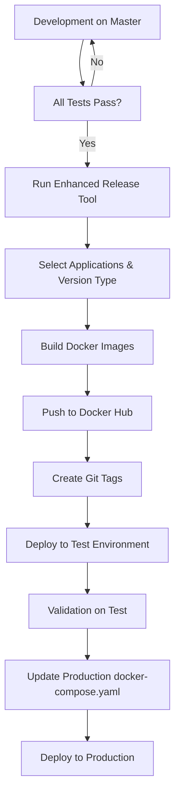
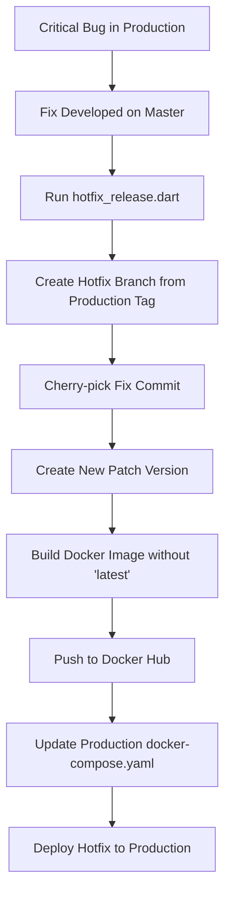

# GrowERP CI Store Maintenance & Release User Guide

**Version:** 1.0
**Target Audience:** Release Managers, DevOps Engineers, and Flutter Developers

## Table of Contents
1. [Overview](#1-overview)
2. [The 30+ App Ecosystem](#2-the-30-app-ecosystem)
3. [The 6-Step Hybrid Release Workflow](#3-the-6-step-hybrid-release-workflow)
4. [Nightly Integration Tests & Status Checks](#4-nightly-integration-tests--status-checks)
5. [Global App Store Integration](#5-global-app-store-integration)
6. [The Live Status Report Matrix](#6-the-live-status-report-matrix)
7. [Handling Rejections & Compliance](#7-handling-rejections--compliance)
8. [Future Roadmap: AI Agents & Redesigns](#8-future-roadmap)

---

## 1. Overview
Maintaining a multi-tenant, multi-platform ecosystem like GrowERP requires strict automation and standardized processes. Our infrastructure actively manages and monitors the status of over 30 distinct application releases across five different app stores: Apple App Store (iOS), Mac App Store (macOS), Google Play Store (Android), Microsoft Partner Center (Windows), and the Snap Store (Linux).

This guide provides a comprehensive breakdown of our CI/CD pipelines, release mechanics, integration testing strategies, and manual intervention protocols. 

---

## 2. The 30+ App Ecosystem
GrowERP is a suite of specialized, white-label applications including:
- **Admin portal**
- **Rental app**
- **Freelance marketplace**
- **Hotel management**
- **Customer Support**
- **Agents portal**
- **Marketing tools**

Each Flutter application targets up to five platforms, resulting in over 30 unique build artifacts and store entries. Every entry maintains its own metadata, localized screenshots, binaries, code signing certificates, and review states. We heavily rely on GitHub Actions workflows (like `publish-binary.yml`, `publish-metadata.yml`, and `status.yml`) to orchestrate these deployments.

---

## 3. The 6-Step Hybrid Release Workflow
To tame this massive ecosystem, we utilize a standardized 6-step release protocol that balances automated CI pipelines with critical manual oversight. 

1. **CI: Download Metadata** 
   - Before any upload occurs, the pipeline pulls down the current store metadata for existing apps. This ensures we are always working from the latest baseline and prevents accidental overwrites of live text.
2. **CI & Manual: Asset Generation** 
   - **CI:** Automatically executes Fastlane scripts to capture and format localized screenshots from our headless UI tests. 
   - **Manual:** Marketing and release managers manually write, review, and refine the localized metadata descriptions for every app.
3. **CI: Upload Metadata** 
   - The pipeline pushes the newly assembled metadata—including the freshly generated screenshots and the approved text—directly to the respective storefronts.
4. **CI: Upload Binaries** 
   - The CI compiles the Flutter code for each target platform, signs the binaries with the appropriate certificates, and uploads them to the store. 
   - Crucially, it sets their status to a **developer-dependent release**, meaning the build is staged but awaiting manual approval before going live.
5. **Manual: Correct Rejections** 
   - Store compliance teams (Apple, Google, etc.) review the binaries. If rejections occur, our team intercepts the store feedback, patches the issues (metadata or code), and resubmits. This cycle repeats until all apps are approved.
6. **CI: Release to Production** 
   - Once all apps clear the review queues, the CI pipeline is triggered again to promote the builds from staging to production, officially releasing them to the public storefronts.

---

## 4. Nightly Integration Tests & Status Checks
Our deployment confidence is anchored by our nightly `status` runs. Every day at exactly **10 PM Bangkok time (15:00 UTC)**, our GitHub Actions runners execute a comprehensive health check across the ecosystem. 

### Testing Matrix
- **Headless Flutter & Docker Compose:** Linux desktop runners spin up headless Flutter integration tests. To ensure these tests reflect a realistic environment, Docker Compose brings up the Moqui backend coupled with a PostgreSQL database.
- **Parallel Slices:** To avoid massive timeout windows, the test suite is split across four parallel slices on separate runners. Because each test is completely self-contained (creating its own company and admin user), the slices do not interfere with each other. We use `xvfb` for virtual displays to simulate real user interactions.
- **Spock Tests:** Alongside the frontend UI validation, backend Spock tests run concurrently to guarantee that Moqui and our API endpoints remain stable.

---

## 5. Global App Store Integration
Ensuring our builds pass internal tests is only the first step; we must also guarantee the global stores accept them. To achieve this without manual dashboard checking, our nightly pipeline pings the APIs of every major storefront using specialized Python scripts:

- **iOS & macOS:** Authenticates against the App Store Connect REST API using securely generated JWTs.
- **Android:** Queries the Google Play Developer API using a dedicated service account.
- **Windows:** Leverages the Microsoft Partner Center REST API via Azure AD.
- **Snap Store:** Uses a combination of curl and Python scripts to query the public API (which requires no auth).

---

## 6. The Live Status Report Matrix
To prevent silent failures—where an app gets stuck in a "Pending" state indefinitely—we consolidate these queried statuses into a single HTML report. This live matrix is published daily to our [GrowERP Status Page](https://growerp.github.io/growerp/).

The report presents a complete bird’s-eye view using a straightforward grid:
- **Rows:** 7 core applications (`admin`, `rental`, `freelance`, `hotel`, `support`, `agents`, `marketing`).
- **Columns:** 5 target platforms (iOS, macOS, Android, Windows, Snap).

Inside each cell is the **live published version number** alongside its **current store status** (e.g., `published`, `PENDING_DEVELOPER_RELEASE`, or `waiting for developer release`). The report highlights statuses using color-coded tags, making it instantly clear which apps need attention. Furthermore, every cell contains direct deep links to the respective developer consoles for rapid intervention.

---

## 7. Handling Rejections & Compliance
Managing store rejections is a critical part of our maintenance cycle. Because we share a unified Flutter codebase across multiple apps, a rejection for one app often implies a structural problem that cascades. 

Our strategy for dealing with this relies heavily on automated metadata synchronization:
- When privacy policies or descriptions mandate an update, we push the change via `publish-metadata.yml`, which fans out the new text to all 30+ store listings simultaneously. 
- When a binary rejection occurs due to a crash, we cross-reference our backend Sentry logs with the failed UI test reports in `failures.html`. 
- Once patched, pushing a commit automatically re-triggers the CI pipeline to re-compile, sign, and submit the new binaries.

---

## 8. Future Roadmap
To improve maintainability and execution speed, we are planning two major upgrades to the pipeline:

### 8.1 The Auto-Fixing CI Agent
When a headless integration test fails, developers currently must manually parse the exception logs. We are prototyping an **autonomous AI agent** that will be plugged directly into our CI pipeline to automatically:
- Ingest the Flutter exception stack trace and test logs.
- Identify the offending code or recent commit that introduced the bug.
- Attempt to generate a fix and submit a Pull Request automatically before the engineering team logs on.

### 8.2 Workflow Reorganization
As our app count has grown, actions like `publish-binary.yml` have become monolithic. We plan to:
- Transition to heavily modular **Reusable Workflows** (`workflow_call`), allowing us to define a single standard deployment template.
- Split up jobs to leverage GitHub's parallel matrix strategies.
- Implement dynamic workflow triggers to run full test suites only on the specific packages altered in a given PR.


## Version Management & Release Process

##### GrowERP Version Management and Release Process

**Subject: Streamlining Our Releases: A Look at GrowERP's New Version Management Process**

Hello Team,

To enhance the stability and efficiency of our release cycle, we are formalizing our version management strategy. This process is designed to ensure our `master` branch remains a reliable source for releases while allowing us to address urgent production issues without disrupting development.

This newsletter outlines our standard release procedure and the new, structured process for deploying hotfixes.

---

###### **The Standard Release Process: Master as the Single Source of Truth**

Our core philosophy is that the `master` branch is the single point of truth and should always be a candidate for the next release. All new features, updates, and bug fixes are ultimately merged into `master`.

Our release cycle follows these steps:

####### 1. Verification
Before a new release is initiated, we ensure all automated integration tests are passing on the `master` branch. This is a critical quality gate.

####### 2. Tagging and Versioning
Once verified, a new release is prepared using the enhanced **GrowERP Release Tool**. This tool automatically assigns and increments the necessary tag numbers and versions for all applications and the backend.

The release tool can be found at `flutter/release/release.sh` and provides:
- Interactive application selection
- Flexible version increment options (patch, minor, major)
- Automated Docker image building and tagging
- Git repository management and tagging
- Both local and repository workspace modes

####### 3. Staging Deployment
The newly versioned Docker images are deployed to our test environment. It's important to note that our test systems are configured to use the `latest` images to ensure we are always testing the most recent code.

####### 4. Production Deployment
After the release is validated on the test system, the production `docker-compose.yaml` file is updated with the specific, newly created version tags. The production system is then updated by running `docker-compose up -d`. This ensures our production environment runs on a stable, specific version, not on `latest`.

---

###### **Handling Urgent Issues: The Hotfix Procedure**

Occasionally, a critical, blocking error is discovered in production that must be fixed immediately. If the `master` branch contains unstable, in-progress features, we cannot deploy it directly. For this scenario, we use a "hotfix" process.

####### 1. Fix on Master
The required fix is first developed, tested, and merged into the `master` branch as usual.

####### 2. Isolate the Fix
The `hotfix.sh` script is then used to apply this specific fix to the production version. The script automates the following:

- It checks out the exact version currently in production by its tag, creating a temporary `production` branch if one doesn't already exist.
- It "cherry-picks" the specific commit containing the fix from `master` and applies it to this branch.
- It creates a new Docker image and a new tag with an incremented **patch number** (e.g., `v2.5.1` becomes `v2.5.2`).
- Crucially, the `latest` tag is **not** updated, ensuring that ongoing development and testing on the main branch are not interrupted.

####### 3. Deploy Hotfix
After a few targeted local tests on the hotfix branch, the production `docker-compose.yaml` is updated with the new patch tag, and the system is restarted.

---

###### **How Does This Compare to Standard Practices?**

Our approach is a pragmatic and effective form of **Trunk-Based Development (TBD)**. In TBD, all developers contribute to a single main branch (our `master`), which is expected to be kept in a constantly releasable state. This is why our investment in a comprehensive automated test suite is so critical.

This model is simpler and often faster than more complex strategies like **GitFlow**, which involves multiple long-lived branches (`develop`, `release`, `hotfix`, etc.). By focusing on a single `master` branch, we reduce complexity and speed up the development-to-release cycle.

Our hotfix script provides a safety valve, giving us the structured control of a more complex model when we need it (isolating a production fix) without carrying the overhead all the time.

####### Key Benefits

1. **Simplicity**: Single main branch reduces complexity
2. **Speed**: Faster development-to-release cycle
3. **Reliability**: Master branch always release-ready
4. **Safety**: Hotfix process provides controlled production fixes
5. **Stability**: Production runs on specific versions, not latest

---

###### **Tools and Scripts**

####### Standard Release Tools

- **`flutter/release.sh`**: Enhanced production release tool with interactive interface
- **`flutter/release/release_tool.dart`**: Core release automation script
- **`flutter/release/release_config.json`**: Configurable release settings
- **Integration Tests**: Automated quality gate before releases
- **Docker Compose**: Production deployment management

######## Enhanced Release Tool Features
- **Interactive Selection**: Choose specific applications to build
- **Version Management**: Patch, minor, and major version increments
- **Workspace Modes**: Local development vs repository-based releases
- **Docker Integration**: Automated image building with proper tagging
- **Configuration**: JSON-based settings with sensible defaults
- **Validation**: Comprehensive environment and dependency checks

For detailed usage instructions, see the [Release Tool Documentation](../flutter/release/README.md).

####### Hotfix Tools

- **`flutter/hotfix/hotfix_release.dart`**: Automated hotfix workflow
- **`flutter/hotfix/hotfix_release.sh`**: Bash wrapper with environment validation
- **Cherry-pick Process**: Selective commit application to production branches

For detailed information about the hotfix process, see the [Hotfix Documentation](../flutter/hotfix/README.md).

---

###### **Workflow Diagrams**

####### Standard Release Flow



####### Hotfix Flow



---

We believe this streamlined process provides the right balance of speed and stability for GrowERP. If you have any questions, please don't hesitate to reach out.

Best,
The GrowERP Team

---


## GitHub Actions Workflows Guide

##### GrowERP GitHub Actions Guide

This document describes all GitHub Actions workflows used in the GrowERP repository, including trigger conditions, input variables, required secrets, and where to find or generate each secret value.

---

###### Table of Contents

1. [Overview](#overview)
2. [Workflow Summary](#workflow-summary)
3. [Workflows](#workflows)
   - [Status (`status.yml`)](#1-status-statusyml)
   - [Update Staging (`update-staging.yml`)](#2-update-staging-update-stagingyml)
   - [Publish to Stores (`publish-binary.yml`)](#3-publish-to-stores-publish-binaryyml)
   - [Release Approved Submissions (`release-approved.yml`)](#4-release-approved-submissions-release-approvedyml)
   - [Stage to Production (`stage-to-production.yml`)](#5-stage-to-production-stage-to-productionyml)
   - [Revert Production Update (`revert-last-sync.yml`)](#6-revert-production-update-revert-last-syncyml)
4. [Secrets Reference](#secrets-reference)
   - [Automatic Secrets](#automatic-secrets)
   - [Production Server Secrets](#production-server-secrets)
   - [Apple / App Store Connect Secrets](#apple--app-store-connect-secrets)
   - [iOS Code-Signing via Fastlane Match](#ios-code-signing-via-fastlane-match)
   - [macOS Code-Signing Secrets](#macos-code-signing-secrets)
   - [Android Signing Secrets](#android-signing-secrets)
   - [Google Play Secrets](#google-play-secrets)
   - [Windows Store Secrets](#windows-store-secrets)
   - [Snap Store Secrets](#snap-store-secrets)
5. [Setting Secrets in GitHub](#setting-secrets-in-github)
6. [Permissions Required](#permissions-required)

---

###### Overview

GrowERP uses ten GitHub Actions workflows to automate testing, releasing Docker images, and publishing to platform stores. All workflows live in `.github/workflows/`. The six documented in detail below are the release path; the remaining four support it.

```
.github/workflows/
├── status.yml                            ##### Integration tests + store status (scheduled + manual)
├── update-staging.yml                    ##### Docker image build + version bump (manual)
├── publish-binary.yml                    ##### Build & submit binaries to stores (manual)
├── release-approved.yml                  ##### Release store-approved versions to public (manual)
├── stage-to-production.yml               ##### Promote staging Docker stack to production (manual)
├── revert-last-sync.yml                  ##### Revert last production promotion (manual)
├── publish-metadata.yml                  ##### Upload listing text + screenshots to stores (manual)
├── screenshots.yml                       ##### Capture + frame store screenshots (manual)
├── download-store-metadata.yml           ##### Pull live listings back into the repo (manual)
└── match-bootstrap.yml                   ##### One-time Apple signing bootstrap (manual)
```

---

###### Workflow Summary

| Workflow | Trigger | Runner | Secrets needed |
|----------|---------|--------|----------------|
| status | Schedule (daily) + manual | `ubuntu-latest` | Store API secrets (see [Secrets Reference](#secrets-reference)) for the store-status jobs; `PROD_SSH_USER`, `PROD_SSH_KEY` for the swarm status; tests need none |
| Update Staging | Manual | `ubuntu-latest` | `GITHUB_TOKEN` |
| Publish to Stores | Manual | macOS / Ubuntu / Windows | See [Secrets Reference](#secrets-reference) |
| Release Approved Submissions | Manual | macOS / Ubuntu / Windows | See [Secrets Reference](#secrets-reference) |
| Stage to Production | Manual | `ubuntu-latest` | `PROD_SSH_USER`, `PROD_SSH_KEY` |
| Revert Production Update | Manual | `ubuntu-latest` | `PROD_SSH_USER`, `PROD_SSH_KEY` |

---

###### Workflows

####### 1. Status (`status.yml`)

**Purpose:** One nightly status run — the full Flutter integration test suite plus the backend Spock tests against a locally-built Moqui backend, the publish state of every app in every store, *and* the state of the production Docker swarm. All results are published as a single GitHub Pages page: <https://growerp.github.io/growerp/>.

**Triggers:**
- **Schedule:** Daily at 10 PM Bangkok time (15:00 UTC); GitHub queues scheduled runs, so the actual start is usually 1-2 hours later. The store-status jobs run every time; the test jobs only run when there were commits in the last 24 hours affecting `flutter/**` or `moqui/runtime/component/**`.
- **Manual (`workflow_dispatch`):** Run at any time from the Actions tab.

**Concurrency:** Only one status run per branch at a time; new runs cancel in-progress runs. Pages deployment uses its own `pages` concurrency group and is never cancelled.

**Manual Input Variables:**

| Input | Type | Required | Default | Description |
|-------|------|----------|---------|-------------|
| `package_filter` | string | No | *(empty)* | Filter to a single package name (e.g. `catalog`). When empty, all 4 parallel slices run. |
| `skip_integration_tests` | boolean | No | `false` | Only refresh the store status — skips the test runners. |

**Job Flow:**

```
check-changes                       resolve-matrix              swarm-status
    ├── backend-tests                   ├── status-ios          (ssh growerp.com:
    └── integration-tests               ├── status-macos         deploy.sh status +
        (matrix: 4 slices × mobile/     ├── status-android       image versions)
         desktop, or 1 slice when       ├── status-windows
         package_filter is set)         └── status-snap
                       ↓                       ↓                       ↓
                                     report
                                       ↓
                                  deploy-pages
```

**What it does — tests:**
1. Checks if there are any relevant recent commits (skips the test jobs if none on a scheduled run).
2. Runs the backend Spock tests of the `growerp` component against an embedded Moqui + H2.
3. Frees disk space on the runner, checks out the repo and initialises all git submodules.
4. Builds the Moqui backend Docker image from local source using Gradle + Java 21.
5. Builds a Flutter test runner Docker image (cached via GitHub Actions cache).
6. Starts the Moqui backend + PostgreSQL via Docker Compose.
7. Runs the integration tests, splitting across 4 parallel matrix slices × mobile/desktop layouts (or filtering to one package).
8. Uploads test logs as artifacts (retained 7 days).

**What it does — stores:**
1. `resolve-matrix` builds the app × store matrix from `storeApps` in `flutter/release/release_config.json`.
2. Each store job queries its API (App Store Connect, Google Play, Partner Center, Snap Store) and uploads a JSON fragment.

**What it does — report:**
1. Merges the store fragments into one matrix table (app rows × store columns) and lists apps waiting for approval.
2. Sums the test totals (backend Spock, Flutter mobile/desktop packages and tests). When the tests were skipped, the last published totals are carried over from `tests-data.json` on the Pages site and labelled with their original date.
3. Renders the swarm section from the `status-swarm` fragment: the `docker stack ps` tasks, plus a **Staging images** and a **Production images** table listing every app's running version, image, replica count and last-deployed time. Non-running tasks and incomplete replica counts (`0/1`) are red; a production version behind staging is amber. The staging/production comparison is per app — since both `Update Staging` and `Copy Staging to Production` can be run for one app at a time, apps within the same environment routinely sit at different versions.
4. Writes `index.html`, `failures.html`, `tests-data.json` for GitHub Pages, a PDF artifact (`status-report`, retained 30 days) and the run's step summary. All timestamps on the page are converted from the runner's UTC to Bangkok local time.
5. Fails the run when more than one individual test failed on a layout, or when the backend tests failed — the page is still published in that case.

**What it does — swarm:** `swarm-status` SSHes into `growerp.com` twice, both read-only. First `cd ~/server/swarm && ./deploy.sh status` (`docker stack ps` + `docker service ls`) → `status.txt`. Then an inline loop over the stack's `<app>-test` (staging) and `<app>-prod` (production) services, recording `app|env|version|image|replicas|updated` → `images.txt`. The version comes from the image's `version` label (set at build time by `release_tool.dart`), because staging is deployed from `:latest` and its tag carries no version. Both files are uploaded as the `status-swarm` fragment and are independent — one failing SSH call does not blank the other's table. The job never blocks the run; when the credentials are missing or the host is unreachable the page says the swarm status is unavailable.

**Failure drill-down:** every non-zero `Failed` count on the page links to `failures.html` on the same site, listing the failed packages, the failed test lines and the exceptions caught by the Flutter test framework, plus a link back to the workflow run for the raw logs. That detail is stored inside `tests-data.json`, so a run that skipped the tests rebuilds the same failures page from the carried-over data.

**Secrets required:** none for the test jobs; the store jobs use the App Store Connect, Google Play, Partner Center and Snap Store secrets listed in the [Secrets Reference](#secrets-reference); the swarm job uses `PROD_SSH_USER` / `PROD_SSH_KEY`.

---

####### 2. Update Staging (`update-staging.yml`)

**Purpose:** Bumps app versions, builds Docker images, and pushes them to `ghcr.io/growerp`. Optionally commits a version bump and pushes a git tag.

**Trigger:** Manual only (`workflow_dispatch`).

**Concurrency:** Only one release at a time; running releases are never cancelled.

**Manual Input Variables:**

| Input | Type | Required | Default | Options | Description |
|-------|------|----------|---------|---------|-------------|
| `bump` | choice | Yes | `patch` | `patch`, `minor`, `major`, `none` | Version bump type. Use `none` to build images at the current version without committing a bump. |
| `apps` | string | No | *(empty)* | — | Comma-separated list of apps to release (e.g. `admin,hotel`). Leave empty to release all apps. |
| `comment` | string | No | *(empty)* | — | Optional comment appended to the git commit message (ignored when `bump` is `none`). |

**Job Flow:**

```
release  (single job)
```

**What it does:**
1. Checks out the repo with full history and all submodules.
2. Sets up Dart SDK and installs `dcli` + release tool dependencies.
3. Sets up Docker Buildx with layer caching.
4. Logs in to GitHub Container Registry (`ghcr.io`) using `GITHUB_TOKEN`.
5. Configures git to allow push-back over HTTPS via `GITHUB_TOKEN`.
6. Runs `dart release/release_tool.dart` with CI flags:
   - `--ci` — non-interactive mode
   - `--bump=<type>` — version bump
   - `--parallel` — build all selected apps in parallel
   - `--workspace=local` — use current checkout, no extra clone
   - `--push-docker` — push images to `ghcr.io/growerp`
   - `--push-github` — commit bump + tag and push (omitted when `bump=none`)

**Secrets required:**

| Secret | Auto-provided | Used for |
|--------|---------------|---------|
| `GITHUB_TOKEN` | Yes | Git push, ghcr.io login |

**Repository settings required:**
- Settings → Actions → General → Workflow permissions → **Read and write permissions**
- Settings → Packages → **Inherit access from repository**

---

####### 3. Publish to Stores (`publish-binary.yml`)

**Purpose:** Builds and publishes GrowERP apps to one or more app stores. Each platform runs as an independent parallel job. iOS, macOS, and Android also bump the build number (stored in `pubspec.yaml`) and commit it back.

**Trigger:** Manual only (`workflow_dispatch`).

**Concurrency:** Only one store deploy at a time; running deploys are never cancelled.

**Manual Input Variables:**

| Input | Type | Default | Options | Description |
|-------|------|---------|---------|-------------|
| `app_admin` … `app_marketing` | boolean | all on | — | One checkbox per app (admin, hotel, freelance, support, agents, rental, marketing). |
| `store_ios` / `store_macos` / `store_android` / `store_windows` / `store_snap` | boolean | all on | — | Stores to deploy to. |
| `track` | choice | `beta` | `beta`, `stable` | Release track. `beta` = TestFlight only (no review submission). `stable` = submit to App Store review / production. |
| `android_release_status` | choice | `auto` | `auto`, `draft`, `completed` | Google Play release status. `auto` = `completed` for a published app (managed publishing holds it after review), `draft` only for an app Play has never published. `draft` forces the staged-release gate on apps without managed publishing. |

**Release gate:** submitting a binary never makes it go live by itself. Every store that
has a release-mode setting is checked on each submit and forced to manual, so
[`release-approved.yml`](#4-release-approved-submissions-release-approvedyml) stays the single
place where an app goes public:

| Store | Setting checked | Forced to |
|-------|-----------------|-----------|
| iOS / macOS | App Store version `releaseType` | `MANUAL` — Fastfile passes `automatic_release: false`, then `ensure_manual_release` re-reads every unreleased version and patches any that is still `AFTER_APPROVAL` |
| Android | app-level **managed publishing** (Play Console → Publishing overview → Manage publishing) | Switched on per app in the Console — Play exposes no API for it. With it on, the uploaded `completed` release is reviewed immediately and parks in *Ready to publish*. Apps without it can still be gated with `android_release_status: draft` |
| Windows | submission `targetPublishMode` | `Manual` — a cloned submission inherits `Immediate` from the last published one, which would go live straight out of certification |
| Snap | upload channel | `candidate` — the Snap Store has no review or hold state, so a `stable` run parks the revision in `candidate` and `release-approved.yml` promotes it. `beta` still goes straight to the beta channel for testers |

**Job Flow:**

```
resolve-matrix ──┬──> bootstrap ──┬──> deploy-ios     ─┐
                 │                ├──> deploy-macos    ─┤──> commit-version
                 │                ├──> deploy-android  ─┘
                 │                ├──> deploy-windows
                 └────────────────┴──> deploy-snap
                 └──> bump-version ──> deploy-ios / deploy-macos / deploy-android
```

**Job: `resolve-matrix`** — Converts the comma-separated `apps` and `stores` inputs into JSON matrix arrays for downstream jobs. Sets `run_<platform>` flags.

**Job: `bootstrap`** — Runs once on Ubuntu. Bootstraps the Melos workspace, runs code generation (Freezed, Retrofit, l10n), and uploads the generated sources as an artifact so no other job needs to regenerate them.

**Job: `bump-version`** — Increments the `+<build_number>` in each selected app's `pubspec.yaml`. Uploads the bumped pubspecs as an artifact. Only runs when iOS, macOS, or Android is targeted.

**Job: `deploy-ios`** — Runs on `macos-latest`.
1. Validates all required iOS secrets are present.
2. Restores bumped pubspecs and generated sources.
3. Sets up Flutter (stable) and Ruby 3.2.
4. Builds the Flutter iOS app (no codesign).
5. Runs `pod install`.
6. Validates access to the Match certificate repository.
7. Runs Fastlane lanes: `codesign`, `ci_build`, `upload`. On `stable`, `upload` submits for review and then forces the version's release type to `MANUAL`.

**Job: `deploy-macos`** — Runs on `macos-latest`.
1. Validates all required macOS secrets are present (including the app-specific provisioning profile).
2. Imports the signing certificate into a temporary keychain.
3. Installs the provisioning profile.
4. Runs `pod install` and `flutter build macos --release`.
5. Archives with `xcodebuild`, generates export options, exports the `.pkg`.
6. Uploads the `.pkg` to App Store Connect using `xcrun altool`.

**Job: `deploy-android`** — Runs on `ubuntu-latest`.
1. Writes the keystore file and `key.properties` from secrets.
2. Builds the Flutter app bundle (`flutter build appbundle --release`).
3. Resolves the release status — `completed` for a published app (managed publishing holds it after review), `draft` for an app Play has never published.
4. Uploads the `.aab` to Google Play via `r0adkll/upload-google-play@v1`.

**Job: `deploy-windows`** — Runs on `windows-latest`.
1. Imports the PFX signing certificate into the Windows certificate store.
2. Builds the MSIX package (`flutter pub run msix:create`).
3. Authenticates with Azure AD and submits to Microsoft Partner Center via the Ingestion API, forcing `targetPublishMode` to `Manual`.

**Job: `deploy-snap`** — Runs on `ubuntu-22.04`.
1. Installs `snapcraft` (with retry logic for flaky snap daemon).
2. Pre-installs `core22` base snap.
3. Builds the Flutter Linux release.
4. Syncs the version from `pubspec.yaml` into `snapcraft.yaml`.
5. Packs and uploads the snap to the Snap Store.

**Job: `commit-version`** — Commits the bumped `pubspec.yaml` files back to the branch after at least one of iOS / macOS / Android succeeds.

---

####### 4. Release Approved Submissions (`release-approved.yml`)

**Purpose:** Checks each store for versions that have passed review but are held pending a manual developer release action, then releases them to the public. No build step — this workflow only calls store APIs.

**Trigger:** Manual only (`workflow_dispatch`).

**Concurrency:** Only one release run at a time; never cancelled.

**Manual Input Variables:**

| Input | Type | Default | Description |
|-------|------|---------|-------------|
| `app_admin` … `app_marketing` | boolean | `true` | One checkbox per app (admin, hotel, freelance, support, agents, rental, marketing). |
| `store_ios` / `store_macos` / `store_android` / `store_windows` | boolean | `true` | Stores to check for approved-but-held versions. |
| `store_snap` | boolean | `true` | Promote `latest/candidate` to `stable`. `publish-binary` parks stable-track revisions in `candidate`, so this is the Snap equivalent of the other stores' release gate. |

Apps are intersected with `storeApps` in `flutter/release/release_config.json`, so an app is only
checked on the stores it is actually published on (e.g. `support` is android + snap only).

**What each platform checks and how it releases:**

| Platform | "Held" state | Release action |
|----------|-------------|----------------|
| iOS | `PENDING_DEVELOPER_RELEASE` on App Store Connect | Fastlane Spaceship `AppStoreVersionReleaseRequest` |
| macOS | `PENDING_DEVELOPER_RELEASE` on App Store Connect | Same as iOS |
| Android | Managed publishing *Ready to publish* (Console-only), or a `draft` release on the production track for apps without managed publishing | No API publishes a managed-publishing release — the job prints a notice to finish in Play Console → Publishing overview → **Publish**. For a `draft` release it sets the status to `completed` and commits the edit, falling back to `changesNotSentForReview` plus a **Send changes for review** notice if Play refuses. |
| Windows | `ReadyToPublish` pending submission in Partner Center | Partner Center Ingestion API publish call |
| Snap | Any revision present in `latest/candidate` channel | `snapcraft release <snap> <revision> stable` |

If no held version is found for a given app/platform combination, the job exits cleanly with a message — it is not an error.

**Secrets required:** Same as Publish to Stores — no additional secrets needed.

---

####### 5. Stage to Production (`stage-to-production.yml`)

**Purpose:** SSHs into the production server (`growerp.com`) and runs `swarm/sync-to-prod.sh` to promote the staging Docker stack to production.

**Trigger:** Manual only (`workflow_dispatch`).

**Concurrency:** Only one sync at a time; never cancelled.

**Manual Input Variables:** None.

**Secrets required:**

| Secret | Description |
|--------|-------------|
| `PROD_SSH_USER` | SSH username on `growerp.com` |
| `PROD_SSH_KEY` | SSH private key for the production server |

---

####### 6. Revert Production Update (`revert-last-sync.yml`)

**Purpose:** SSHs into the production server and runs `swarm/revert-prod.sh` to roll back the last production promotion.

**Trigger:** Manual only (`workflow_dispatch`).

**Concurrency:** Only one revert at a time; never cancelled.

**Manual Input Variables:** None.

**Secrets required:** Same as Stage to Production.

| Secret | Description |
|--------|-------------|
| `PROD_SSH_USER` | SSH username on `growerp.com` |
| `PROD_SSH_KEY` | SSH private key for the production server |

---

###### Secrets Reference

All secrets are stored under **Settings → Secrets and variables → Actions** in the GitHub repository (or organisation-level secrets).

####### Automatic Secrets

| Secret | Source | Description |
|--------|--------|-------------|
| `GITHUB_TOKEN` | Auto-injected by GitHub | Used for git push, tagging, and `ghcr.io` login. No setup required. |

---

####### Production Server Secrets

Used by: `stage-to-production.yml`, `revert-last-sync.yml`

| Secret | Format | Where to find / how to generate |
|--------|--------|----------------------------------|
| `PROD_SSH_USER` | Plain string | The Linux username used to SSH into `growerp.com` (e.g. `deploy` or `ubuntu`). Ask your infrastructure team. |
| `PROD_SSH_KEY` | PEM private key (plain text, including `-----BEGIN ... KEY-----` headers) | Generate with `ssh-keygen -t ed25519 -C "github-actions"`. Add the public key to `~/.ssh/authorized_keys` on the production server. Paste the private key as the secret value. |

---

####### Apple / App Store Connect Secrets

Used by: `deploy-ios`, `deploy-macos`

These three secrets authenticate CI against the App Store Connect API. A single API key can be shared between iOS and macOS jobs.

| Secret | Format | Where to find / how to generate |
|--------|--------|----------------------------------|
| `APP_STORE_CONNECT_API_KEY_ID` | String (e.g. `ABC123DEFG`) | App Store Connect → Users and Access → Integrations → App Store Connect API → **Key ID** column. |
| `APP_STORE_CONNECT_API_ISSUER_ID` | UUID string | Same page as above → **Issuer ID** (shown at the top of the Keys table). |
| `APP_STORE_CONNECT_API_KEY_CONTENT` | Base64-encoded `.p8` file | 1. Generate a new API key on App Store Connect (or download an existing one — it can only be downloaded once). 2. Encode: `base64 -i AuthKey_XXXXXXX.p8 | tr -d '\n'`. 3. Paste the result as the secret. |

> **Note:** The `.p8` file can only be downloaded once. Store it securely (e.g. 1Password). If lost, generate a new key.

---

####### iOS Code-Signing via Fastlane Match

Used by: `deploy-ios`

GrowERP uses [Fastlane Match](https://docs.fastlane.tools/actions/match/) to sync iOS certificates and provisioning profiles from a private Git repository.

| Secret | Format | Where to find / how to generate |
|--------|--------|----------------------------------|
| `MATCH_GIT_URL` | Git URL (HTTPS, e.g. `https://github.com/org/certs-repo.git`) | The URL of the private Git repository that stores your Match certificates. This is the repo you passed to `fastlane match init`. |
| `MATCH_GIT_BASIC_AUTHORIZATION` | Base64-encoded `username:token` | Run: `printf '%s' 'github_user:ghp_your_pat' \| base64`. The PAT needs `repo` scope on the certs repository. Paste the base64 output as the secret. |
| `MATCH_PASSWORD` | Plain string (passphrase) | The encryption passphrase used when the Match repository was first set up (`fastlane match init` prompted for it). Store it securely — it was chosen by whoever ran `fastlane match` the first time. |

---

####### macOS Code-Signing Secrets

Used by: `deploy-macos`

macOS now uses [Fastlane Match](https://docs.fastlane.tools/actions/match/), the same certificate repository flow used by iOS.

| Secret | Format | Where to find / how to generate |
|--------|--------|----------------------------------|
| `MATCH_GIT_URL` | Git URL (HTTPS, e.g. `https://github.com/org/certs-repo.git`) | The private Match repository that stores Apple signing assets for both iOS and macOS. |
| `MATCH_GIT_BASIC_AUTHORIZATION` | Base64-encoded `username:token` | Run: `printf '%s' 'github_user:ghp_your_pat' \| base64`. The token must have access to the Match repo. |
| `MATCH_PASSWORD` | Plain string (passphrase) | The Match encryption password chosen when the certificates repo was initialized. |

To create or refresh macOS signing assets on a Mac:

```bash
cd flutter
bundle install --gemfile fastlane/Gemfile
fastlane match appstore --platform macos --app_identifier org.growerp.admin,org.growerp.hotel
```

To verify the shared Match repo contents locally:

```bash
cd flutter
BUNDLE_ID=org.growerp.admin bundle exec fastlane codesign_macos
BUNDLE_ID=org.growerp.hotel bundle exec fastlane codesign_macos
```

The workflow resolves the installed Match provisioning profile by bundle ID and archives with the `Apple Distribution` identity for Mac App Store upload.

> **Apple Developer Portal:** [developer.apple.com](https://developer.apple.com) → Account → Certificates, Identifiers & Profiles.
> The Development Team ID used in the workflow is `P64T65C668`.

---

####### Android Signing Secrets

Used by: `deploy-android`

| Secret | Format | Where to find / how to generate |
|--------|--------|----------------------------------|
| `ANDROID_KEYSTORE_BASE64` | Base64-encoded `.jks` / `.keystore` file | 1. Generate: `keytool -genkey -v -keystore release.jks -alias <alias> -keyalg RSA -keysize 2048 -validity 10000`. 2. Encode: `base64 -i release.jks \| tr -d '\n'`. If you already have a keystore, just encode the existing file. |
| `ANDROID_KEY_ALIAS` | Plain string | The alias you used when generating the keystore (e.g. `release`). |
| `ANDROID_KEY_PASSWORD` | Plain string | The password for the key entry inside the keystore. |
| `ANDROID_STORE_PASSWORD` | Plain string | The password for the keystore file itself (may be the same as `ANDROID_KEY_PASSWORD`). |

> **Important:** The keystore is permanent — if lost, you cannot update your Play Store listing. Store the `.jks` file and its passwords in a secure location (e.g. 1Password, a private encrypted repo).

---

####### Google Play Secrets

Used by: `deploy-android`

| Secret | Format | Where to find / how to generate |
|--------|--------|----------------------------------|
| `GOOGLE_PLAY_SERVICE_ACCOUNT_JSON` | Raw JSON string | 1. Open [Google Play Console](https://play.google.com/console). 2. Setup → API access → Link to a Google Cloud project. 3. In Google Cloud Console → IAM & Admin → Service Accounts → Create a service account. 4. Grant it the **Release Manager** role in Play Console. 5. Create a JSON key for the service account. 6. Paste the entire JSON file contents as the secret value (not base64-encoded — the action reads it as plain text). |

---

####### Windows Store Secrets

Used by: `deploy-windows`

######## Code-Signing Certificate

| Secret | Format | Where to find / how to generate |
|--------|--------|----------------------------------|
| `WINDOWS_CERTIFICATE_BASE64` | Base64-encoded `.pfx` file | Purchase or obtain a **code-signing certificate** from a CA (e.g. DigiCert, Sectigo). Export as `.pfx`. Encode: `[Convert]::ToBase64String([IO.File]::ReadAllBytes('cert.pfx'))` (PowerShell) or `base64 -i cert.pfx \| tr -d '\n'` (bash). |
| `WINDOWS_CERTIFICATE_PASSWORD` | Plain string | The password set when exporting the `.pfx`. |

######## Microsoft Partner Center (Ingestion API)

Authentication uses an Azure AD app registration with the Partner Center API.

| Secret | Format | Where to find / how to generate |
|--------|--------|----------------------------------|
| `WINDOWS_TENANT_ID` | UUID | [Azure Portal](https://portal.azure.com) → Azure Active Directory → Overview → **Tenant ID**. |
| `WINDOWS_CLIENT_ID` | UUID | Azure Portal → Azure AD → App registrations → your app → **Application (client) ID**. To create: register a new app, then go to [Partner Center](https://partner.microsoft.com/en-us/dashboard) → Account settings → User management → Azure AD applications → Associate the app and grant it the **Manager** role. |
| `WINDOWS_CLIENT_SECRET` | Plain string | Azure Portal → App registrations → your app → Certificates & secrets → New client secret. Copy the **Value** immediately (shown only once). |
| `WINDOWS_ADMIN_PRODUCT_ID` | Store ID string (e.g. `9NWX6KFTJNQL`) | [Partner Center](https://partner.microsoft.com/en-us/dashboard) → Apps and games → select the **admin** app → Product identity → **Store ID**. Must be the published Store ID, not a draft. |
| `WINDOWS_HOTEL_PRODUCT_ID` | Store ID string | Same as above for the **hotel** app. |
| `WINDOWS_FREELANCE_PRODUCT_ID` | Store ID string | Same as above for the **freelance** app. |
| `WINDOWS_RENTAL_PRODUCT_ID` | Store ID string | Same as above for the **rental** app. |
| `WINDOWS_AGENTS_PRODUCT_ID` | Store ID string | Same as above for the **agents** app. |
| `WINDOWS_MARKETING_PRODUCT_ID` | Store ID string | Same as above for the **marketing** app. |

---

####### Snap Store Secrets

Used by: `deploy-snap`, `upload-metadata-snap`

| Secret | Format | Where to find / how to generate |
|--------|--------|----------------------------------|
| `SNAPCRAFT_STORE_CREDENTIALS` | Snapcraft credentials token | On a machine with `snapcraft` installed and logged in, run: `snapcraft export-login --snaps growerp-admin,growerp-hotel --channels beta,stable,edge --acls package_upload,package_release - 2>/dev/null`. This prints a credentials token to stdout. Paste that token as the secret value. `package_upload` is needed by Publish to Stores (binary uploads and, via `upload-metadata-snap`, listing text/screenshots); `package_release` is additionally needed by Release Approved Submissions to promote beta → stable. Credentials expire — regenerate periodically. |

> **Snapcraft login:** `snapcraft login` uses your [Ubuntu One](https://login.ubuntu.com) / Snap Store developer account.

---

###### Setting Secrets in GitHub

1. Go to your repository on GitHub.
2. Click **Settings** → **Secrets and variables** → **Actions**.
3. Click **New repository secret**.
4. Enter the secret **Name** (exactly as listed in this document) and its **Value**.
5. Click **Add secret**.

For organisation-wide secrets (shared across repos):
- Go to your **Organisation** → **Settings** → **Secrets and variables** → **Actions** → **New organisation secret**.
- Choose which repositories can access it.

---

###### Permissions Required

####### Repository Settings

| Setting | Value | Required by |
|---------|-------|-------------|
| Actions → General → Workflow permissions | **Read and write permissions** | `update-staging.yml` (git push, tagging) |
| Packages → Inherit access from repository | **Enabled** | `update-staging.yml` (ghcr.io image publishing) |

####### External Service Roles

| Service | Role / Permission | Required by |
|---------|------------------|-------------|
| App Store Connect | API key with **App Manager** role | iOS + macOS deploy |
| Google Play Console | Service account with **Release Manager** role | Android deploy |
| Microsoft Partner Center | Azure AD app with **Manager** role | Windows deploy |
| Snap Store | `package_upload` ACL for the relevant snaps | Snap deploy + Snap metadata upload |
| Production server | SSH access for `PROD_SSH_USER` | Stage-to-production + Revert + swarm status |
| Match certs repository | GitHub PAT with `repo` scope | iOS deploy |


---


## Store Deploy Secrets & Environment Setup

##### Store Deploy — Secrets & Settings Setup Guide

This document explains every GitHub Actions secret and configuration value required by
`.github/workflows/publish-binary.yml` and `.github/workflows/release-approved.yml`.
Add secrets at: **GitHub repo → Settings → Secrets and variables → Actions → New repository secret**

---

###### Workflows overview

####### Publish to Stores

Go to **Actions → Publish to Stores → Run workflow** and fill in:

| Input | Description | Example |
|-------|-------------|---------|
| `apps` | Comma-separated app names | `admin,hotel` |
| `stores` | Comma-separated store targets | `ios,macos,android,windows,snap` |
| `track` | Release track | `beta` = TestFlight only · `stable` = submit for App Store review / production |

The `track` input controls iOS review submission: `beta` uploads to TestFlight without submitting for review; `stable` builds, uploads, and submits the build for App Store review.

####### Release Approved Submissions

Go to **Actions → Release Approved Store Submissions → Run workflow** and fill in:

| Input | Description | Default |
|-------|-------------|---------|
| `app_admin` … `app_marketing` | One checkbox per app | all on |
| `store_ios` / `store_macos` / `store_android` / `store_windows` | Stores to check | all on |
| `store_snap` | Promote `latest/candidate` to `stable` | on |

This workflow does **not** build anything. It queries each store API for versions that have passed review and are waiting for a manual developer release, then releases them. Run this after Apple/Google/Microsoft notifies you that your submission has been approved.

---

###### Android

####### Secrets

| Secret | Description |
|--------|-------------|
| `ANDROID_KEYSTORE_BASE64` | Release keystore, base64-encoded |
| `ANDROID_KEY_ALIAS` | Alias of the key inside the keystore |
| `ANDROID_KEY_PASSWORD` | Password for that key |
| `ANDROID_STORE_PASSWORD` | Password for the keystore file |
| `GOOGLE_PLAY_SERVICE_ACCOUNT_JSON` | Google Play service account credentials (JSON, plain text) |

####### How to obtain each

**Keystore (`ANDROID_KEYSTORE_BASE64`, `ANDROID_KEY_ALIAS`, `ANDROID_KEY_PASSWORD`, `ANDROID_STORE_PASSWORD`)**

If you don't have a keystore yet, create one:
```bash
keytool -genkey -v -keystore release.jks \
  -alias <YOUR_ALIAS> \
  -keyalg RSA -keysize 2048 -validity 10000
```
Then base64-encode it:
```bash
base64 -w 0 release.jks   ##### Linux
base64 -i release.jks     ##### macOS
```
Copy the output as `ANDROID_KEYSTORE_BASE64`. Store `release.jks` safely — it cannot be regenerated.

**Google Play service account (`GOOGLE_PLAY_SERVICE_ACCOUNT_JSON`)**

1. Open [Google Play Console](https://play.google.com/console) → Setup → API access
2. Link to a Google Cloud project (or create one)
3. Click **Create new service account** → follow the link to Google Cloud Console
4. Create a service account, grant it the **Release manager** role
5. Create a JSON key for it → download the `.json` file
6. Back in Play Console, grant the service account access to the app
7. Paste the full JSON file contents as the secret value

####### Version code / build number

The build number (the `+NNN` part of `version:` in `pubspec.yaml`) is automatically
incremented by the `bump-version` job before any platform build runs. A single commit
covering all selected apps is pushed to the branch; iOS and Android use that bumped
number directly. macOS uses a CI-only offset of `pubspec build number + 1`, so it can
be submitted independently while still sharing the same `pubspec.yaml`. Google Play and
App Store Connect both require the number to be strictly increasing — you never need to
bump it manually.

---

###### iOS

####### Secrets

| Secret | Description |
|--------|-------------|
| `APP_STORE_CONNECT_API_KEY_ID` | Key ID from App Store Connect API key |
| `APP_STORE_CONNECT_API_ISSUER_ID` | Issuer ID from App Store Connect |
| `APP_STORE_CONNECT_API_KEY_CONTENT` | Private key file contents, base64-encoded |
| `MATCH_PASSWORD` | Password used to encrypt the Fastlane Match certificate repo |
| `MATCH_GIT_BASIC_AUTHORIZATION` | Base64-encoded `username:personal_access_token` for the Match git repo |
| `MATCH_GIT_URL` | Clone URL of the private Fastlane Match certificate repo |

####### How to obtain each

**App Store Connect API key (`API_KEY_ID`, `API_ISSUER_ID`, `API_KEY_CONTENT`)**

1. Sign in to [App Store Connect](https://appstoreconnect.apple.com)
2. Users and Access → Integrations → App Store Connect API → Team Keys
3. Click **+** → name it, set role to **App Manager**
4. Download the `.p8` file (only available once)
5. Note the **Key ID** and **Issuer ID** shown on that page
6. Base64-encode the `.p8`:
   ```bash
   base64 -w 0 AuthKey_XXXXXXXX.p8   ##### Linux
   base64 -i AuthKey_XXXXXXXX.p8     ##### macOS
   ```
7. Set `APP_STORE_CONNECT_API_KEY_ID` = Key ID, `APP_STORE_CONNECT_API_ISSUER_ID` = Issuer ID,
   `APP_STORE_CONNECT_API_KEY_CONTENT` = base64 output

**Fastlane Match (`MATCH_PASSWORD`, `MATCH_GIT_BASIC_AUTHORIZATION`)**

Match stores certificates and provisioning profiles encrypted in a private git repo.

1. Create a **private** GitHub repository to hold the certificates (e.g. `growerp/certificates`)
2. Run `bundle exec fastlane match init` in the iOS directory, point it at that repo
3. Run `bundle exec fastlane match appstore` (and `development` if needed) to generate and store certs
4. `MATCH_PASSWORD` = the passphrase you chose when initialising Match (used to encrypt/decrypt)
5. `MATCH_GIT_BASIC_AUTHORIZATION` = `echo -n "github_username:ghp_token" | base64`
   — use a GitHub Personal Access Token with `repo` scope for the certificates repo
6. `MATCH_GIT_URL` = the repository clone URL, for example `https://github.com/growerp/certificates.git`
7. If either secret is missing in GitHub Actions, Fastlane receives an empty string and the failure looks like `fatal: repository '' does not exist` or `Authorization: Basic ` with no value. That is a secret configuration problem, not a Match bug.

---

###### macOS

####### Secrets

| Secret | Description |
|--------|-------------|
| `APP_STORE_CONNECT_API_KEY_ID` | Same key as iOS (shared) |
| `APP_STORE_CONNECT_API_ISSUER_ID` | Same issuer as iOS (shared) |
| `APP_STORE_CONNECT_API_KEY_CONTENT` | Same base64 key as iOS (shared) |
| `MATCH_PASSWORD` | Same Match encryption password used for iOS |
| `MATCH_GIT_BASIC_AUTHORIZATION` | Same base64-encoded `username:personal_access_token` used for iOS |
| `MATCH_GIT_URL` | Same private Match certificates repo URL used for iOS |

####### How to obtain each

macOS now uses **Fastlane Match**, the same as iOS. Create or refresh the macOS signing assets with:

```bash
cd flutter
BUNDLE_ID=org.growerp.admin bundle exec fastlane codesign_macos
BUNDLE_ID=org.growerp.hotel bundle exec fastlane codesign_macos
```

For first-time setup on a Mac, generate the Mac App Store assets with Match:

```bash
fastlane match appstore --platform macos --app_identifier org.growerp.admin,org.growerp.hotel
```

This stores the Apple Distribution certificate and Mac App Store provisioning profiles in the Match repo, so no separate macOS `.p12` or base64 provisioning profile secrets are needed.

> **Note:** The workflow hardcodes `DEVELOPMENT_TEAM=P64T65C668` in the xcodebuild step.
> Update this value in the workflow if your Apple Team ID differs.

---

###### Windows (Microsoft Store)

The Windows deploy workflow assumes the app already has a published Microsoft
Store submission. The submission API creates a new submission by cloning the last
published one. For a brand-new unpublished app, complete the first submission in
Partner Center manually, including category, pricing/availability, and age ratings.

####### Secrets

| Secret | Description |
|--------|-------------|
| `WINDOWS_CERTIFICATE_BASE64` | Code-signing certificate (PFX), base64-encoded |
| `WINDOWS_CERTIFICATE_PASSWORD` | Password for the PFX |
| `WINDOWS_TENANT_ID` | Azure AD tenant ID |
| `WINDOWS_CLIENT_ID` | Azure AD app (service principal) client ID |
| `WINDOWS_CLIENT_SECRET` | Client secret for the Azure AD app |
| `WINDOWS_ADMIN_PRODUCT_ID` | Microsoft Store ID for the admin app |
| `WINDOWS_HOTEL_PRODUCT_ID` | Microsoft Store ID for the hotel app |
| `WINDOWS_FREELANCE_PRODUCT_ID` | Microsoft Store ID for the freelance app |
| `WINDOWS_RENTAL_PRODUCT_ID` | Microsoft Store ID for the rental app |
| `WINDOWS_AGENTS_PRODUCT_ID` | Microsoft Store ID for the agents app |
| `WINDOWS_MARKETING_PRODUCT_ID` | Microsoft Store ID for the marketing app |

####### How to obtain each

**Code-signing certificate (`WINDOWS_CERTIFICATE_BASE64`, `WINDOWS_CERTIFICATE_PASSWORD`)**

Purchase or obtain a code-signing certificate from a trusted CA (e.g. DigiCert, Sectigo).
Export it as a `.pfx` file with a password, then:
```bash
base64 -w 0 certificate.pfx   ##### Linux
base64 -i certificate.pfx     ##### macOS
[Convert]::ToBase64String([IO.File]::ReadAllBytes("certificate.pfx"))  ##### PowerShell
```

**Azure AD app (`WINDOWS_TENANT_ID`, `WINDOWS_CLIENT_ID`, `WINDOWS_CLIENT_SECRET`)**

1. Open [Azure Portal](https://portal.azure.com) → Azure Active Directory → App registrations → New registration
2. Name it (e.g. `growerp-store-deploy`), single-tenant, no redirect URI
3. Note the **Application (client) ID** → `WINDOWS_CLIENT_ID`
4. Note the **Directory (tenant) ID** → `WINDOWS_TENANT_ID`
5. Certificates & secrets → New client secret → copy the value → `WINDOWS_CLIENT_SECRET`
6. In [Partner Center](https://partner.microsoft.com/dashboard), go to Account settings → User management →
   Azure AD applications → Add Azure AD application → select the app you just created → assign the
   **Manager** role

**Store IDs (`WINDOWS_<APP>_PRODUCT_ID`, one per app)**

1. In Partner Center, open each app
2. Copy the **Store ID** from App management → App identity
3. This is the same 12-character ID used in the public Microsoft Store URL, for example
   `https://apps.microsoft.com/detail/9NWX6KFTJNQL`
4. Do not use an internal dashboard URL identifier or a draft app record ID here; the
   submission API expects the Store ID of the published app

---

###### Snap Store

####### Secrets

| Secret | Description |
|--------|-------------|
| `SNAPCRAFT_STORE_CREDENTIALS` | Snapcraft login token |

####### How to obtain

```bash
snapcraft export-login --snaps=growerp-admin,growerp-hotel \
  --channels=beta,stable,edge \
  --acls=package_upload,package_release -
```
Copy the printed token as the secret value. The token expires after 1 year by default.

> `package_upload` is required by **Publish to Stores** and also covers listing text + screenshot updates in **Publish Metadata to Stores**. `package_release` is additionally required by **Release Approved Submissions** to promote a beta revision to stable.

---

###### Summary table

| Secret | Android | iOS | macOS | Windows | Snap |
|--------|:-------:|:---:|:-----:|:-------:|:----:|
| `ANDROID_KEYSTORE_BASE64` | ✓ | | | | |
| `ANDROID_KEY_ALIAS` | ✓ | | | | |
| `ANDROID_KEY_PASSWORD` | ✓ | | | | |
| `ANDROID_STORE_PASSWORD` | ✓ | | | | |
| `GOOGLE_PLAY_SERVICE_ACCOUNT_JSON` | ✓ | | | | |
| `APP_STORE_CONNECT_API_KEY_ID` | | ✓ | ✓ | | |
| `APP_STORE_CONNECT_API_ISSUER_ID` | | ✓ | ✓ | | |
| `APP_STORE_CONNECT_API_KEY_CONTENT` | | ✓ | ✓ | | |
| `MATCH_PASSWORD` | | ✓ | ✓ | | |
| `MATCH_GIT_BASIC_AUTHORIZATION` | | ✓ | ✓ | | |
| `MATCH_GIT_URL` | | ✓ | ✓ | | |
| `WINDOWS_CERTIFICATE_BASE64` | | | | ✓ | |
| `WINDOWS_CERTIFICATE_PASSWORD` | | | | ✓ | |
| `WINDOWS_TENANT_ID` | | | | ✓ | |
| `WINDOWS_CLIENT_ID` | | | | ✓ | |
| `WINDOWS_CLIENT_SECRET` | | | | ✓ | |
| `WINDOWS_<APP>_PRODUCT_ID` (one per app) | | | | ✓ | |
| `SNAPCRAFT_STORE_CREDENTIALS` | | | | | ✓ |

---

###### Troubleshooting: iOS deploy fails with "Repository not found"

**Root cause:** The job fails when validating access to the Fastlane Match repo,
not in Flutter/build steps.

From the failing job log:

```
Unable to access the iOS Match certificate repository:
remote: Repository not found.
fatal: repository '***/' not found
Verify MATCH_GIT_URL and MATCH_GIT_BASIC_AUTHORIZATION.
```

####### 1) Fix the repository URL secret

Update `MATCH_GIT_URL` in repo/org secrets to the **exact existing git URL** of
your Match certs repo:

```
https://github.com/<owner>/<cert-repo>.git
```

Most common issues:
- Wrong owner or repo name
- Missing `.git` suffix
- Pointing to a deleted or private repo under another org
- Trailing whitespace/newlines pasted into the secret value

####### 2) Fix auth secret format and token scope

`MATCH_GIT_BASIC_AUTHORIZATION` must be the base64 encoding of
`username:personal_access_token`:

```bash
printf '%s' 'github_user:github_token' | base64
```

Store that base64 output as the secret value (no newlines, no whitespace).

The token must have access to the Match repo:
- **Fine-grained PAT:** repository access to the cert repo + Contents: Read
- **Classic PAT:** `repo` scope (for private repo access)

####### 3) Validate locally before re-running

Run exactly what the workflow runs:

```bash
git -c credential.helper= \
  -c http.extraheader="Authorization: Basic $MATCH_GIT_BASIC_AUTHORIZATION" \
  ls-remote "$MATCH_GIT_URL"
```

If this fails locally, CI will fail too. Fix the URL or token first.


---
