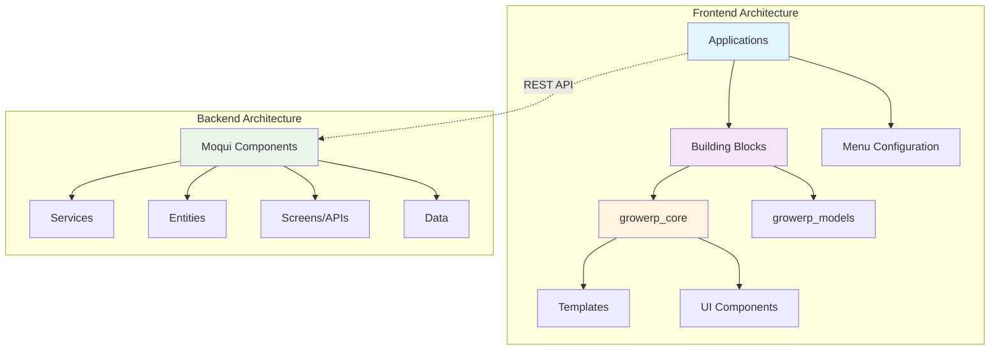

# GrowERP Extensibility Guide

## Overview

GrowERP is designed with extensibility at its core, using a modular architecture that allows developers to create custom applications and extend functionality through well-defined building blocks and configuration systems.

## Architecture Overview



## Table of Contents

1. [Frontend Extensibility](#frontend-extensibility)
   - [Building Blocks (growerp_* packages)](#building-blocks)
   - [Menu System Configuration](#menu-system)
   - [Template System](#template-system)
   - [Application Composition](#application-composition)

2. [Backend Extensibility](#backend-extensibility)
   - [Moqui Component Development](#moqui-components)
   - [Service Layer Extension](#service-layer)
   - [Data Model Extension](#data-model)
   - [API Development](#api-development)

3. [Integration Patterns](#integration-patterns)
   - [Frontend-Backend Communication](#communication)
   - [Security and Permissions](#security)
   - [State Management](#state-management)

4. [Examples and Best Practices](#examples)
   - [Real-world Extensions](#real-world)
   - [Development Guidelines](#guidelines)
   - [Testing Strategies](#testing)

---

## Frontend Extensibility

### Building Blocks (growerp_* packages) {#building-blocks}

GrowERP uses a modular package system where functionality is organized into reusable building blocks. Each package follows a consistent structure and naming convention.

#### Package Types

**Core Packages:**
- `growerp_core` - Foundation package with templates, UI components, and shared functionality
- `growerp_models` - Data models, entities, and API clients
- `growerp_chat` - Real-time chat functionality

**Domain Packages:**
- `growerp_catalog` - Product catalog management
- `growerp_inventory` - Inventory and warehouse management
- `growerp_order_accounting` - Orders, invoices, and accounting
- `growerp_user_company` - User and company management
- `growerp_marketing` - Marketing campaigns and analytics
- `growerp_website` - Website content management
- `growerp_activity` - Task and activity management

#### Package Structure

Each growerp_* package follows this structure:

```
growerp_example/
├── lib/
│   ├── src/
│   │   ├── models/          # Data models
│   │   ├── views/           # UI screens and widgets
│   │   ├── blocs/           # State management
│   │   └── services/        # API clients and business logic
│   └── growerp_example.dart # Public API exports
├── pubspec.yaml             # Dependencies and metadata
└── README.md               # Package documentation
```

#### Creating a New Building Block

1. **Initialize Package Structure:**
```yaml
# pubspec.yaml
name: growerp_custom
description: Custom functionality for GrowERP
version: 1.0.0
homepage: https://www.growerp.com
repository: https://github.com/growerp/growerp

environment:
  sdk: ">=3.8.0 <4.0.0"
  flutter: ">=3.32.0"

dependencies:
  flutter:
    sdk: flutter
  growerp_core: ^1.9.0      # Always required
  growerp_models: ^1.9.0    # Always required
  flutter_bloc: ^8.1.4      # For state management
  equatable: ^2.0.5         # For value equality
```

2. **Define Data Models:**
```dart
// lib/src/models/custom_model.dart
import 'package:equatable/equatable.dart';
import 'package:growerp_models/growerp_models.dart';

class CustomModel extends Equatable {
  final String id;
  final String name;
  final DateTime createdDate;

  const CustomModel({
    required this.id,
    required this.name,
    required this.createdDate,
  });

  @override
  List<Object?> get props => [id, name, createdDate];

  // JSON serialization
  factory CustomModel.fromJson(Map<String, dynamic> json) {
    return CustomModel(
      id: json['id'] ?? '',
      name: json['name'] ?? '',
      createdDate: DateTime.parse(json['createdDate']),
    );
  }

  Map<String, dynamic> toJson() {
    return {
      'id': id,
      'name': name,
      'createdDate': createdDate.toIso8601String(),
    };
  }
}
```

3. **Create BLoC for State Management:**
```dart
// lib/src/blocs/custom_bloc.dart
import 'package:flutter_bloc/flutter_bloc.dart';
import 'package:equatable/equatable.dart';
import '../models/custom_model.dart';

// Events
abstract class CustomEvent extends Equatable {
  const CustomEvent();
  @override
  List<Object> get props => [];
}

class CustomLoad extends CustomEvent {}

class CustomCreate extends CustomEvent {
  final CustomModel item;
  const CustomCreate(this.item);
  @override
  List<Object> get props => [item];
}

// States
abstract class CustomState extends Equatable {
  const CustomState();
  @override
  List<Object> get props => [];
}

class CustomInitial extends CustomState {}

class CustomLoading extends CustomState {}

class CustomLoaded extends CustomState {
  final List<CustomModel> items;
  const CustomLoaded(this.items);
  @override
  List<Object> get props => [items];
}

class CustomError extends CustomState {
  final String message;
  const CustomError(this.message);
  @override
  List<Object> get props => [message];
}

// BLoC
class CustomBloc extends Bloc<CustomEvent, CustomState> {
  CustomBloc() : super(CustomInitial()) {
    on<CustomLoad>(_onLoad);
    on<CustomCreate>(_onCreate);
  }

  void _onLoad(CustomLoad event, Emitter<CustomState> emit) async {
    emit(CustomLoading());
    try {
      // Load data from API
      final items = await _loadItems();
      emit(CustomLoaded(items));
    } catch (e) {
      emit(CustomError(e.toString()));
    }
  }

  void _onCreate(CustomCreate event, Emitter<CustomState> emit) async {
    // Implementation for creating items
  }

  Future<List<CustomModel>> _loadItems() async {
    // API call implementation
    return [];
  }
}
```

4. **Create UI Components:**
```dart
// lib/src/views/custom_list.dart
import 'package:flutter/material.dart';
import 'package:flutter_bloc/flutter_bloc.dart';
import 'package:growerp_core/growerp_core.dart';
import '../blocs/custom_bloc.dart';
import '../models/custom_model.dart';

class CustomList extends StatelessWidget {
  const CustomList({Key? key}) : super(key: key);

  @override
  Widget build(BuildContext context) {
    return BlocProvider(
      create: (context) => CustomBloc()..add(CustomLoad()),
      child: BlocBuilder<CustomBloc, CustomState>(
        builder: (context, state) {
          if (state is CustomLoading) {
            return const LoadingIndicator();
          }
          
          if (state is CustomError) {
            return Center(child: Text('Error: ${state.message}'));
          }
          
          if (state is CustomLoaded) {
            return ListView.builder(
              itemCount: state.items.length,
              itemBuilder: (context, index) {
                final item = state.items[index];
                return ListTile(
                  title: Text(item.name),
                  subtitle: Text(item.id),
                  onTap: () => _showDetail(context, item),
                );
              },
            );
          }
          
          return const SizedBox();
        },
      ),
    );
  }

  void _showDetail(BuildContext context, CustomModel item) {
    // Navigate to detail screen
  }
}
```

5. **Export Public API:**
```dart
// lib/growerp_custom.dart
library growerp_custom;

// Models
export 'src/models/custom_model.dart';

// BLoCs
export 'src/blocs/custom_bloc.dart';

// Views
export 'src/views/custom_list.dart';
```

### Menu System Configuration {#menu-system}

The menu system is the primary way users navigate through GrowERP applications. It's highly configurable and supports role-based access control.

#### Menu Structure

The menu system is defined in `flutter/packages/admin/lib/menu_options.dart` and consists of:

```dart
List<MenuOption> menuOptions = [
  MenuOption(
    image: 'packages/growerp_core/images/dashBoardGrey.png',
    selectedImage: 'packages/growerp_core/images/dashBoard.png',
    title: 'Main',
    route: '/',
    userGroups: [UserGroup.admin, UserGroup.employee],
    child: const AdminDbForm(),
  ),
  // More menu options...
];
```

#### MenuOption Properties

```dart
class MenuOption {
  final String image;              // Unselected state icon
  final String selectedImage;      // Selected state icon
  final String title;              // Display title
  final String route;              // Navigation route
  final List<UserGroup>? userGroups; // Access control
  final Widget? child;             // Simple page content
  final List<TabItem>? tabItems;   // Tabbed interface
}
```

#### TabItem Structure

For complex screens with multiple tabs:

```dart
TabItem(
  form: const ProductList(),           // Widget to display
  label: 'Products',                   // Tab label
  icon: const Icon(Icons.inventory),   // Tab icon
  floatButtonRoute: '/product/add',    // Optional: route for FAB
  floatButtonForm: ProductDialog(),    // Optional: dialog for FAB
  floatButtonArgs: {'mode': 'create'}, // Optional: FAB arguments
)
```

#### Creating Custom Menu Configurations

1. **Simple Menu Item:**
```dart
MenuOption(
  image: 'packages/growerp_core/images/customGrey.png',
  selectedImage: 'packages/growerp_core/images/custom.png',
  title: 'Custom Module',
  route: '/custom',
  userGroups: [UserGroup.admin],
  child: const CustomDashboard(),
)
```

2. **Tabbed Menu Item:**
```dart
MenuOption(
  image: 'packages/growerp_core/images/customGrey.png',
  selectedImage: 'packages/growerp_core/images/custom.png',
  title: 'Custom Module',
  route: '/custom',
  userGroups: [UserGroup.admin, UserGroup.employee],
  tabItems: [
    TabItem(
      form: const CustomList(),
      label: 'Items',
      icon: const Icon(Icons.list),
      floatButtonForm: const CustomDialog(),
    ),
    TabItem(
      form: const CustomReports(),
      label: 'Reports',
      icon: const Icon(Icons.analytics),
    ),
    TabItem(
      form: const CustomSettings(),
      label: 'Settings',
      icon: const Icon(Icons.settings),
    ),
  ],
)
```

3. **Role-Based Access:**
```dart
// Admin only
userGroups: [UserGroup.admin]

// Admin and employees
userGroups: [UserGroup.admin, UserGroup.employee]

// All authenticated users
userGroups: [UserGroup.admin, UserGroup.employee, UserGroup.customer]
```

### Template System {#template-system}

The template system provides consistent UI patterns and responsive layouts across all GrowERP applications.

#### Core Templates

Located in `flutter/packages/growerp_core/lib/src/templates/`:

1. **DisplayMenuOption** - Main template engine
2. **MyDrawerWidget** - Mobile navigation drawer
3. **MyNavigationRailWidget** - Desktop navigation rail
4. **AppBarTitle** - Consistent app bar styling
5. **ImageButtons** - Reusable button components

#### Template Features

**Responsive Design:**
- Automatic phone/tablet/desktop layout switching
- Navigation drawer for mobile
- Navigation rail for desktop
- Adaptive tab layouts

**Security Integration:**
- Automatic menu filtering based on user permissions
- Role-based UI element visibility
- Secure route handling

**State Management:**
- Integrated BLoC pattern support
- Automatic loading states
- Error handling and notifications

#### Customizing Templates

1. **Custom App Bar:**
```dart
// Create custom app bar title
Widget customAppBarTitle(BuildContext context, String title, bool isPhone) {
  return Row(
    children: [
      Image.asset('assets/custom_logo.png', height: 32),
      const SizedBox(width: 8),
      Text(
        title,
        style: Theme.of(context).textTheme.titleLarge?.copyWith(
          color: Theme.of(context).colorScheme.onPrimaryContainer,
        ),
      ),
    ],
  );
}
```

2. **Custom Navigation Drawer:**
```dart
Widget customDrawer(BuildContext context, bool isPhone, List<MenuOption> menuList) {
  return Drawer(
    child: Column(
      children: [
        // Custom header
        DrawerHeader(
          decoration: BoxDecoration(
            color: Theme.of(context).colorScheme.primary,
          ),
          child: const CustomLogo(),
        ),
        // Menu items
        Expanded(
          child: ListView.builder(
            itemCount: menuList.length,
            itemBuilder: (context, index) {
              return CustomMenuTile(menuList[index]);
            },
          ),
        ),
      ],
    ),
  );
}
```

### Application Composition {#application-composition}

Applications in GrowERP are composed by combining building blocks and configuring menus. This allows for rapid development of specialized applications.

#### Application Structure

```
admin/                    # Application package
├── lib/
│   ├── main.dart        # Application entry point
│   ├── menu_options.dart # Menu configuration
│   └── views/           # Application-specific views
├── pubspec.yaml         # Dependencies
└── assets/
    └── cfg/             # Configuration files
```

#### Application Dependencies

Applications depend on the building blocks they need:

```yaml
# admin/pubspec.yaml
dependencies:
  flutter:
    sdk: flutter
  growerp_core: ^1.9.0           # Always required
  growerp_models: ^1.9.0         # Always required
  growerp_catalog: ^1.9.0        # Product management
  growerp_inventory: ^1.9.0      # Inventory management
  growerp_order_accounting: ^1.9.0 # Orders and accounting
  growerp_user_company: ^1.9.0   # User management
  growerp_marketing: ^1.9.0      # Marketing features
  growerp_website: ^1.9.0        # Website management
  growerp_activity: ^1.8.1       # Activity tracking
```

#### Creating a Custom Application

1. **Create Application Structure:**
```bash
mkdir my_custom_app
cd my_custom_app
flutter create . --template=app
```

2. **Configure Dependencies:**
```yaml
# pubspec.yaml
name: my_custom_app
version: 1.0.0

dependencies:
  flutter:
    sdk: flutter
  growerp_core: ^1.9.0
  growerp_models: ^1.9.0
  growerp_catalog: ^1.9.0    # Include needed building blocks
  growerp_custom: ^1.0.0     # Your custom building block
```

3. **Configure Menu:**
```dart
// lib/menu_options.dart
import 'package:growerp_core/growerp_core.dart';
import 'package:growerp_catalog/growerp_catalog.dart';
import 'package:growerp_custom/growerp_custom.dart';

List<MenuOption> menuOptions = [
  MenuOption(
    image: 'packages/growerp_core/images/dashBoardGrey.png',
    selectedImage: 'packages/growerp_core/images/dashBoard.png',
    title: 'Dashboard',
    route: '/',
    userGroups: [UserGroup.admin, UserGroup.employee],
    child: const CustomDashboard(),
  ),
  MenuOption(
    image: 'packages/growerp_core/images/productsGrey.png',
    selectedImage: 'packages/growerp_core/images/products.png',
    title: 'Catalog',
    route: '/catalog',
    userGroups: [UserGroup.admin, UserGroup.employee],
    tabItems: [
      TabItem(
        form: const ProductList(),
        label: 'Products',
        icon: const Icon(Icons.inventory),
      ),
      TabItem(
        form: const CategoryList(),
        label: 'Categories',
        icon: const Icon(Icons.category),
      ),
    ],
  ),
  MenuOption(
    image: 'packages/growerp_core/images/customGrey.png',
    selectedImage: 'packages/growerp_core/images/custom.png',
    title: 'Custom Features',
    route: '/custom',
    userGroups: [UserGroup.admin],
    child: const CustomList(),
  ),
];
```

4. **Create Main Application:**
```dart
// lib/main.dart
import 'package:flutter/material.dart';
import 'package:growerp_core/growerp_core.dart';
import 'menu_options.dart';

void main() {
  runApp(const MyCustomApp());
}

class MyCustomApp extends StatelessWidget {
  const MyCustomApp({Key? key}) : super(key: key);

  @override
  Widget build(BuildContext context) {
    return GrowerpApp(
      title: 'My Custom App',
      menuOptions: menuOptions,
      classificationId: 'AppAdmin',
      chatEnabled: true,
      router: generateRoute,
    );
  }
}

// Route generation
Route<dynamic> generateRoute(RouteSettings settings) {
  switch (settings.name) {
    case '/':
      return MaterialPageRoute(
        builder: (context) => DisplayMenuOption(
          menuList: menuOptions,
          menuIndex: 0,
        ),
        settings: settings,
      );
    case '/catalog':
      return MaterialPageRoute(
        builder: (context) => DisplayMenuOption(
          menuList: menuOptions,
          menuIndex: 1,
        ),
        settings: settings,
      );
    case '/custom':
      return MaterialPageRoute(
        builder: (context) => DisplayMenuOption(
          menuList: menuOptions,
          menuIndex: 2,
        ),
        settings: settings,
      );
    default:
      return MaterialPageRoute(
        builder: (context) => const NotFoundPage(),
        settings: settings,
      );
  }
}
```

---

## Backend Extensibility

### Moqui Component Development {#moqui-components}

The backend uses Moqui Framework's component system for extensibility. Components are self-contained modules that can extend or override system functionality.

#### Component Structure

```
my_component/
├── component.xml           # Component definition
├── MoquiConf.xml          # Configuration
├── entity/                # Data model definitions
│   └── MyEntities.xml
├── service/               # Business logic services
│   └── MyServices.xml
├── screen/                # REST API definitions
│   └── MyScreens.xml
├── data/                  # Seed data
│   └── MyData.xml
└── template/              # Email/report templates
    └── MyTemplates.ftl
```

#### Component Definition

```xml
<!-- component.xml -->
<?xml version="1.0" encoding="UTF-8"?>
<component xmlns:xsi="http://www.w3.org/2001/XMLSchema-instance"
        xsi:noNamespaceSchemaLocation="http://moqui.org/xsd/moqui-conf-2.1.xsd"
        name="my-component" version="1.0.0">
    <depends-on name="growerp"/>
    <depends-on name="mantle-udm"/>
</component>
```

#### Creating a New Component

1. **Initialize Component:**
```bash
mkdir moqui/runtime/component/my-component
cd moqui/runtime/component/my-component
```

2. **Define Component:**
```xml
<!-- component.xml -->
<?xml version="1.0" encoding="UTF-8"?>
<component xmlns:xsi="http://www.w3.org/2001/XMLSchema-instance"
        xsi:noNamespaceSchemaLocation="http://moqui.org/xsd/moqui-conf-2.1.xsd"
        name="my-component" version="1.0.0">
    <depends-on name="growerp"/>
    <depends-on name="mantle-udm"/>
</component>
```

3. **Configure Component:**
```xml
<!-- MoquiConf.xml -->
<?xml version="1.0" encoding="UTF-8"?>
<moqui-conf xmlns:xsi="http://www.w3.org/2001/XMLSchema-instance"
        xsi:noNamespaceSchemaLocation="http://moqui.org/xsd/moqui-conf-2.1.xsd">
    
    <!-- Database configuration -->
    <entity-facade>
        <datasource group-name="transactional" database-conf-name="h2" 
                   schema-name="my_component"/>
    </entity-facade>
    
    <!-- Service configuration -->
    <service-facade>
        <service-location name="my.component" location="component://my-component/service"/>
    </service-facade>
    
    <!-- Screen configuration -->
    <screen-facade>
        <screen-location name="my.component" location="component://my-component/screen"/>
    </screen-facade>
    
</moqui-conf>
```

### Service Layer Extension {#service-layer}

Services contain business logic and are the primary way to extend backend functionality.

#### Service Definition

```xml
<!-- service/MyServices.xml -->
<?xml version="1.0" encoding="UTF-8"?>
<services xmlns:xsi="http://www.w3.org/2001/XMLSchema-instance"
        xsi:noNamespaceSchemaLocation="http://moqui.org/xsd/service-definition-2.1.xsd">

    <service verb="create" noun="CustomItem">
        <description>Create a new custom item</description>
        <in-parameters>
            <parameter name="name" required="true"/>
            <parameter name="description"/>
            <parameter name="categoryId"/>
        </in-parameters>
        <out-parameters>
            <parameter name="customItemId"/>
        </out-parameters>
        <actions>
            <!-- Validation -->
            <if condition="!name">
                <return error="true" message="Name is required"/>
            </if>
            
            <!-- Create entity -->
            <service-call name="create#CustomItem" out-map="context">
                <field-map field-name="customItemId" from="ec.entity.sequencedIdPrimary"/>
                <field-map field-name="name" from="name"/>
                <field-map field-name="description" from="description"/>
                <field-map field-name="categoryId" from="categoryId"/>
                <field-map field-name="createdDate" from="ec.user.nowTimestamp"/>
            </service-call>
            
            <!-- Log activity -->
            <service-call name="growerp.100.GeneralServices100.createActivity">
                <field-map field-name="activityTypeEnumId" value="CUSTOM_CREATED"/>
                <field-map field-name="description" value="Created custom item: ${name}"/>
            </service-call>
        </actions>
    </service>

    <service verb="update" noun="CustomItem">
        <description>Update an existing custom item</description>
        <in-parameters>
            <parameter name="customItemId" required="true"/>
            <parameter name="name"/>
            <parameter name="description"/>
            <parameter name="categoryId"/>
        </in-parameters>
        <actions>
            <!-- Get existing record -->
            <entity-find-one entity-name="CustomItem" value-field="customItem">
                <field-map field-name="customItemId" from="customItemId"/>
            </entity-find-one>
            
            <if condition="!customItem">
                <return error="true" message="Custom item not found"/>
            </if>
            
            <!-- Update entity -->
            <service-call name="update#CustomItem">
                <field-map field-name="customItemId" from="customItemId"/>
                <field-map field-name="name" from="name ?: customItem.name"/>
                <field-map field-name="description" from="description ?: customItem.description"/>
                <field-map field-name="categoryId" from="categoryId ?: customItem.categoryId"/>
                <field-map field-name="lastUpdatedStamp" from="ec.user.nowTimestamp"/>
            </service-call>
        </actions>
    </service>

    <service verb="get" noun="CustomItemList">
        <description>Get list of custom items</description>
        <in-parameters>
            <parameter name="categoryId"/>
            <parameter name="pageIndex" type="Integer" default="0"/>
            <parameter name="pageSize" type="Integer" default="20"/>
        </in-parameters>
        <out-parameters>
            <parameter name="customItemList" type="List"/>
            <parameter name="customItemListCount" type="Integer"/>
        </out-parameters>
        <actions>
            <entity-find entity-name="CustomItem" list="customItemList">
                <search-form-inputs default-order-by="name"/>
                <econdition field-name="categoryId" from="categoryId" ignore-if-empty="true"/>
            </entity-find>
            
            <set field="customItemListCount" from="customItemList.size()"/>
        </actions>
    </service>

</services>
```

### Data Model Extension {#data-model}

Entities define the data model and relationships between different data types.

#### Entity Definition

```xml
<!-- entity/MyEntities.xml -->
<?xml version="1.0" encoding="UTF-8"?>
<entities xmlns:xsi="http://www.w3.org/2001/XMLSchema-instance"
        xsi:noNamespaceSchemaLocation="http://moqui.org/xsd/entity-definition-2.1.xsd">

    <entity entity-name="CustomItem" package="my.component">
        <description>Custom item entity</description>
        <field name="customItemId" type="id" is-pk="true"/>
        <field name="name" type="text-medium"/>
        <field name="description" type="text-long"/>
        <field name="categoryId" type="id"/>
        <field name="statusId" type="id"/>
        <field name="createdDate" type="date-time"/>
        <field name="lastUpdatedStamp" type="date-time"/>
        
        <!-- Relationships -->
        <relationship type="one" related="moqui.basic.StatusItem">
            <key-map field-name="statusId"/>
        </relationship>
        <relationship type="one" related="growerp.Category" short-alias="category">
            <key-map field-name="categoryId"/>
        </relationship>
        
        <!-- Indexes -->
        <index name="CUSTOM_ITEM_NAME" unique="false">
            <index-field name="name"/>
        </index>
        <index name="CUSTOM_ITEM_CATEGORY" unique="false">
            <index-field name="categoryId"/>
        </index>
    </entity>

    <entity entity-name="CustomItemAttribute" package="my.component">
        <description>Custom item attributes</description>
        <field name="customItemId" type="id" is-pk="true"/>
        <field name="attributeName" type="text-short" is-pk="true"/>
        <field name="attributeValue" type="text-long"/>
        
        <relationship type="one" related="my.component.CustomItem">
            <key-map field-name="customItemId"/>
        </relationship>
    </entity>

    <!-- View entity for reporting -->
    <view-entity entity-name="CustomItemDetail" package="my.component">
        <description>Custom item with category details</description>
        <member-entity entity-alias="CI" entity-name="my.component.CustomItem"/>
        <member-entity entity-alias="CAT" entity-name="growerp.Category" join-from-alias="CI">
            <key-map field-name="categoryId"/>
        </member-entity>
        
        <alias-all entity-alias="CI"/>
        <alias entity-alias="CAT" name="categoryName" field="categoryName"/>
        <alias entity-alias="CAT" name="categoryDescription" field="description"/>
    </view-entity>

</entities>
```

### API Development {#api-development}

REST APIs are defined using Moqui's screen system, providing automatic JSON serialization and authentication.

#### REST API Definition

```xml
<!-- screen/rest.xml -->
<?xml version="1.0" encoding="UTF-8"?>
<screen xmlns:xsi="http://www.w3.org/2001/XMLSchema-instance"
        xsi:noNamespaceSchemaLocation="http://moqui.org/xsd/xml-screen-2.1.xsd"
        require-authentication="true" allow-extra-path="true">

    <subscreens default-item="CustomItems"/>

    <subscreen name="CustomItems" location="component://my-component/screen/CustomItems.xml"/>

</screen>
```

```xml
<!-- screen/CustomItems.xml -->
<?xml version="1.0" encoding="UTF-8"?>
<screen xmlns:xsi="http://www.w3.org/2001/XMLSchema-instance"
        xsi:noNamespaceSchemaLocation="http://moqui.org/xsd/xml-screen-2.1.xsd"
        require-authentication="true" allow-extra-path="true">

    <parameter name="customItemId"/>

    <transition name="createCustomItem" method="post">
        <service-call name="my.component.CustomServices.create#CustomItem"/>
        <default-response type="screen-path" save-parameters="true"/>
        <error-response type="screen-path" save-parameters="true"/>
    </transition>

    <transition name="updateCustomItem" method="put">
        <service-call name="my.component.CustomServices.update#CustomItem"/>
        <default-response type="screen-path" save-parameters="true"/>
        <error-response type="screen-path" save-parameters="true"/>
    </transition>

    <transition name="deleteCustomItem" method="delete">
        <service-call name="delete#my.component.CustomItem"/>
        <default-response type="screen-path" save-parameters="true"/>
        <error-response type="screen-path" save-parameters="true"/>
    </transition>

    <actions>
        <if condition="customItemId">
            <!-- Get single item -->
            <entity-find-one entity-name="my.component.CustomItemDetail" value-field="customItem">
                <field-map field-name="customItemId" from="customItemId"/>
            </entity-find-one>
            <script>ec.web.sendJsonResponse(customItem)</script>
        <else>
            <!-- Get list of items -->
            <service-call name="my.component.CustomServices.get#CustomItemList" out-map="context"/>
            <script>ec.web.sendJsonResponse([customItemList: customItemList, customItemListCount: customItemListCount])</script>
        </if>
    </actions>

</screen>
```

---

## Integration Patterns

### Frontend-Backend Communication {#communication}

GrowERP uses a standardized REST API pattern for frontend-backend communication.

#### API Client Pattern

```dart
// lib/src/services/custom_api_client.dart
import 'package:dio/dio.dart';
import 'package:growerp_models/growerp_models.dart';
import '../models/custom_model.dart';

class CustomApiClient {
  final Dio _dio;
  final String _baseUrl;

  CustomApiClient(this._dio, this._baseUrl);

  Future<List<CustomModel>> getCustomItems({
    String? categoryId,
    int pageIndex = 0,
    int pageSize = 20,
  }) async {
    try {
      final response = await _dio.get(
        '$_baseUrl/rest/s1/my-component/CustomItems',
        queryParameters: {
          if (categoryId != null) 'categoryId': categoryId,
          'pageIndex': pageIndex,
          'pageSize': pageSize,
        },
      );

      final data = response.data as Map<String, dynamic>;
      final items = data['customItemList'] as List;
      
      return items.map((item) => CustomModel.fromJson(item)).toList();
    } catch (e) {
      throw ApiException('Failed to load custom items: $e');
    }
  }

  Future<CustomModel> createCustomItem(CustomModel item) async {
    try {
      final response = await _dio.post(
        '$_baseUrl/rest/s1/my-component/CustomItems/createCustomItem',
        data: item.toJson(),
      );

      return CustomModel.fromJson(response.data);
    } catch (e) {
      throw ApiException('Failed to create custom item: $e');
    }
  }

  Future<CustomModel> updateCustomItem(CustomModel item) async {
    try {
      final response = await _dio.put(
        '$_baseUrl/rest/s1/my-component/CustomItems/updateCustomItem',
        data: item.toJson(),
      );

      return CustomModel.fromJson(response.data);
    } catch (e) {
      throw ApiException('Failed to update custom item: $e');
    }
  }

  Future<void> deleteCustomItem(String customItemId) async {
    try {
      await _dio.delete(
        '$_baseUrl/rest/s1/my-component/CustomItems/deleteCustomItem',
        queryParameters: {'customItemId': customItemId},
      );
    } catch (e) {
      throw ApiException('Failed to delete custom item: $e');
    }
  }
}
```

### Security and Permissions {#security}

GrowERP implements role-based access control at both frontend and backend levels.

#### Frontend Security

```dart
// Role-based menu filtering
MenuOption(
  title: 'Admin Only Feature',
  route: '/admin-feature',
  userGroups: [UserGroup.admin], // Only admins can see this
  child: const AdminFeature(),
)

// Conditional UI elements
BlocBuilder<AuthBloc, AuthState>(
  builder: (context, state) {
    final user = state.authenticate?.user;
    final isAdmin = user?.userGroup == UserGroup.admin;
    
    return Column(
      children: [
        const RegularContent(),
        if (isAdmin) const AdminOnlyWidget(),
      ],
    );
  },
)
```

#### Backend Security

```xml
<!-- Service-level security -->
<service verb="delete" noun="CustomItem">
    <description>Delete custom item (admin only)</description>
    <in-parameters>
        <parameter name="customItemId" required="true"/>
    </in-parameters>
    <actions>
        <!-- Check permissions -->
        <if condition="!ec.user.hasPermission('CUSTOM_ADMIN')">
            <return error="true" message="Permission denied"/>
        </if>
        
        <service-call name="delete#my.component.CustomItem">
            <field-map field-name="customItemId" from="customItemId"/>
        </service-call>
    </actions>
</service>
```

### State Management {#state-management}

GrowERP uses the BLoC pattern for consistent state management across all components.

#### BLoC Integration Pattern

```dart
// Repository pattern for data access
class CustomRepository {
  final CustomApiClient _apiClient;
  
  CustomRepository(this._apiClient);
  
  Future<List<CustomModel>> getItems() => _apiClient.getCustomItems();
  Future<CustomModel> createItem(CustomModel item) => _apiClient.createCustomItem(item);
  Future<CustomModel> updateItem(CustomModel item) => _apiClient.updateCustomItem(item);
  Future<void> deleteItem(String id) => _apiClient.deleteCustomItem(id);
}

// BLoC with repository
class CustomBloc extends Bloc<CustomEvent, CustomState> {
  final CustomRepository _repository;
  
  CustomBloc(this._repository) : super(CustomInitial()) {
    on<CustomLoad>(_onLoad);
    on<CustomCreate>(_onCreate);
    on<CustomUpdate>(_onUpdate);
    on<CustomDelete>(_onDelete);
  }
  
  void _onLoad(CustomLoad event, Emitter<CustomState> emit) async {
    emit(CustomLoading());
    try {
      final items = await _repository.getItems();
      emit(CustomLoaded(items));
    } catch (e) {
      emit(CustomError(e.toString()));
    }
  }
  
  // Other event handlers...
}
```

---

## Examples and Best Practices

### Real-world Extensions {#real-world}

#### Hotel Application Example

The hotel application demonstrates how to create a specialized application:

```dart
// Hotel-specific menu configuration
List<MenuOption> hotelMenuOptions = [
  MenuOption(
    image: 'packages/growerp_core/images/dashBoardGrey.png',
    selectedImage: 'packages/growerp_core/images/dashBoard.png',
    title: 'Dashboard',
    route: '/',
    userGroups: [UserGroup.admin, UserGroup.employee],
    child: const HotelDashboard(),
  ),
  MenuOption(
    image: 'packages/growerp_core/images/roomsGrey.png',
    selectedImage: 'packages/growerp_core/images/rooms.png',
    title: 'Rooms',
    route: '/rooms',
    userGroups: [UserGroup.admin, UserGroup.employee],
    tabItems: [
      TabItem(
        form: const RoomList(),
        label: 'Rooms',
        icon: const Icon(Icons.hotel),
        floatButtonForm: const RoomDialog(),
      ),
      TabItem(
        form: const RoomTypeList(),
        label: 'Room Types',
        icon: const Icon(Icons.category),
      ),
    ],
  ),
  MenuOption(
    image: 'packages/growerp_core/images/bookingGrey.png',
    selectedImage: 'packages/growerp_core/images/booking.png',
    title: 'Bookings',
    route: '/bookings',
    userGroups: [UserGroup.admin, UserGroup.employee],
    child: const BookingList(),
  ),
];
```

#### Freelance Application Example

The freelance application shows domain-specific customization:

```dart
// Freelance-specific building blocks
dependencies:
  growerp_core: ^1.9.0
  growerp_models: ^1.9.0
  growerp_user_company: ^1.9.0  # Client management
  growerp_activity: ^1.8.1      # Task tracking
  growerp_order_accounting: ^1.9.0 # Invoicing
  # No inventory or catalog needed
```

### Development Guidelines {#guidelines}

#### Package Development Best Practices

1. **Naming Conventions:**
   - Use `growerp_` prefix for building blocks
   - Use descriptive domain names (e.g., `growerp_hotel`, `growerp_medical`)
   - Follow Dart package naming conventions

2. **Dependency Management:**
   - Always depend on `growerp_core` and `growerp_models`
   - Minimize dependencies between domain packages
   - Use semantic versioning

3. **Code Organization:**
   - Separate models, views, BLoCs, and services
   - Export only public APIs
   - Include comprehensive documentation

4. **Testing Strategy:**
   - Unit tests for BLoCs and services
   - Widget tests for UI components
   - Integration tests for complete workflows

#### Backend Development Best Practices

1. **Component Structure:**
   - Follow Moqui conventions
   - Use clear naming for entities and services
   - Document all services and entities

2. **Data Modeling:**
   - Use appropriate field types
   - Define proper relationships
   - Include necessary indexes

3. **Service Design:**
   - Validate input parameters
   - Handle errors gracefully
   - Log important activities

4. **API Design:**
   - Use RESTful conventions
   - Provide consistent error responses
   - Include proper authentication

### Testing Strategies {#testing}

#### Frontend Testing

```dart
// BLoC testing example
void main() {
  group('CustomBloc', () {
    late CustomBloc customBloc;
    late MockCustomRepository mockRepository;

    setUp(() {
      mockRepository = MockCustomRepository();
      customBloc = CustomBloc(mockRepository);
    });

    blocTest<CustomBloc, CustomState>(
      'emits [CustomLoading, CustomLoaded] when CustomLoad is added',
      build: () {
        when(() => mockRepository.getItems())
            .thenAnswer((_) async => [testCustomItem]);
        return customBloc;
      },
      act: (bloc) => bloc.add(CustomLoad()),
      expect: () => [
        CustomLoading(),
        CustomLoaded([testCustomItem]),
      ],
    );
  });
}
```

#### Backend Testing

```xml
<!-- Test data for services -->
<entity-facade-xml type="seed">
    <CustomItem customItemId="TEST_ITEM_1" name="Test Item" 
                description="Test Description" categoryId="TEST_CAT_1"/>
</entity-facade-xml>

<!-- Service test -->
<simple-method method-name="testCreateCustomItem">
    <call-service service-name="my.component.CustomServices.create#CustomItem">
        <field-map field-name="name" value="Test Item"/>
        <field-map field-name="description" value="Test Description"/>
    </call-service>
    <assert>
        <condition>
            <not><if-empty field="customItemId"/></not>
        </condition>
        <fail-message message="Custom item ID should be generated"/>
    </assert>
</simple-method>
```

---

## Conclusion

GrowERP's extensibility system provides a powerful foundation for building custom business applications. The modular architecture allows developers to:

- **Reuse building blocks** across different applications
- **Customize menus and navigation** for specific use cases
- **Extend backend functionality** through Moqui components
- **Maintain consistency** through shared templates and patterns

This guide provides the foundation for extending GrowERP. For specific implementation details, refer to the existing packages and components in the codebase.

## Additional Resources

- [GrowERP GitHub Repository](https://github.com/growerp/growerp)
- [Moqui Framework Documentation](https://www.moqui.org/docs)
- [Flutter BLoC Documentation](https://bloclibrary.dev/)
- [Dart Package Development](https://dart.dev/guides/libraries/create-library-packages)
