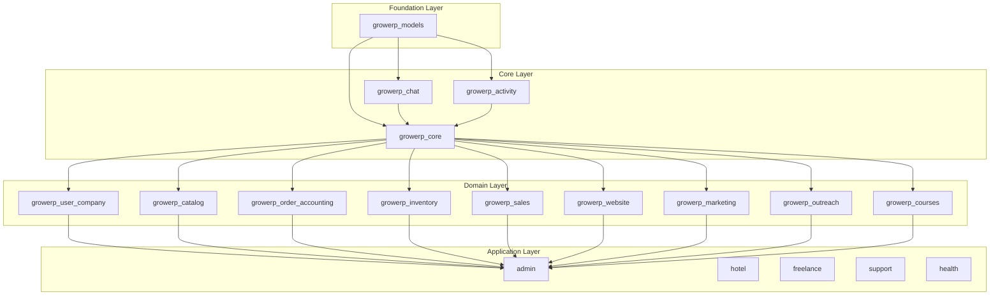

# GrowERP Package Organization & UI Redesign Implementation Order

This document describes how the Flutter packages are organized in GrowERP and serves as the implementation order reference for the UI redesign.

## Package Architecture Overview

GrowERP uses a **modular, composable architecture** with two types of packages:

1. **Building Block Packages** (`growerp_*`) - Domain-specific, relatively independent modules
2. **Application Packages** - Deployable apps that compose building blocks



---

## Building Block Packages

### Foundation Layer

#### `growerp_models`
- **Description**: Data models and Moqui backend REST interface
- **Dependencies**: No GrowERP dependencies (standalone)
- **Contents**: Freezed models, API clients, JSON serialization
- **Role**: Defines all data structures shared across packages

### Core Layer

#### `growerp_core`
- **Description**: Core of the GrowERP frontend
- **Dependencies**: `growerp_models`, `growerp_chat`, `growerp_activity`
- **Contents**: 
  - Authentication and authorization
  - Theme and styling utilities
  - Shared widgets and templates
  - Navigation and routing (go_router)
  - Common BLoCs and state management patterns
- **Role**: Provides shared infrastructure for all domain packages

#### `growerp_chat`
- **Description**: Internal chat within the GrowERP system
- **Dependencies**: `growerp_core`, `growerp_models`
- **Contents**: Chat rooms, messaging, real-time communication
- **Role**: Enables in-app communication between users

#### `growerp_activity`
- **Description**: Activity, task, and event management
- **Dependencies**: `growerp_core`, `growerp_models`
- **Contents**: Tasks, events, workflow management, activity logging
- **Role**: Manages internal activities and task workflows

### Domain Layer

| Package | Description | Key Features |
|---------|-------------|--------------|
| `growerp_user_company` | User and company management | Users, roles, companies, multi-tenancy |
| `growerp_catalog` | Product catalog | Products, categories, assets, pricing |
| `growerp_order_accounting` | Orders and accounting | Orders, invoices, payments, ledger |
| `growerp_inventory` | Inventory/warehouse | Stock, locations, movements |
| `growerp_sales` | Sales/marketing functions | Sales pipeline, opportunities |
| `growerp_website` | Website management | Content pages, CMS, website builder |
| `growerp_marketing` | Assessment and lead scoring | Lead scoring, assessments |
| `growerp_outreach` | Campaign management | Multi-platform outreach campaigns |
| `growerp_courses` | Course management | AI-powered course content |

---

## Application Packages

Applications are **compositions** of building blocks tailored for specific use cases.

| Application | Description | Building Blocks Used |
|-------------|-------------|---------------------|
| **admin** | Full ERP administration | All domain packages |
| **hotel** | Hotel management | core, user_company, catalog, order_accounting, inventory, sales, website, activity |
| **freelance** | Freelancer/consultant | core, user_company, catalog, order_accounting, inventory, sales, website, marketing, outreach, activity |
| **support** | System support | core, user_company, activity |
| **health** | Healthcare management | core, user_company, + healthcare-specific |

---

## UI Redesign Implementation Order

The redesign follows the dependency graph from foundation to top-level packages:

### Phase 1: Foundation & Core (Priority: Highest)

| Order | Package | Rationale |
|-------|---------|-----------|
| 1 | `growerp_core` | All packages depend on core styling, widgets, and themes |
| 2 | `growerp_chat` | Tightly integrated with core |
| 3 | `growerp_activity` | Tightly integrated with core |

> [!IMPORTANT]
> Core must be redesigned first as it defines the design system (themes, colors, typography, shared components) that all other packages inherit.

### Phase 2: User & Company Management

| Order | Package | Rationale |
|-------|---------|-----------|
| 4 | `growerp_user_company` | User-facing UI, authentication flows, company setup |

### Phase 3: Catalog & Commerce

| Order | Package | Rationale |
|-------|---------|-----------|
| 5 | `growerp_catalog` | Product management, core business data |
| 6 | `growerp_order_accounting` | Orders, invoices - high usage screens |
| 7 | `growerp_inventory` | Warehouse and stock management |

### Phase 4: Sales & Marketing

| Order | Package | Rationale |
|-------|---------|-----------|
| 8 | `growerp_sales` | Sales pipeline and opportunities |
| 9 | `growerp_marketing` | Lead scoring and assessments |
| 10 | `growerp_outreach` | Campaign management |

### Phase 5: Content & Specialized

| Order | Package | Rationale |
|-------|---------|-----------|
| 11 | `growerp_website` | Content management, website builder |
| 12 | `growerp_courses` | Course content (newer, lower priority) |

### Phase 6: Application Integration

| Order | Application | Notes |
|-------|-------------|-------|
| 13 | admin | Full integration of all redesigned packages |
| 14 | hotel | Validate hotel-specific workflows |
| 15 | freelance | Validate freelancer workflows |
| 16 | support | Minimal UI, quick update |
| 17 | health | Healthcare-specific validation |

---

## Package Dependency Summary

```
growerp_models (foundation - no deps)
    └── growerp_core
        ├── growerp_chat
        ├── growerp_activity
        └── [All domain packages]
            └── [All applications]
```

Each domain package (`growerp_user_company`, `growerp_catalog`, etc.) depends on:
- `growerp_core`
- `growerp_models`

Each application depends on:
- A selection of domain packages based on its use case
- All transitive dependencies are resolved via core

---

## Key Design Principles for Redesign

1. **Design Tokens in Core**: All colors, typography, spacing, and animation curves should be defined in `growerp_core`
2. **Component Library**: Shared components (buttons, cards, forms, tables) in `growerp_core`
3. **Package Independence**: Domain packages should not depend on each other directly
4. **Consistent Patterns**: Each package uses BLoC for state management
5. **Responsive Design**: All packages use `responsive_framework` from core
