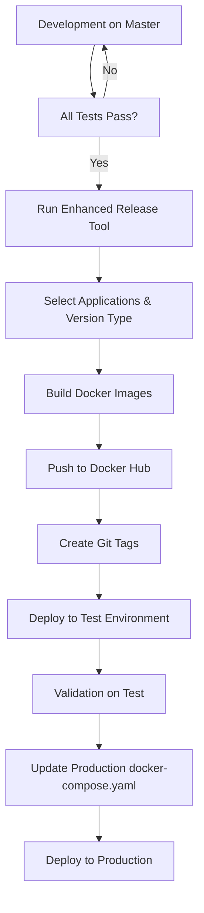
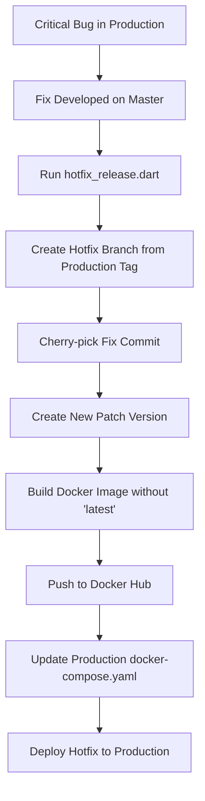

# GrowERP Version Management and Release Process

**Subject: Streamlining Our Releases: A Look at GrowERP's New Version Management Process**

Hello Team,

To enhance the stability and efficiency of our release cycle, we are formalizing our version management strategy. This process is designed to ensure our `master` branch remains a reliable source for releases while allowing us to address urgent production issues without disrupting development.

This newsletter outlines our standard release procedure and the new, structured process for deploying hotfixes.

---

## **The Standard Release Process: Master as the Single Source of Truth**

Our core philosophy is that the `master` branch is the single point of truth and should always be a candidate for the next release. All new features, updates, and bug fixes are ultimately merged into `master`.

Our release cycle follows these steps:

### 1. Verification
Before a new release is initiated, we ensure all automated integration tests are passing on the `master` branch. This is a critical quality gate.

### 2. Tagging and Versioning
Once verified, a new release is prepared using the enhanced **GrowERP Release Tool**. This tool automatically assigns and increments the necessary tag numbers and versions for all applications and the backend.

The release tool can be found at `flutter/release/release.sh` and provides:
- Interactive application selection
- Flexible version increment options (patch, minor, major)
- Automated Docker image building and tagging
- Git repository management and tagging
- Both local and repository workspace modes

### 3. Staging Deployment
The newly versioned Docker images are deployed to our test environment. It's important to note that our test systems are configured to use the `latest` images to ensure we are always testing the most recent code.

### 4. Production Deployment
After the release is validated on the test system, the production `docker-compose.yaml` file is updated with the specific, newly created version tags. The production system is then updated by running `docker-compose up -d`. This ensures our production environment runs on a stable, specific version, not on `latest`.

---

## **Handling Urgent Issues: The Hotfix Procedure**

Occasionally, a critical, blocking error is discovered in production that must be fixed immediately. If the `master` branch contains unstable, in-progress features, we cannot deploy it directly. For this scenario, we use a "hotfix" process.

### 1. Fix on Master
The required fix is first developed, tested, and merged into the `master` branch as usual.

### 2. Isolate the Fix
The `hotfix.sh` script is then used to apply this specific fix to the production version. The script automates the following:

- It checks out the exact version currently in production by its tag, creating a temporary `production` branch if one doesn't already exist.
- It "cherry-picks" the specific commit containing the fix from `master` and applies it to this branch.
- It creates a new Docker image and a new tag with an incremented **patch number** (e.g., `v2.5.1` becomes `v2.5.2`).
- Crucially, the `latest` tag is **not** updated, ensuring that ongoing development and testing on the main branch are not interrupted.

### 3. Deploy Hotfix
After a few targeted local tests on the hotfix branch, the production `docker-compose.yaml` is updated with the new patch tag, and the system is restarted.

---

## **How Does This Compare to Standard Practices?**

Our approach is a pragmatic and effective form of **Trunk-Based Development (TBD)**. In TBD, all developers contribute to a single main branch (our `master`), which is expected to be kept in a constantly releasable state. This is why our investment in a comprehensive automated test suite is so critical.

This model is simpler and often faster than more complex strategies like **GitFlow**, which involves multiple long-lived branches (`develop`, `release`, `hotfix`, etc.). By focusing on a single `master` branch, we reduce complexity and speed up the development-to-release cycle.

Our hotfix script provides a safety valve, giving us the structured control of a more complex model when we need it (isolating a production fix) without carrying the overhead all the time.

### Key Benefits

1. **Simplicity**: Single main branch reduces complexity
2. **Speed**: Faster development-to-release cycle
3. **Reliability**: Master branch always release-ready
4. **Safety**: Hotfix process provides controlled production fixes
5. **Stability**: Production runs on specific versions, not latest

---

## **Tools and Scripts**

### Standard Release Tools

- **`flutter/release.sh`**: Enhanced production release tool with interactive interface
- **`flutter/release/release_tool.dart`**: Core release automation script
- **`flutter/release/release_config.json`**: Configurable release settings
- **Integration Tests**: Automated quality gate before releases
- **Docker Compose**: Production deployment management

#### Enhanced Release Tool Features
- **Interactive Selection**: Choose specific applications to build
- **Version Management**: Patch, minor, and major version increments
- **Workspace Modes**: Local development vs repository-based releases
- **Docker Integration**: Automated image building with proper tagging
- **Configuration**: JSON-based settings with sensible defaults
- **Validation**: Comprehensive environment and dependency checks

For detailed usage instructions, see the [Release Tool Documentation](../flutter/release/README.md).

### Hotfix Tools

- **`flutter/hotfix/hotfix_release.dart`**: Automated hotfix workflow
- **`flutter/hotfix/hotfix_release.sh`**: Bash wrapper with environment validation
- **Cherry-pick Process**: Selective commit application to production branches

For detailed information about the hotfix process, see the [Hotfix Documentation](../flutter/hotfix/README.md).

---

## **Workflow Diagrams**

### Standard Release Flow

### Hotfix Flow

---

We believe this streamlined process provides the right balance of speed and stability for GrowERP. If you have any questions, please don't hesitate to reach out.

Best,
The GrowERP Team