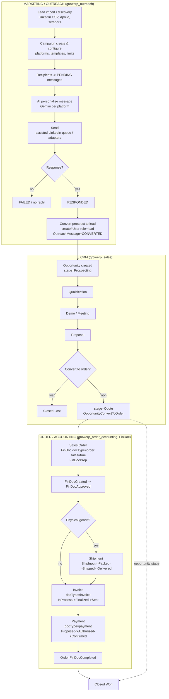

# GrowERP Marketing & Sales Process Flow

End-to-end flow from lead generation (outreach/marketing) through CRM, order,
fulfillment, invoicing and payment. Implemented across `growerp_outreach`,
`growerp_sales`, `growerp_order_accounting` (Flutter) and the Moqui `growerp`
backend.

## High-level flow

## Stage detail

### Marketing / Outreach
| Stage | Screen / Service | BLoC / event | REST -> backend service | Entity / status |
|---|---|---|---|---|
| Lead import | `growerp_outreach/.../screens/linkedin_lead_import_dialog.dart` | manual upload | `POST ImportExport/companyUsers` -> `import#CompanyUsers` | `User(role=lead)` + `Company` |
| Campaign create | `.../screens/campaign_detail_screen.dart` | `OutreachCampaignBloc` / `OutreachCampaignCreate` | `POST OutreachCampaign` -> `create#OutreachCampaign` | `MarketingCampaign` PLANNED |
| Recipients | campaign_detail_screen / orchestrator | programmatic | `POST OutreachRecipients` -> `import#OutreachRecipients` | `OutreachMessage` PENDING |
| Personalize | backend | — | `POST generate#PlatformMessage` (GeminiAiUtil) | `OutreachMessage.messageContent` |
| Send | `.../screens/linkedin_send_queue_screen.dart` + adapters | `OutreachMessageBloc` | `PATCH OutreachMessage` -> `update#OutreachMessageStatus` | PENDING -> SENT |
| Respond | send queue | `OutreachMessageBloc` | `PATCH OutreachMessage` | SENT -> RESPONDED |
| Convert | `.../services/campaign_automation_service.dart` | — | `POST User` + `PATCH OutreachMessage` | `User(role=lead)`, msg CONVERTED + `convertedPartyId` |

### CRM (Opportunity)
- File: `growerp_sales/lib/src/opportunities/` (`opportunity_bloc.dart`, `opportunity_dialog.dart`).
- Backend: `backend/service/growerp/100/CrmServices100.xml`, entity `mantle.sales.opportunity.SalesOpportunity`.
- Stages: Prospecting -> Qualification -> Demo/Meeting -> Proposal -> Quote -> Closed Won / Closed Lost.
- `OpportunityConvertToOrder` creates a sales-order FinDoc from `estAmount`, `leadUser`, `leadUser.company`; sets stage=Quote.

### Order / Accounting (unified FinDoc)
- File: `growerp_order_accounting/lib/src/findoc/` (`fin_doc_bloc.dart`, `findoc_dialog.dart`).
- Backend: `backend/service/growerp/100/FinDocServices100.xml`.
- One `FinDoc` model covers order / shipment / invoice / payment via `docType` + `sales` flag.
- Unified status: FinDocPrep -> FinDocCreated -> FinDocApproved -> FinDocCompleted (or FinDocCancelled).
  - order: Prep/Created/Approved/Completed
  - shipment: ShipInput -> Scheduled -> Packed -> Shipped -> Delivered
  - invoice: InProcess -> Finalized -> Sent -> PmtRecvd
  - payment: Proposed -> Promised -> Authorized -> Delivered -> Confirmed (gateway via `GatewayPayment`)

## Handoff
Outreach `convertProspectToLead` -> `User(role=lead)` is the boundary; caller then
opens an `Opportunity(stage=Prospecting)` against that `partyId`, after which the CRM
and FinDoc pipeline drives the deal to Closed Won + payment.

## Key files
- Outreach entities/services: `backend/entity/OutreachEntities.xml`, `backend/service/growerp/100/OutreachServices100.xml`
- CRM: `backend/service/growerp/100/CrmServices100.xml`
- FinDoc: `backend/service/growerp/100/FinDocServices100.xml`
- REST contracts: `flutter/packages/growerp_models/lib/src/rest_client.dart`
