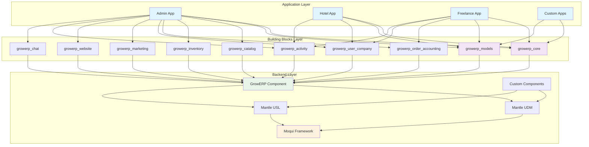

# GrowERP Extensibility Documentation

This directory contai8. **[WebSocket No10. # GrowERP Extensibility Documentation

This directory contains comprehensive documentation for extending GrowERP through its modular architecture. GrowERP is designed with extensibility at its core, allowing developers to create custom applications and extend functionality through well-defined building blocks and configuration systems.

## Documentation Overview

### 📚 Main Guides

1. **[GrowERP Extensibility Guide](./GrowERP_Extensibility_Guide.md)**
   - Complete overview of GrowERP's extensibility architecture
   - Frontend and backend extensibility patterns
   - Integration patterns and security
   - Examples and best practices

2. **[Building Blocks Development Guide](./Building_Blocks_Development_Guide.md)**
   - Detailed guide for creating Flutter packages (growerp_* packages)
   - Package structure and development patterns
   - State management with BLoC
   - UI components and testing strategies

### 🚀 Release & Version Management

3. **[Version Management and Release Process](./GrowERP_Version_Management_and_Release_Process.md)**
   - Comprehensive guide to GrowERP's release strategy and version management
   - Standard release process with master branch as single source of truth
   - Hotfix procedure for urgent production fixes
   - Trunk-based development methodology and best practices
   - Enhanced release tooling: [Release Tool Documentation](../flutter/release/README.md)

### 🎨 Design & Development Patterns

4. **[GrowERP Design Patterns](./GrowERP_Design_Patterns.md)**
   - Comprehensive design patterns for consistent development
   - BLoC state management patterns
   - UI component patterns and form handling
   - Testing patterns and data model conventions

5. **[GrowERP Code Templates](./GrowERP_Code_Templates.md)**
   - Ready-to-use code templates for rapid development
   - BLoC, UI component, and test templates
   - Model and API integration templates
   - Quick generation commands and examples

6. **[GrowERP AI Development Instructions](./GrowERP_AI_Instructions.md)**
   - Comprehensive guide for AI-assisted development
   - Code quality standards and best practices
   - Anti-patterns to avoid and quality checklists
   - Integration guidelines for AI coding tools

### 🔧 Backend & Integration

7. **[Backend Components Development Guide](./Backend_Components_Development_Guide.md)**
   - Comprehensive guide for Moqui component development
   - Entity, service, and API development
   - Data management and security
   - Testing and deployment strategies

8. **[Data Model Basic Guide](./basic_explanation_of_the_frontend_REST_Backend_data_models.md)**
   - Flutter Data Model (growerp_models package)
   - Moqui Data Model (mantle-udm component)
   - REST Interface (e.g., https://test.growerp.org/rest/service.swagger/growerp)

9. **[Stripe Payment Processing](./Stripe_Payment_Processing_Documentation.md)**
   - Complete integration guide for Stripe payment processing
   - Setup, configuration, and best practices

10. **[Timezone Management Guide](./GrowERP_Timezone_Management_Guide.md)**
    - Comprehensive guide for handling timezone differences between server and client
    - Implementation details and usage patterns
    - Quick reference: [Timezone Quick Reference](./GrowERP_Timezone_Quick_Reference.md)

11. **[WebSocket Notification System](./WebSocket_Notification_System.md)**
    - Real-time notification system implementation
    - Moqui NotificationMessage framework integration
    - Topic-based subscriptions and user preferences
    - WebSocket connection management and error handling

12. **[Model Context Protocol (MCP) Server](../moqui/runtime/component/growerp/docs/README.md)**
    - AI integration system for business automation
    - Model Context Protocol server implementation
    - Business tools and operations integration
    - Multi-language client examples and authentication

13. **[Snap Linux Distribution Guide](./snap_linux_distribution.md)**
    - Guide for packaging GrowERP as a Snap package for Linux distribution
    - Guide for packaging GrowERP as a Snap package for Linux distribution

11. **[Version Management and Release Process](./GrowERP_Version_Management_and_Release_Process.md)**
    - Comprehensive guide to GrowERP's release strategy and version management
    - Standard release process with master branch as single source of truth
    - Hotfix procedure for urgent production fixes
    - Trunk-based development methodology and best practices

## Quick Startcation System](./WebSocket_Notification_System.md)**
   - Real-time notification system implementation
   - Moqui NotificationMessage framework integration
   - Topic-based subscriptions and user preferences
   - WebSocket connection management and error handling

9. **[Model Context Protocol (MCP) Server](../moqui/runtime/component/growerp/docs/README.md)**
   - AI integration system for business automation
   - Model Context Protocol server implementation
   - Business tools and operations integration
   - Multi-language client examples and authentication

10. **[Snap Linux distribition Guide](./snap_linux_distribution.md)**rehensive documentation for extending GrowERP through its modular architecture. GrowERP is designed with extensibility at its core, allowing developers to create custom applications and extend functionality through well-defined building blocks and configuration systems.

## Documentation Overview

### 📚 Main Guides

1. **[GrowERP Extensibility Guide](./GrowERP_Extensibility_Guide.md)**
   - Complete overview of GrowERP's extensibility architecture
   - Frontend and backend extensibility patterns
   - Integration patterns and security
   - Examples and best practices

2. **[Building Blocks Development Guide](./Building_Blocks_Development_Guide.md)**
   - Detailed guide for creating Flutter packages (growerp_* packages)
   - Package structure and development patterns
   - State management with BLoC
   - UI components and testing strategies

### 🏗️ Design & Development Patterns

3. **[GrowERP Design Patterns](./GrowERP_Design_Patterns.md)**
   - Comprehensive design patterns for consistent development
   - BLoC state management patterns
   - UI component patterns and form handling
   - Testing patterns and data model conventions

4. **[GrowERP Code Templates](./GrowERP_Code_Templates.md)**
   - Ready-to-use code templates for rapid development
   - BLoC, UI component, and test templates
   - Model and API integration templates
   - Quick generation commands and examples

5. **[GrowERP AI Development Instructions](./GrowERP_AI_Instructions.md)**
   - Comprehensive guide for AI-assisted development
   - Code quality standards and best practices
   - Anti-patterns to avoid and quality checklists
   - Integration guidelines for AI coding tools

3. **[Backend Components Development Guide](./Backend_Components_Development_Guide.md)**
   - Comprehensive guide for Moqui component development
   - Entity, service, and API development
   - Data management and security
   - Testing and deployment strategies

4. **[Data model basic Guide](./basic_explanation_of_the_frontend_REST_Backend_data_models.md)**
   - Flutter Data Model (growerp_models package)
   - Moqui Data Model (mantle-udm component)
   - REST Interface (e.g., https://test.growerp.org/rest/service.swagger/growerp)

5. **[Stripe Payment processing](./Stripe_Payment_Processing_Documentation.md)**
   - Complete integration guide for Stripe payment processing
   - Setup, configuration, and best practices

6. **[Timezone Management Guide](./GrowERP_Timezone_Management_Guide.md)**
   - Comprehensive guide for handling timezone differences between server and client
   - Implementation details and usage patterns
   - Quick reference: [Timezone Quick Reference](./GrowERP_Timezone_Quick_Reference.md)

7. **[WebSocket Notification System](./WebSocket_Notification_System.md)**
   - Real-time notification system implementation
   - Moqui NotificationMessage framework integration
   - Topic-based subscriptions and user preferences
   - WebSocket connection management and error handling

8. **[Snap Linux distribition Guide](./snap_linux_distribution.md)**

## Quick Start

### For Frontend Developers

If you want to create a new Flutter building block:

1. Read the [Building Blocks Development Guide](./Building_Blocks_Development_Guide.md)
2. Follow the package creation steps
3. Implement your domain-specific functionality
4. Test and integrate with existing applications

### For Backend Developers

If you want to create a new Moqui component:

1. Read the [Backend Components Development Guide](./Backend_Components_Development_Guide.md)
2. Set up your component structure
3. Define entities, services, and APIs
4. Implement security and testing

### For Application Developers

If you want to create a complete application:

1. Start with the [GrowERP Extensibility Guide](./GrowERP_Extensibility_Guide.md)
2. Choose the building blocks you need
3. Configure your menu system
4. Customize templates as needed

### For AI Integration

If you want to integrate AI agents with GrowERP:

1. Read the [MCP Server Documentation](../moqui/runtime/component/growerp/docs/README.md)
2. Set up API key authentication
3. Choose from 25+ available business tools
4. Implement your AI client using provided examples

## Architecture Overview

GrowERP uses a layered architecture that promotes modularity and reusability:

## Key Concepts

### Frontend Extensibility

- **Building Blocks**: Reusable Flutter packages that encapsulate specific business functionality
- **Menu System**: Configurable navigation with role-based access control
- **Templates**: Consistent UI patterns and responsive layouts
- **Applications**: Composed by combining building blocks and configuring menus

### Backend Extensibility

- **Components**: Self-contained Moqui modules that extend backend functionality
- **Entities**: Data model definitions with relationships and constraints
- **Services**: Business logic with validation, transactions, and error handling
- **APIs**: REST endpoints with automatic JSON serialization and authentication

### AI Integration

- **MCP Server**: Model Context Protocol server for AI-powered business automation
- **Business Tools**: 25+ integrated business operations accessible to AI agents
- **Authentication**: Secure API key-based access with user classification
- **Multi-language Support**: Client examples in Python, Node.js, JavaScript, and more

### Integration Patterns

- **State Management**: BLoC pattern for consistent frontend state management
- **API Communication**: Standardized REST API patterns with error handling
- **AI Integration**: Model Context Protocol (MCP) server for AI-powered business automation
- **Security**: Role-based access control at both frontend and backend levels
- **Testing**: Comprehensive testing strategies for both layers

## Examples

### Real-world Applications

1. **Admin Application**
   - Full-featured ERP application
   - Uses all available building blocks
   - Comprehensive menu system
   - Role-based access control

2. **Hotel Application**
   - Specialized for hotel management
   - Uses core, user management, and activity building blocks
   - Custom room management functionality
   - Booking workflow

3. **Freelance Application**
   - Focused on freelance project management
   - Uses core, user management, and accounting building blocks
   - Time tracking and invoicing
   - Client management

### Building Block Examples

1. **growerp_catalog**
   - Product and category management
   - Asset tracking
   - Image handling
   - Search and filtering

2. **growerp_inventory**
   - Warehouse management
   - Stock tracking
   - Location management
   - Shipment processing

3. **growerp_order_accounting**
   - Order processing
   - Invoice generation
   - Payment tracking
   - Financial reporting

## Development Workflow

### 1. Planning Phase
- Identify business requirements
- Choose appropriate building blocks
- Design data model extensions
- Plan integration points

### 2. Development Phase
- Create backend components
- Develop frontend building blocks
- Implement business logic
- Create user interfaces

### 3. Integration Phase
- Configure menu systems
- Set up security permissions
- Test integration points
- Validate workflows

### 4. Testing Phase
- Unit tests for components
- Integration tests for workflows
- UI tests for user interactions
- Performance testing

### 5. Deployment Phase
- Package applications
- Configure production environment
- Deploy and monitor
- Maintain and update

## Best Practices

### Code Organization
- Follow established naming conventions
- Maintain clear separation of concerns
- Document public APIs
- Use consistent coding standards

### Performance
- Implement proper pagination
- Use caching where appropriate
- Optimize database queries
- Monitor resource usage

### Security
- Implement role-based access control
- Validate all user inputs
- Use secure communication protocols
- Regular security audits

### Maintainability
- Write comprehensive tests
- Maintain backward compatibility
- Version components properly
- Document changes and migrations

## Getting Help

### Resources
- [GrowERP GitHub Repository](https://github.com/growerp/growerp)
- [Moqui Framework Documentation](https://www.moqui.org/docs)
- [Flutter Documentation](https://flutter.dev/docs)
- [BLoC Library Documentation](https://bloclibrary.dev/)

### Community
- GitHub Issues for bug reports and feature requests
- Discussions for questions and ideas
- Contributing guidelines for code contributions

## Contributing

We welcome contributions to GrowERP's extensibility documentation and codebase. Please:

1. Read the contributing guidelines
2. Follow the established patterns
3. Write tests for new functionality
4. Update documentation as needed
5. Submit pull requests for review

## License

GrowERP is released under the CC0 1.0 Universal license, making it freely available for use, modification, and distribution.

---

*This documentation is maintained by the GrowERP community. For updates and improvements, please contribute to the GitHub repository.*
