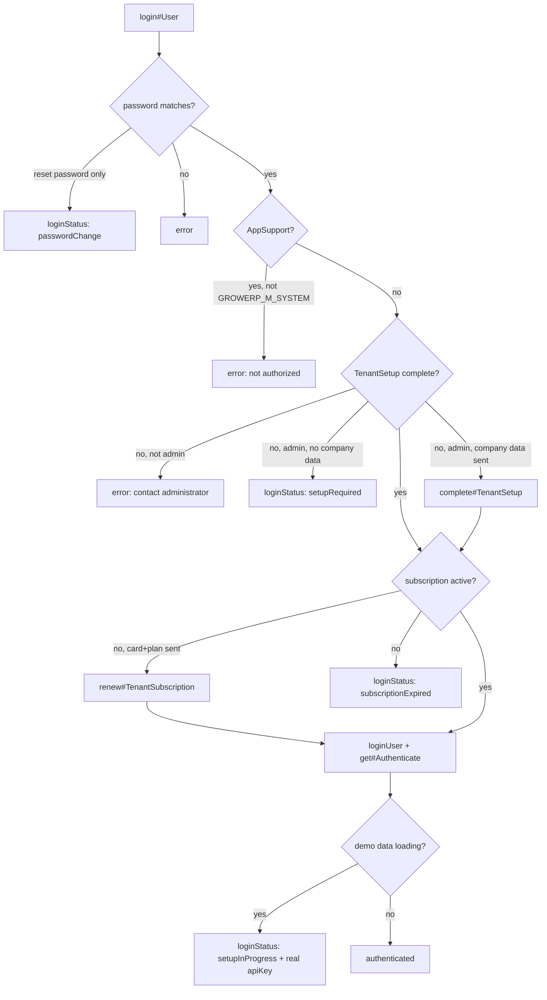
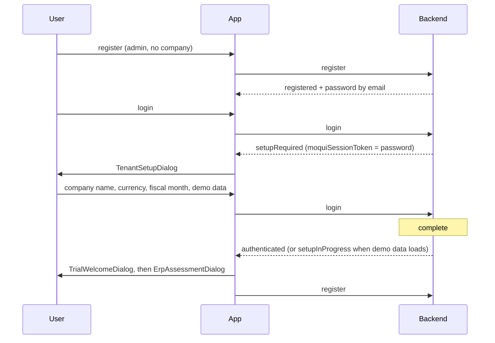

# Registration, Login and Trial — Specification

**Status:** describes the implementation as of commit `c558bdf6f` (29 Aug 2026)
**Scope:** app startup company resolution, user registration, tenant creation and setup,
the login state machine, the evaluation (trial) period and subscription renewal.

This document is written to be used as an implementation specification: every state,
parameter and service contract below exists in the code and is referenced by file.

---

## 1. Terms

| Term | Meaning |
|---|---|
| **owner party** (`ownerPartyId`) | The tenant. A `mantle.party.Party` with `partyTypeEnumId='PtyOwner'`, itself owned by `_NA_`. Every row created inside a tenant carries this id. |
| **main company** | The tenant's internal organization: the Party with role `OrgInternal` owned by the owner party. |
| **admin user** | User in group `GROWERP_M_ADMIN` of the tenant. |
| **`applicationId`** | Which vertical app is running (`AppAdmin`, `AppHotel`, `AppSupport`, …), a `growerp.Application` row. The former name `classificationId` is still accepted as a deprecated alias on every service. |
| **GROWERP** | Two roles in one party: the system tenant (support users, marketing website) *and* the bookkeeping tenant that owns every tenant's subscription and customer record. |

---

## 2. Startup — resolving the preset company

**Source:** [`get_startup_company.dart`](../flutter/packages/growerp_core/lib/src/domains/common/functions/get_startup_company.dart)
(added in `c558bdf6f`). Called by every app `main(List<String> args)` before `runApp`.

```dart
Company? company = await getStartupCompany(restClient, args: args);
```

Before this commit the company could only come from the web hostname, and only in web
builds; on Android, iOS, Linux and Windows it was always null.

### 2.1 Precedence

First non-null wins:

| # | Source | Platform | Form |
|---|---|---|---|
| 1 | command line | desktop | `--companyPartyId=100000` or `--companyPartyId 100000` |
| 2 | current URL | web | `?companyPartyId=100000` in `Uri.base` |
| 3 | initial deeplink | mobile | `AppLinks().getInitialLink()` carrying the same query parameter |
| 4 | remembered value | all | SharedPreferences key `companyPartyId` |
| 5 | build-time define | all | `--dart-define=COMPANY_PARTY_ID=100000` |
| 6 | app settings asset | all | `singleCompany` in `assets/cfg/app_settings.json` |
| 7 | hostname (fallback) | web | `getCompanyFromHost(Uri.base.host)` |

### 2.2 Rules

- A value supplied at launch (sources 1–3) is **persisted** to the `companyPartyId`
  preference, so the next start without any parameter keeps the same company.
- The command line form works for the built bundle. Under `flutter run` the argument must be
  wrapped, because the flutter CLI parses its own command line:
  `flutter run -d linux --dart-entrypoint-args=--companyPartyId=100000`
  (VS Code: put it in `toolArgs`, not in `args` — `args` is appended to the flutter CLI and
  rejected with `Could not find an option named "--companyPartyId"`).
- An **explicitly empty** value (`--companyPartyId=` / `?companyPartyId=`) removes the
  remembered value — this is the documented way to go back to multi-company mode.
- A resolved id is written back into `GlobalConfiguration('singleCompany')`.
- Any failure (unknown id, backend unreachable) logs and returns `null`. `null` means
  "no preset company": registration then creates a new tenant.
- Deeplink support requires per-app registration: `https://<app>.growerp.com|org` app links
  plus the `growerp://<app>` custom scheme in `android/app/src/main/AndroidManifest.xml`,
  and `CFBundleURLSchemes: growerp` in `ios/Runner/Info.plist`.

### 2.3 Backend contract

`growerp.100.PartyServices100.get#PublicCompany` — [PartyServices100.xml:72](../backend/service/growerp/100/PartyServices100.xml)
`authenticate="anonymous-all"`, REST `GET rest/s1/growerp/100/PublicCompany?companyPartyId=`.

| In | |
|---|---|
| `companyPartyId` | required |

| Out `company` (Map) | |
|---|---|
| `ownerPartyId`, `partyId`, `pseudoId`, `name`, `email`, `role` | from `growerp.party.OwnerCompany`; when a party has several role rows the `OrgInternal` one is preferred |
| `address` | `PostalPrimary` contact mech |
| `telephoneNr` | `PhonePrimary`, concatenated country+area+number |
| `url` | `WebUrlPrimary` |
| `image` | base64 of PartyContent `PcntImageSmall`, read through `ec.resource` — `download#Image` cannot be used here because it requires a logged-in user |

An unknown `companyPartyId` returns an empty result (logged at info), not an error.
`get#CompanyFromHost` resolves the ProductStore for the hostname and then delegates to this
service, so both paths return the same shape.

### 2.4 Consumers

`main → TopApp → RepositoryProvider<Company?>`:

- `RegisterUserDialog._presetCompany` — decides the registration branch (§3).
- `HomeForm` — company name and logo on the unauthenticated home screen.
- `AuthBloc.company` — search key for the `getCompanies` sanity check in `AuthLoad` (§8).

---

## 3. Registration

**Service:** `growerp.100.PartyServices100.register#User` — [PartyServices100.xml:3188](../backend/service/growerp/100/PartyServices100.xml),
`authenticate="anonymous-all"`.
**Client:** `AuthRegister` → `restClient.register` ([auth_bloc.dart](../flutter/packages/growerp_core/lib/src/domains/authenticate/blocs/auth_bloc.dart)).

### 3.1 Parameters

| In | Required | Notes |
|---|---|---|
| `firstName`, `lastName`, `email` | yes | |
| `applicationId` | | validated against `growerp.Application`; invalid → error |
| `companyPartyId` | | when set: join that company (§3.2). Supplied by the startup company of §2 |
| `ownerPartyId` | | only with `companyPartyId`; derived from the company when omitted |
| `userGroupId` | | `GROWERP_M_ADMIN` triggers new-tenant creation |
| `newPassword` | | defaults to a random `getRandomString(6) + '9!'`. The Flutter client sends `qqqqqq9!` in debug builds and nothing in release |
| `timeZoneOffset`, `locale` | | `locale` is a language code only (`new Locale(locale)` server side) |

Out: `authenticate` Map with `ownerPartyId`, `applicationId`, `user` (incl. `company`),
and `loginStatus = apiKey = 'registered'`.

### 3.2 Branches

**A — join an existing company** (`companyPartyId` present)
1. Validate it is a main company: `growerp.party.CompanyPreferenceAndRole` with
   `roleTypeId='OrgInternal'`; otherwise error `Not a valid main company`.
2. `ownerPartyId` defaults to that company's owner.
3. `create#User` with `role: 'Customer'`, `userGroupId: 'GROWERP_M_OTHER'`,
   `loginName: email`, and `trustGroup: true` (see §3.3).

**B — create a new tenant** (no `companyPartyId`, `userGroupId == 'GROWERP_M_ADMIN'`)
→ `growerp.100.TenantServices100.create#Tenant` — [TenantServices100.xml:18](../backend/service/growerp/100/TenantServices100.xml):
1. **Owner party selection**
   - `GROWERP` exists (seed) and has no non-owner parties → this is the first registration
     on a fresh install: owner = `GROWERP`.
   - `GROWERP` exists and has users → create a new `PtyOwner` party, `disabled='Y'`,
     `ownerPartyId='_NA_'`. It is deliberately not self-owning: `Party.pseudoId` defaults to
     `partyId` and the per-owner pseudoId sequence hands the same number to the first party
     created inside the tenant, which would collide with the `PARTY_ID_PSEUDO` unique index
     on (`pseudoId`, `ownerPartyId`).
   - `GROWERP` missing → create it (should not happen with seed data loaded).
2. `create#User` with `trustGroup: true` (see §3.3): admin user in `GROWERP_M_ADMIN` with
   role `OrgInternal` and a placeholder company named `Main Organization`.
3. `growerp.general.TenantSetup` row with `setupComplete='N'` and the `applicationId`.
4. System event `New tenant & admin created`.
5. Back in `register#User`: `BirdSendServices100.registerAdd#UserToGroup` (mailing list).

### 3.3 How the user group is decided

The client supplies `userGroupId`, so it is never trusted. `create#User` and `update#User`
run it through `growerp.100.SecurityServices100.resolve#GrantableUserGroup`:

- a caller who is not an admin cannot change a group at all — the user keeps the one they have;
- an admin may grant Admin, Employee or Other, but never `GROWERP_M_SYSTEM`;
- only a system user may grant `GROWERP_M_SYSTEM`;
- an unknown group id is rejected.

Registration and tenant creation legitimately pick the group server-side, and say so with an
explicit `trustGroup: true` parameter. It is explicit **on purpose**: inferring "this is
registration" from the absence of a logged-in user is wrong, because an anonymous REST request
can run on a pooled request thread that still carries the previous request's user.

`register#WebsiteUser` (also `anonymous-all`) previously passed the caller's `userGroupId`
straight into `create#UserGroupMember`, which let an anonymous caller make themselves an
admin. It now fixes the group to `GROWERP_M_OTHER` and takes the business relationship from a
`role` parameter, falling back to the legacy `userGroupId` values for older clients.

The user group is the **only** security axis; the party role carries the business
relationship and grants nothing. See
[GrowERP Security Model](./GrowERP_Security_Model.md).

**C — anything else** → error `Invalid registration: must provide companyPartyId or be an
admin user`.

### 3.4 Welcome email

Sent from `create#User` ([PartyServices100.xml:2127](../backend/service/growerp/100/PartyServices100.xml)) when a
`loginName` is set, asynchronously, template `WELCOME` on a `.com` host and `WELCOME_TEST`
otherwise. Skipped — with the generated password written to the log at WARN — when no
SYSTEM `EmailServer` is configured or the address is `@example.com`. Per-application copy
comes from `GrowerpEmailWelcomeIntro<App>` localized message rows.

### 3.5 Client rule

`loginStatus`/`apiKey` `'registered'` is a **sentinel, not a key**. The client must clear it
before persisting; persisting it sends `api_key: registered` on every later request, which
the backend rejects as `[No User]`. The register dialog closes and the login form opens.

---

## 4. Login state machine

**Service:** `growerp.100.GeneralServices100.login#User` — [GeneralServices100.xml:954](../backend/service/growerp/100/GeneralServices100.xml),
`authenticate="anonymous-all"`. The client calls the *same* service repeatedly, adding the
parameters each returned status asks for.



### 4.1 Statuses

| `loginStatus` | apiKey | Client action | Dialog |
|---|---|---|---|
| `passwordChange` | sentinel | ask for a new password, call `AuthChangePassword` | `changePasswordForm` |
| `setupRequired` | sentinel | collect `companyName`, `currencyId`, `fiscalYearStartMonth`, `demoData`; call `login#User` again. `moquiSessionToken` carries the password back | `TenantSetupDialog` |
| `setupInProgress` | **real** | persist the key, connect the notification socket, wait for the `DemoDataLoad` notification | `SetupInProgressDialog` |
| `subscriptionExpired` | sentinel | collect `plan` + card fields; call `login#User` again. Carries `evaluationDays` and `subscriptionDaysRemaining` | `PaymentSubscriptionDialog` |
| `registered` | sentinel | (from `register#User`) show the login form | `loginForm` |
| *none* | real | authenticated | dialog pops |

Routing lives in [login_dialog.dart](../flutter/packages/growerp_core/lib/src/domains/authenticate/views/login_dialog.dart);
the allowed-status list is duplicated in `AuthBloc._onAuthLogin` — **both must be updated
together when a status is added**.

### 4.2 Step detail

1. **Credentials.** `moqui.security.UserAccount` by username (cache disabled), Shiro
   credentials matcher against `currentPassword`; on failure retry against `resetPassword`
   → `passwordChange`; otherwise `Password incorrect for user …`.
2. **`AppSupport`.** Group membership `GROWERP_M_SYSTEM` is verified *before*
   `loginUser`, so an unauthorized user never gets a session. Returns immediately after
   `get#Authenticate` — support users are cross-company and get no company data.
3. **Tenant.** `ownerPartyId` from the user's Party; main company from
   `growerp.party.OwnerAndCompany` with `companyRole='OrgInternal'`. No company → error.
4. **Setup status.** `TenantServices100.check#TenantSetupStatus` reads
   `growerp.general.TenantSetup.setupComplete`.
5. **Subscription.** §7. Skipped entirely when `ownerPartyId == 'GROWERP'`.
6. **Session.** `ec.user.loginUser`; if a different user is already logged in on the
   session it is logged out first. `ec.user.setLocale` is applied only after login because
   it writes to the UserAccount. Then `get#Authenticate` fills the response.
7. **Demo data.** When `complete#TenantSetup` scheduled a background load, the status is
   downgraded to `setupInProgress` while keeping the real apiKey.

### 4.3 `get#Authenticate`

[GeneralServices100.xml:614](../backend/service/growerp/100/GeneralServices100.xml). Returns user, company (skipped for
`AppSupport`), `apiKey` (`ec.user.getLoginKey()`), `moquiSessionToken`, the dashboard
`stats` map, and — for non-GROWERP tenants — `subscriptionDaysRemaining` and
`subscriptionStatus`. `applicationId=token` short-circuits to just the session token (used
by the chat client to test a key).

---

## 5. Tenant setup

`growerp.100.TenantServices100.complete#TenantSetup` — [TenantServices100.xml:122](../backend/service/growerp/100/TenantServices100.xml).
In: `ownerPartyId`, `companyPartyId`, `companyName`, `currencyId`,
`fiscalYearStartMonth` (default 1), `demoData` (default false), `applicationId`,
`userPartyId`, `hostName`, `timeZoneOffset`. Out: `success`, `demoDataLoading`.

Order of operations:

1. `demoData` forced false for the GROWERP tenant.
2. Rename the placeholder organization to `companyName`; set owner party `disabled='N'`.
3. `AccountingServices100.init#PartyAccountingConfiguration` from `DefaultSettings` with the
   chosen currency and fiscal year start month.
4. `PartyServices100.setup#MainOrganization`: inventory facility, top-level `DbResource`,
   a `WikiSpace` cloned from `DEFAULT_WS` with its pages, and a `ProductStore` cloned from
   `POPC_DEFAULT` (ship options, payment gateways; `AppAdmin`/`AppHotel` get
   `requireInventory='N'` and `AsResOrdNoRes`).
5. `PartyServices100.setup#SpecificApp` — per-application catalog/category scaffolding, and
   when `demoData` is set it schedules `load#DemoDataAsync` on the worker pool via a
   transaction synchronization: the load must start only **after** the login transaction
   commits (it reads the ProductStore created in step 4) and must not run inside it (it
   takes minutes and would push the request transaction into rollback-only). Completion is
   reported with a persisted notification on topic **`DemoDataLoad`**, addressed by userId.
6. Trial subscription (§7.1), skipped for GROWERP.
7. GROWERP tenant only: load the marketing/landing/assessment seed data, point the store at
   `GROWERP_WS` + the `modern` template, and add `PsstHostname` settings for
   growerp.com/.org.
8. `TenantSetup.setupComplete='Y'`, `setupCompletedDate` = now.

Client side: the `demoData` login call is issued with a 900 s Dio timeout because steps 3–4
are synchronous.

---

## 6. First login, end to end — where the trial screen comes from

The first login is not a single call: it is two `login#User` round trips with the tenant
setup in between, and the trial subscription is created *inside the second one*, before
that same call evaluates the subscription gate.



### 6.1 Step by step

1. **Registration** (§3 branch B) returns `registered`; the password arrives by email.
2. **Login #1** — gate 3 finds `setupComplete='N'` and the user in `GROWERP_M_ADMIN` with no
   company data attached, so it returns `setupRequired`. The password is echoed back in
   `moquiSessionToken` precisely so the client can repeat the call.
3. **`TenantSetupDialog`** collects `companyName`, `currencyId`, `fiscalYearStartMonth` and
   `demoData` (default on in debug builds, off in release) and dispatches `AuthLogin` with
   the same email and the echoed password.
4. **Login #2** runs `complete#TenantSetup` inside the request (§5). Its last step before the
   completion flag is the **trial subscription** (§7.1).
5. **The subscription gate then sees the row that was just created**: `thruDate = now +
   evaluationDays` → active. A first login therefore never hits the paywall; the trial is
   what carries it through.
6. **Session**: without demo data the call returns authenticated. With demo data it returns
   `setupInProgress` plus a real apiKey; `SetupInProgressDialog` waits for the `DemoDataLoad`
   notification (socket, plus a 5-second poll because the message is persisted and may
   predate the subscription), then dispatches `AuthSetupCompleted`, which promotes the
   session. That dialog never pops itself — the login dialog's listener does.
7. **Post-login sequence** — `LoginDialog`'s `authenticated` listener, guarded by
   `_postLoginHandled` and a `listenWhen` on status change so later emissions cannot re-run
   it. Conditions: the company is not GrowERP itself and `user.appsUsed` is empty.
   1. `TrialWelcomeDialog`, `barrierDismissible: false`, one action `Key('startTrial')`
      labelled *Get started*. Only for `user.userGroup == GROWERP_M_ADMIN`: a user who
      registered into an existing company (§3.2 branch A, `GROWERP_M_OTHER`) or was created
      by an admin does not own the trial.
   2. `ErpAssessmentDialog` ("Do you need an ERP system?").
   3. `registerAppUsed(applicationId)` → `appsUsed` is no longer empty, so neither dialog
      returns on the next login. A failure here is swallowed on purpose: the dialogs may
      repeat, but login itself must not break.
8. The login dialog pops, or navigates to `/` when it cannot pop.

### 6.2 What the trial screen shows

Company name, the admin's name and email, `"<n>-Day Free Trial"`, `"Expires: dd/mm/yyyy"`, a
feature list and *No credit card required during trial*.

> **Caveat.** Those two numbers do not come from the subscription. The dialog reads
> `authenticate.evaluationDays`, which the backend only fills in on the
> `subscriptionExpired` branch — on this path it is null, so the dialog falls back to a
> hard-coded 14 and computes `DateTime.now() + 14` locally. It is right only while
> `evaluationDays` is at its default, and it can never reflect the row's real `thruDate`.

---

## 7. Trial and subscription

### 7.1 Creation

Inside `complete#TenantSetup`, for every tenant except GROWERP:

- `evaluationDays` = system property `evaluationDays`, default **14**.
- Subscriber: a customer (user + company, `loginDisabled`) created **in the GROWERP tenant**
  from the admin's name/email via `create#User`, reused when a subscription for this tenant
  already exists.
- `SubscriptionServices100.create#Subscription` with `ownerPartyId='GROWERP'`,
  `product = GROWERP_SMALL_PLAN`, `fromDate = now`, `thruDate = now + evaluationDays`,
  `externalId = <tenant ownerPartyId>`, description `"<n>-day trial subscription"`.

There is no separate trial flag or entity: a trial is an ordinary `Subscription` row whose
`thruDate` is near.

### 7.2 State

`check#TenantSubscription` — [TenantServices100.xml:341](../backend/service/growerp/100/TenantServices100.xml). Finds the newest
date-filtered Subscription in the GROWERP tenant with
`externalSubscriptionId == ownerPartyId` (cache disabled — multi-device logins).

| Condition | `hasActiveSubscription` | `subscriptionStatus` | `daysRemaining` |
|---|---|---|---|
| `thruDate - now >= 0` | true | `active` | whole days, floored at 0 |
| `thruDate` passed | false | `expired` | 0 |
| no `thruDate` | true | `active` | −1 (unlimited) |
| no subscription | false | `none` | 0 |

Comparison is in milliseconds, not days, so same-day expiry behaves correctly.

### 7.3 Expiry warning

`get#Authenticate` returns `subscriptionDaysRemaining` on every authenticated call.
`SubscriptionWarningHelper` ([subscription_warning_helper.dart](../flutter/packages/growerp_core/lib/src/domains/common/functions/subscription_warning_helper.dart))
shows a warning dialog when 1–3 days remain, at most once per day per tenant (a
SharedPreferences key `subscription_warning_<owner>_<y>_<m>_<d>`), triggered from
`display_menu_option.dart`.

### 7.4 Auto-renewal

ServiceJob `renew_due_tenant_subscriptions`, cron `0 30 4 * * ?`
([GrowerpAaSetupData.xml](../backend/data/GrowerpAaSetupData.xml)) → `renew#DueTenantSubscriptions`:

- window: `thruDate` between now−3 days and now+3 days (the dunning grace window);
- only subscribers that have a stored `mantle.account.method.PaymentMethod`;
- outcome detected by whether `thruDate` moved (the inner call is `ignore-error`);
- on failure: `PAYMENT_FAILED` email to the tenant admin when a SYSTEM EmailServer is
  configured. After the grace window the login paywall takes over.

### 7.5 Renewal

`renew#TenantSubscription` — [TenantServices100.xml:454](../backend/service/growerp/100/TenantServices100.xml). Called from
`login#User` with card data, or from the cron without it. Charges the plan price converted
to the receiving GROWERP company's base currency, captures through Stripe when
`paymentGatewayConfigId=STRIPE`, then extends `thruDate` by **one month** from
`max(now, thruDate)` and updates `productId`/description to the chosen plan.

Plans are listed publicly by `get#SubscriptionPlans` (GROWERP-owned `PtService` products
with id `GROWERP_%` and a current purchase price).

### 7.6 Effect of expiry

Login only. Data is untouched; the tenant is not disabled. Every login returns
`subscriptionExpired` until a renewal succeeds.

### 7.7 Testing

`login#User` accepts `testDaysOffset` (Integer). It shifts `ec.user` effective time and is
honored **only** when the system property `instance_purpose` is `dev` or `test`. The Flutter
side has `setTestDaysOffset(n)` in each app `main`.

---

## 8. Subsequent starts

`AuthBloc._onAuthLoad` ([auth_bloc.dart](../flutter/packages/growerp_core/lib/src/domains/authenticate/blocs/auth_bloc.dart)):

1. Clear the REST cache (AuthLoad doubles as pull-to-refresh), load currencies.
2. `getCompanies(searchString: <persisted company | startup company>, limit: 1)` — a
   connectivity and validity check in one.
3. With a persisted apiKey: if the persisted company no longer exists →
   unauthenticated; else `get#Authenticate`. A null `apiKey` or missing `userId` in the
   response → unauthenticated; otherwise authenticated, persist, connect the chat and
   notification sockets.
4. Connection/timeout `DioException`s deliberately do **not** wipe the stored session; other
   errors persist the fallback authenticate.

### 8.1 Relation to the first login

The post-login dialog sequence of §6.1 step 7 is keyed on `user.appsUsed`, not on a flag in
the session, so it is evaluated on every start — it simply finds `appsUsed` non-empty from
the second login on. Integration tests must dismiss both dialogs (`CommonTest.login` does).

---

## 9. Known gaps

| Gap | Location |
|---|---|
| `TrialWelcomeDialog` shows `evaluationDays` and an end date it computes as `DateTime.now() + evaluationDays`. On the first-login path `authenticate.evaluationDays` is null — the backend fills it only in the `subscriptionExpired` branch — so the dialog falls back to a hard-coded 14 and can never show the subscription's real `thruDate`. | `trial_welcome_dialog.dart`, `GeneralServices100.xml` |
| `check#TenantSubscription` documents a `'trial'` value for `subscriptionStatus` that is never produced — only `active`, `expired`, `none`. | `TenantServices100.xml` |
| `RegisterUserDialog._selectedCompany` is declared and read but never assigned: the fallback `Company(partyId: _selectedCompany?.partyId)` is dead code; only the startup preset company is ever used. | `register_user_dialog.dart` |
| The allowed `loginStatus` list exists twice (bloc + dialog switch); adding a status requires editing both. | `auth_bloc.dart`, `login_dialog.dart` |
