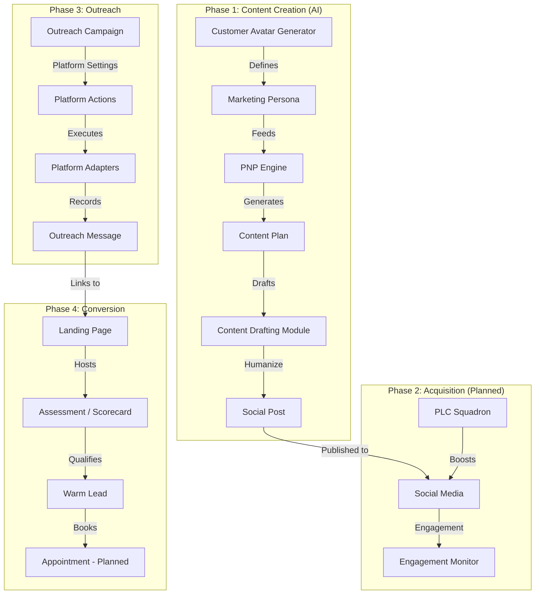

# Social Media Lead Activation and Nurturing System Design

## Overview
This document outlines the technical design for the **Social Media Lead Activation and Nurturing System** within GrowERP. The system is designed to automate and streamline the process of finding, engaging, and converting leads using AI-driven content, strategic outreach, and interactive landing pages.

The system is divided into four distinct phases:
1.  **Targeted Content Creation (AI-Driven)** ✅ Implemented
2.  **Lead Acquisition & Signal Detection** 🔜 Planned
3.  **Initial Outreach (Cold DMs)** ✅ Implemented
4.  **Lead Warming & Conversion (Scorecard/Landing Page)** ⚠️ Partial

## Architecture



## Component Breakdown

### Phase 1: Targeted Content Creation and Curation (AI-Driven) ✅

This phase leverages Generative AI to assist users in creating high-quality, targeted content.

#### Data Models
*   **`MarketingPersona`**: Stores the "Customer Avatar" details.
    *   *Ref*: `MarketingEntities.xml`
    *   Fields: `personaId`, `pseudoId`, `ownerPartyId`, `name`, `demographics`, `painPoints`, `goals`, `toneOfVoice`.
*   **`ContentPlan`**: Represents the weekly "Pain-News-Prize" schedule.
    *   *Ref*: `MarketingEntities.xml`
    *   Fields: `planId`, `pseudoId`, `personaId`, `weekStartDate`, `theme`, `status`.
*   **`SocialPost`**: Represents a specific piece of content.
    *   *Ref*: `MarketingEntities.xml`
    *   Fields: `postId`, `pseudoId`, `planId`, `type` (PAIN/NEWS/PRIZE/OTHER), `platform`, `headline`, `draftContent`, `finalContent`, `status` (DRAFT/SCHEDULED/PUBLISHED), `scheduledDate`.

#### Services
*   **`growerp.100.MarketingServices100.generate#MarketingPersona`**: AI service to generate persona details based on business description.
*   **`growerp.100.MarketingServices100.generate#ContentPlan`**: AI service to generate weekly content plan (PNP formula) based on a Persona.
*   **`growerp.100.MarketingServices100.draft#SocialPost`**: AI service to generate full post text from a headline.
*   Full CRUD services for Personas, Content Plans, and Social Posts.

#### UI Components
*   **Persona Editor**: Form to view/edit the AI-generated avatar (`growerp_marketing/lib/src/persona/`).
*   **Content Calendar**: View of the weekly plan with content management (`growerp_marketing/lib/src/content_plan/`, `social_post/`).

---

### Phase 2: Lead Acquisition and Signal Detection 🔜 Planned

Focuses on tracking engagement to identify potential leads. **Not yet implemented.**

#### Data Models (Planned)
*   **`SocialEngagement`**: Records interactions.
    *   Fields: `engagementId`, `postId`, `platform`, `userProfileUrl`, `type` (Like/Comment/Share), `status` (New/Contacted).
*   **`PlcSquadron`**: Manages the support group for content boosting.
    *   Fields: `squadronId`, `members` (List of PartyIds).

#### Services (Planned)
*   **`recordEngagement`**: Service to manually (or via webhook) log a "Signal of Interest".
*   **`notifySquadron`**: Notification service to alert the PLC group of a new post.

---

### Phase 3: Initial Outreach (Multi-Platform Campaigns) ✅

Manages the automated outreach workflow across multiple platforms.

#### Data Models
*   **`MarketingCampaign` (Extended)**: Groups outreach efforts with platform-specific settings.
    *   *Ref*: `OutreachEntities.xml`
    *   Fields: `marketingCampaignId`, `pseudoId`, `ownerPartyId`, `campaignName`, `platforms` (JSON array), `messageTemplate` (base template), `emailSubject`, `targetAudience`, `landingPageId`, `dailyLimitPerPlatform`, `platformSettings` (JSON).
*   **`OutreachMessage`**: A specific message sent to a lead.
    *   *Ref*: `OutreachEntities.xml`
    *   Fields: `messageId`, `marketingCampaignId`, `platform`, `recipientName`, `recipientEmail`, `recipientHandle`, `recipientProfileUrl`, `messageContent`, `sentDate`, `status` (PENDING/SENT/RESPONDED/FAILED).
*   **`PlatformConfiguration`**: Platform-specific credentials and settings.
    *   *Ref*: `OutreachEntities.xml`
    *   Fields: `configId`, `ownerPartyId`, `platform`, `isEnabled`, `dailyLimit`, `apiKey`, `apiSecret`, `username`, `password`.
*   **`CampaignMetrics`**: Performance tracking.
    *   *Ref*: `OutreachEntities.xml`
    *   Fields: `metricId`, `marketingCampaignId`, `messagesSent`, `responsesReceived`, `leadsGenerated`.

#### Platform Settings Structure
Templates are consolidated into `platformSettings` JSON on campaigns with per-platform overrides:
```json
{
  "linkedin": {
    "actionType": "message_connections",
    "searchKeywords": "CEO SaaS Startup",
    "messageTemplate": "LinkedIn-specific intro..."
  },
  "email": {
    "actionType": "send_email",
    "messageTemplate": ""  // Uses campaign default
  },
  "twitter": {
    "actionType": "post_tweet",
    "messageTemplate": "Check out our feature! #SaaS"
  }
}
```

#### Supported Action Types by Platform
| Platform | Action Types |
|----------|--------------|
| EMAIL | `send_email` |
| LINKEDIN | `message_connections`, `search_and_connect` |
| TWITTER | `post_tweet`, `follow_profiles`, `send_dms` |
| SUBSTACK | `post_note`, `subscribe`, `comment` |

#### Services
*   **`growerp.100.OutreachServices100.create#OutreachCampaign`**: Create campaign with platforms and settings.
*   **`growerp.100.OutreachServices100.create#OutreachMessage`**: Record message sent/failed.
*   **`growerp.100.OutreachServices100.update#CampaignMetrics`**: Update performance metrics.
*   Campaign automation via `CampaignAutomationService` and `AutomationOrchestrator` in Flutter.

#### Template Variables
Available for personalization in message templates:
*   `{name}` - Recipient's name
*   `{company}` - Recipient's company
*   `{title}` - Recipient's job title

---

### Phase 4: Lead Warming and Conversion ⚠️ Partial

Leverages existing GrowERP capabilities with extensions for Booking.

#### Existing Components ✅
*   **`LandingPage`**: Used to host the content and Scorecard.
    *   *Ref*: `LandingPageEntities.xml`, `LandingPageServices100.xml`
*   **`Assessment` (Scorecard)**: The interactive quiz to qualify leads.
    *   *Ref*: `AssessmentEntities.xml`, `AssessmentServices100.xml`
*   **`ScoringThreshold`**: Configurable lead status logic (Cold/Warm/Hot).
    *   *Ref*: `AssessmentEntities.xml`

#### New Components (Booking) 🔜 Planned
*   **`AppointmentSlot`**: Available times for consultation.
    *   Fields: `slotId`, `startDateTime`, `endDateTime`, `status` (Available/Booked).
*   **`Appointment`**: A booked meeting.
    *   Fields: `appointmentId`, `slotId`, `leadPartyId`, `notes`.
*   **Note**: Future integration with Google Calendar API for appointment scheduling.

#### Services (Planned)
*   **`getAvailableSlots`**: Returns open slots.
*   **`bookAppointment`**: Reserves a slot for a lead (potentially auto-created from Assessment submission).

## Integration Strategy

1.  **Backend (Moqui)**:
    *   Entities and Services are in the `growerp` component.
    *   `MarketingEntities.xml` / `MarketingServices100.xml` for Phase 1.
    *   `OutreachEntities.xml` / `OutreachServices100.xml` for Phase 3.
    *   AI integration via Groovy scripts (e.g., `generatePersonaWithAI.groovy`).

2.  **Frontend (Flutter)**:
    *   **`growerp_marketing`**: Personas, Content Plans, Social Posts, Assessments, Landing Pages.
    *   **`growerp_outreach`**: Campaign management, Message tracking, Platform automation.
    *   Platform adapters: `EmailAutomationAdapter`, `LinkedInAutomationAdapter`, `XAutomationAdapter`, `SubstackAutomationAdapter`.

3.  **External Integrations**:
    *   **LinkedIn/Socials**: Browser-based automation via platform adapters. Future: API integration.
    *   **Calendar**: Planned internal `AppointmentSlot`. Future: Google Calendar/Calendly integration.
