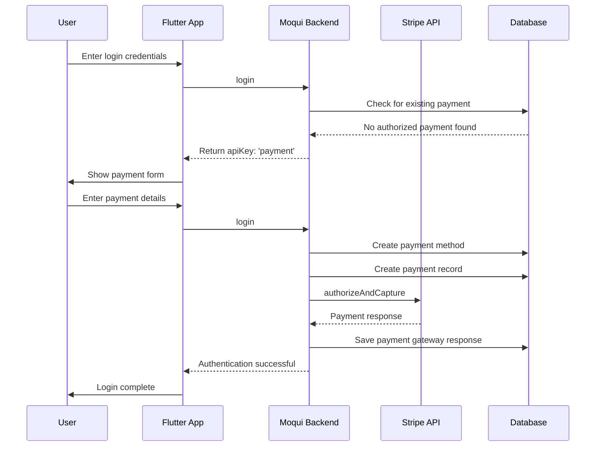

# Stripe Payment Processing in GrowERP

## Overview

GrowERP integrates with Stripe for processing subscription payments and credit card transactions. The Stripe integration is activated when a Stripe API key is present in the `PaymentGatewayStripe` entity with owner ID `100000`. This document outlines the complete payment processing flow, from user authentication to subscription activation.

## Table of Contents

1. [Architecture Overview](#architecture-overview)
2. [Stripe Configuration](#stripe-configuration)
3. [Authentication and Login Flow](#authentication-and-login-flow)
4. [Payment Processing Components](#payment-processing-components)
5. [Frontend Payment Interface](#frontend-payment-interface)
6. [Backend Services](#backend-services)
7. [Database Schema](#database-schema)
8. [Payment Flow Sequence](#payment-flow-sequence)
9. [Error Handling](#error-handling)
10. [Security Considerations](#security-considerations)

## Architecture Overview

The GrowERP Stripe integration consists of several key components:

- **Frontend**: Flutter-based payment forms in the login dialog
- **Backend**: Moqui services for payment processing
- **Stripe Component**: Mantle-stripe component for Stripe API integration
- **Database**: Payment gateway configuration and transaction storage

```
┌─────────────────┐    ┌──────────────────┐    ┌─────────────────┐
│   Flutter App   │───▶│  Moqui Backend   │───▶│  Stripe API     │
│  (login_dialog) │    │ (GeneralServices)│    │ (mantle-stripe) │
└─────────────────┘    └──────────────────┘    └─────────────────┘
         │                        │                       │
         │                        ▼                       │
         │              ┌──────────────────┐              │
         └─────────────▶│    Database      │◀─────────────┘
                        │ (PaymentGateway) │
                        └──────────────────┘
```
## gateway configuration

The PaymentGatewayConfiguration defines the settings required to integrate GrowERP with external payment gateways such as Stripe. This configuration includes credentials (e.g., API keys), endpoint URLs, supported payment methods, and gateway-specific parameters necessary for secure transaction processing. Proper configuration ensures that payment operations comply with gateway requirements and that sensitive data is handled securely.

### Login Service Processing

The login service in `moqui/runtime/component/growerp/service/growerp/100/GeneralServices100.xml` manages user authentication for GrowERP. It validates user credentials, creates sessions, and enforces security policies. Upon successful login, the service initializes user context, permissions, and logs authentication events. It also handles payment validation and triggers payment screens if required, ensuring only authorized users access protected resources and supporting robust error handling and audit logging.

Depending on the PaymentGatewayConfig entity test modus is activated with the configs started with 'TEST' or the STRIPE config with a vali stripe key installed.

## Stripe Configuration

### Entity Configuration

Stripe keys are stored per owner party ID in the `Stripe.PaymentGatewayStripe` entity:

```xml
<entity entity-name="PaymentGatewayStripe" package="Stripe">
    <field name="paymentGatewayConfigId" type="id" is-pk="true"/>
    <field name="ownerPartyId" type="id" is-pk="true"/>
    <field name="certificateAlias" type="text-medium"/>
    <field name="secretKey" type="text-medium" encrypt="true"/>
    <field name="apiVersion" type="text-short"/>
</entity>
```

### Activation Logic

GrowERP subscription fees are activated when:
1. A Stripe key is present at entity `PaymentGatewayStripe` with `ownerPartyId = 100000`
2. The payment gateway configuration ID is set to `STRIPE`
3. The secret key is properly configured

### Website Service Integration

The website service checks for Stripe API key availability:

```xml
<!-- From WebsiteServices100.xml -->
<set field="paymentGatewayConfigId" value="STRIPE" />
<entity-find-one entity-name="Stripe.PaymentGatewayStripe" value-field="paymentGateway" />
<set field="website.stripeApiKey" from="paymentGateway?.secretKey" />
```

## Authentication and Login Flow

### Login Service Parameters

The login service (`growerp.100.GeneralServices100.login#User`) accepts payment-related parameters:

```xml
<parameter name="creditCardNumber" />
<parameter name="creditCardType" />
<parameter name="nameOnCard" />
<parameter name="expireMonth" />
<parameter name="expireYear" />
<parameter name="cVC" />
<parameter name="plan" /><!-- diyPlan, smallPlan, fullPlan -->
```

### Payment Validation Logic

During login, the system checks for payment requirements:

1. **Payment Gateway Check**: Verifies if Stripe is configured for owner `100000`
2. **Existing Payment Check**: Looks for authorized payments from the company to GrowERP
3. **Payment Screen Trigger**: Returns `apiKey: 'payment'` if payment is required

```xml
<!-- Payment requirement check -->
<entity-find-one entity-name="Stripe.PaymentGatewayStripe" value-field="stripeKey">
    <field-map field-name="paymentGatewayConfigId" value="STRIPE" />
    <field-map field-name="ownerPartyId" value="100000" />
</entity-find-one>
<if condition="ownerPartyId != '100000' &amp;&amp; stripeKey">
    <entity-find entity-name="mantle.account.payment.Payment" list="payments">
        <econdition field-name="fromPartyId" from="companyPartyId" />
        <econdition field-name="toPartyId" from="growerpPartyId" />
        <econdition field-name="statusId" value="PmntAuthorized" />
    </entity-find>
    <if condition="!payments">
        <set field="authenticate" from="authenticate + [apiKey: 'payment']" />
        <return />
    </if>
</if>
```

## Payment Processing Components

### Subscription Plans

GrowERP offers three subscription plans:

```dart
// From login_dialog.dart
FormBuilderFieldOption(
    value: 'diyPlan',
    child: Text('DIY Plan \$50 per month\nFull functionality, unlimited users\nsupport charged extra \$75/hr')),
FormBuilderFieldOption(
    value: 'smallPlan', 
    child: Text('Small Company Plan \$499 per month\nFull functionality, unlimited users\nincluding support for 20hrs/month')),
FormBuilderFieldOption(
    value: 'fullPlan',
    child: Text('Full Company Plan \$999 per month\nFull functionality, unlimited users\nincluding support for 40hrs/month')),
```

### Plan Pricing

Backend plan pricing configuration:

```xml
<set field="planAmount"
    from="[diyPlan: '50.00',
    smallPlan: '499.00', fullPlan: '999.00']" />
```

### Payment Method Creation

When payment information is provided, the system:

1. Creates or updates a credit card payment method
2. Associates it with the user's party
3. Sets up the payment gateway configuration

```xml
<service-call name="mantle.account.PaymentMethodServices.create#CreditCard"
    in-map="[
        paymentMethodTypeEnumId: 'PmtCreditCard',
        ownerPartyId: userAccount.partyId,
        cardNumber: creditCardNumber,
        creditCardTypeEnumId: 'Cct' + creditCardType,
        expireDate: expireDate,
        firstNameOnAccount: nameOnCard,
        lastNameOnAccount: '',
        paymentGatewayConfigId: System.getProperty('paymentGatewayConfigId'),
    ]" />
```

## Frontend Payment Interface

### Payment Form Structure

The Flutter payment form (`paymentForm()` in `login_dialog.dart`) includes:

1. **Plan Selection**: Checkbox group for subscription plans
2. **Credit Card Information**: 
   - Card number with validation
   - Expiry date (MM/YY format)
   - CVC code
   - Cardholder name
3. **Payment Processing**: Calls the login service with payment parameters

### Form Validation

```dart
validator: FormBuilderValidators.compose([
    (val) {
        if (val == null || val.isEmpty || val.length > 1) {
            return 'Please select a single plan';
        }
        return null;
    }
]),
```

### Payment Submission

```dart
context.read<AuthBloc>().add(AuthLogin(
    user!.loginName!,
    moquiSessionToken!, // returned password
    creditCardNumber: formData['cardNumber']?.toString().replaceAll(' ', '') ?? '',
    nameOnCard: formData['cardHolderName']?.toString() ?? '',
    cVC: formData['cvvCode']?.toString() ?? '',
    plan: selectedPlan?.isNotEmpty == true ? selectedPlan![0] : '',
    expireMonth: expiryParts.isNotEmpty ? expiryParts[0] : '',
    expireYear: expiryParts.length > 1 ? expiryParts[1] : ''));
```

## Backend Services

### Stripe Payment Services

The mantle-stripe component provides core payment operations:

#### Authorization and Capture
- `authorize#Payment`: Authorizes a payment without capturing funds
- `capture#Payment`: Captures previously authorized payment
- `authorizeAndCapture#Payment`: Single-step authorization and capture

#### Gateway Configuration
```xml
<service verb="get" noun="StripeGatewayInfo">
    <if condition="paymentGatewayConfigId == 'GROWERP'">
        <entity-find-one entity-name="Stripe.PaymentGatewayStripe" value-field="pgs">
            <field-map field-name="paymentGatewayConfigId" value="STRIPE"/>
            <field-map field-name="ownerPartyId" value="100000"/>
        </entity-find-one>
    </if>
</service>
```

### Payment Processing Flow

1. **Payment Creation**: Creates a payment record with plan amount
2. **Stripe Processing**: Calls `authorizeAndCapture#Payment` with `GROWERP` gateway config
3. **Status Tracking**: Updates payment status based on Stripe response
4. **Error Handling**: Creates payment gateway response records for audit

## Database Schema

### Key Entities

#### PaymentGatewayStripe
```sql
CREATE TABLE PaymentGatewayStripe (
    paymentGatewayConfigId VARCHAR(20) NOT NULL,
    ownerPartyId VARCHAR(20) NOT NULL,
    secretKey TEXT ENCRYPTED,
    certificateAlias TEXT,
    apiVersion VARCHAR(20),
    PRIMARY KEY (paymentGatewayConfigId, ownerPartyId)
);
```

#### Payment
```sql
CREATE TABLE Payment (
    paymentId VARCHAR(20) NOT NULL PRIMARY KEY,
    paymentTypeEnumId VARCHAR(20),
    paymentMethodId VARCHAR(20),
    fromPartyId VARCHAR(20),
    toPartyId VARCHAR(20),
    amount DECIMAL(18,6),
    amountUomId VARCHAR(20),
    statusId VARCHAR(20),
    effectiveDate TIMESTAMP
);
```

#### PaymentGatewayResponse
```sql
CREATE TABLE PaymentGatewayResponse (
    paymentGatewayResponseId VARCHAR(20) NOT NULL PRIMARY KEY,
    paymentGatewayConfigId VARCHAR(20),
    paymentId VARCHAR(20),
    paymentOperationEnumId VARCHAR(20),
    resultSuccess CHAR(1),
    resultError CHAR(1),
    responseCode VARCHAR(20),
    reasonMessage TEXT
);
```

## Payment Flow Sequence



## Error Handling

### Payment Failures

The system handles various payment failure scenarios:

1. **Invalid Card Information**: Stripe validation errors
2. **Insufficient Funds**: Declined transactions
3. **Network Issues**: API communication failures
4. **Configuration Errors**: Missing or invalid Stripe keys

### Error Response Structure

```xml
<service-call name="create#mantle.account.method.PaymentGatewayResponse"
    in-map="[
        paymentGatewayConfigId:paymentGatewayConfigId,
        paymentOperationEnumId:'PgoAuthAndCapture',
        paymentId:paymentId,
        resultSuccess:'N',
        resultError:'Y',
        responseCode:errorInfo.responseCode,
        reasonMessage:errorInfo.reasonMessage
    ]" />
```

### Frontend Error Display

```dart
switch (state.status) {
    case AuthStatus.failure:
        HelperFunctions.showMessage(
            context, '${state.message}', Colors.red);
    case AuthStatus.authenticated:
        Navigator.of(context).pop();
    default:
        HelperFunctions.showMessage(
            context, state.message, Colors.green);
}
```

## Security Considerations

### Data Protection

1. **Encryption**: Stripe secret keys are encrypted in the database
2. **PCI Compliance**: Credit card data handling follows PCI DSS standards
3. **Secure Transmission**: All API calls use HTTPS
4. **Token Management**: Session tokens for authentication

### Access Control

1. **Owner Isolation**: Payment configurations are isolated by `ownerPartyId`
2. **User Authentication**: Payment processing requires valid user session
3. **Role-Based Access**: Admin users have different payment setup privileges

### Best Practices

1. **Key Rotation**: Regular rotation of Stripe API keys
2. **Audit Logging**: All payment transactions are logged
3. **Error Sanitization**: Sensitive information is not exposed in error messages
4. **Timeout Handling**: Proper handling of API timeouts and retries

## Configuration Examples

### Development Setup

```xml
<!-- Test Stripe Configuration -->
<Stripe.PaymentGatewayStripe 
    paymentGatewayConfigId="STRIPE" 
    ownerPartyId="100000"
    secretKey="sk_test_..." />
```

### Production Setup

```xml
<!-- Production Stripe Configuration -->
<Stripe.PaymentGatewayStripe 
    paymentGatewayConfigId="STRIPE" 
    ownerPartyId="100000"
    secretKey="sk_live_..." />
```

### Website Integration

```xml
<!-- Website service returns Stripe key availability -->
<parameter name="stripeApiKey" />
```

## Troubleshooting

### Common Issues

1. **Payment Screen Not Showing**: Check if Stripe key exists for owner `100000`
2. **Payment Failures**: Verify Stripe API key validity and network connectivity
3. **Duplicate Payments**: Check for existing authorized payments before processing
4. **Configuration Issues**: Ensure proper gateway configuration mapping

### Debug Information

Enable debug logging for payment processing:

```xml
<log level="info" message="Successfully completed authorization+capture of charge: ${responseMap.charge.id}"/>
```

### Testing

Use Stripe test cards for development:
- `4242424242424242` - Visa test card
- `4000000000000002` - Card declined
- `4000000000009995` - Insufficient funds

## Conclusion

The GrowERP Stripe integration provides a comprehensive payment processing solution for subscription-based services. The system handles the complete flow from user authentication through payment processing, with proper error handling and security measures in place. The modular architecture allows for easy maintenance and extension of payment functionality.
