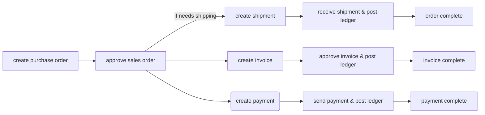
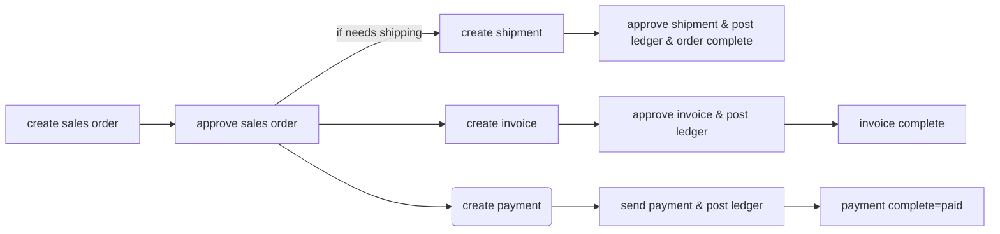

# ERP General Business flow

Please find below the general business flow of the purchase and sales process. The processes assume that incoming and outgoing products, employees, suppliers and customer have been defined. Accounting has been setup by the system when the company was created.

## Purchasing  

## Sales  

## End user actions  

Below an explanation of the user actions which are possible. All other actions referenced will be performed by the system.

#### Create Order

If anything has been bought or sold, it will start with an order. This avoids inputting duplicate data on either the lower level documents like invoices, payment, shipment documents and ledger transactions.

Creating an order is doing just that, it has no further implications in the system and the order can be cancelled when input in error.

#### Approve order

Approving an order is a major action within the system, it will create an invoice and payment using the data from the order. If there are any physical order items which need to be sent or received, also a shipment note will be created. (see the 'use warehouse' field on the product.) 

#### Approve shipment

The creation of a shipment happened by approving the order. If this shipment is approved, it confirms that either the purchase order has received or the sales order has gone out. If successful, the system will set the order to be completed and that order will will not appear on the outstanding order list anymore. Further the ledger will be credited or debited by the system depending if it was an incoming of outgoing shipment.

#### Approve invoice

The invoice was created by the system when the order was approved. If it was a purchase invoice it should be compared and adjusted by the user with the invoice from the supplier. When it is the same the invoice can be approved and the system will post the invoice to the ledger.

#### Approve payment
Also the payment was created by the system when the order was approved. The payment can be confirmed as received or sent by the user depending if a receipt or a purchase; the system will post this event to the ledger which will also complete the purchase or sales business process. 

#### Ledger reports.

the content of the ledger can be browsed and printed to processed by an accountant.