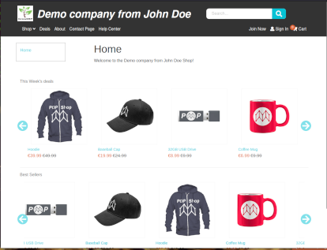
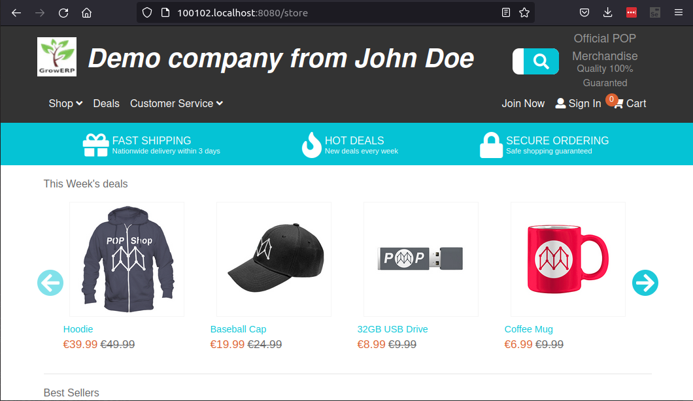

# Marketing & Sales
The marketing and Sales function defines the products and services the customer may need. Further, for product promotion, publishing of blogs and tutorials can be used. Use the social medium for regular announcements. Primary contact for customers.

### Definition of product categories.
Categories are used to group products together. This category can also be used at the E-commerce website in the 'shop' dropdown.
Products can be assigned to categories either on the product or the category detail screen.

### Add/update a product category
1. Select catalog from the main dashboard.
2. select categories
3. Press the '+' button to add, or an existing category to modify.
4. Add or modify the name and description.
5. Add or modify related products.
6. Press create/update.

### Add/update a product
1. After you started the application a screen will be shown with either the option to login with an existing login ID or start a new company with and admin login. Click/tap on the 'new company' option
2. complete the following screen, select the demo data only if you think it will help, we advice not to use it because it is very easy to setup and you do not need to delete demo data afterwards.
3. Press the 'create new company button' and wait until the login screen appears again.
4. The system will now send you a password email to the email address you entered at the registration screen. Use this password together with the email address (already filled in) and press the 'login' button. 
5. You should now see the main dashboard.
6. Select catalog and should see a product list.
7. Press the '+' button to add a new product and complete the form, select as type 'Physical good', make sure you use the warehouse and enter an amount in the 'assets in warehouse' field to tell the system you have a number of these products in stock.

### Publish a product on the E-commerce website
1. go (back) to the home screen using the home icon at the top right (mobile) or select 'dashboard' from the menu on the left (WebBrowser).
2. Select company on the main menu and then select 'website' on the bottom (mobile) or top(Web)
3. press the 'deals' button, then on the next screen press the 'select products' button, then add the product you just entered and press the update button to publish your product.
4. Enter now the internet address shown at the top of the website screen in your browser, the website should show your first product online. If you go back the product screen to add a picture and perhaps a more extensive description.

### GrowERP HTML E-Commerce website.

When a new company is created, also new subdomain and html E-commerce website is created.
The html website can be maintained within the flutter admin application as is shown in the mobile website screen. This subdomain can be replaced with a any other domain you prefer.

This website also can accept payments which will be forwarded to the registered company when a bank is provided.

