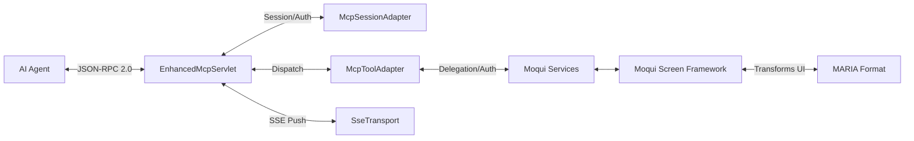

# Moqui MCP Server Documentation

## Overview

The Moqui MCP Server provides a direct interface for AI agents to interact with the [Moqui Framework](https://www.moqui.org/) ERP platform via the Model Context Protocol (MCP). Agents can securely browse screens, query data, discover and execute services, and run transactions natively — the same operations humans perform through the web UI — without browser automation or raw API scraping.

Component: **moqui-mcp-2 v1.0.0** (server version 2.0.2). MCP endpoint: `http://<host>:8080/mcp`.

---

## 1. Core Architecture



### 1.1 The MARIA Format
**MARIA (MCP Accessible Rich Internet Applications)** is a JSON serialization of W3C ARIA accessibility standards. Moqui transforms its declarative XML screens into a semantic accessibility tree instead of HTML — low noise, low latency, directly consumable by LLMs.

```json
{
  "role": "document", "name": "FindParty",
  "children": [
    {"role": "form", "name": "CreatePersonForm",
     "children": [
       {"role": "textbox", "name": "First Name", "required": true},
       {"role": "combobox", "name": "Role", "options": 140},
       {"role": "button", "name": "createPerson"}
     ]},
    {"role": "grid", "name": "PartyListForm", "rowcount": 47,
     "columns": ["ID", "Name", "Username", "Role"]}
  ]
}
```

AI agents are accessibility-challenged users: they need structured semantics, not pixels. MARIA applies the ARIA vocabulary over JSON/MCP, the same model screen readers use — so humans and agents can describe the same UI interaction in the same terms.

### 1.2 Rendering Modes

| Mode | Output | Use Case |
|------|--------|----------|
| `aria` | MARIA accessibility tree | Structured agent interaction |
| `compact` | Condensed JSON summary | Quick screen overview |
| `mcp` | Full semantic state | Complete metadata access |
| `text` | Plain text | Simple queries |
| `html` | Standard HTML | Debugging, human review |
| `ai` | AI-optimized JSON with business rules | Smaller models (9B params) |

### 1.3 Deployment Modes

The server adapts its available tools based on what Moqui components are loaded:

| Mode | When | Available Tools |
|------|------|-----------------|
| **PopCommerce** | `SimpleScreens` component loaded | Screen tools + service tools |
| **GrowERP** | `SimpleScreens` not loaded | Service tools only |

Screen tools (`moqui_browse_screens`, etc.) require `SimpleScreens`. If not present, those calls return an error directing the agent to use service tools instead.

### 1.4 Transport

The server supports two transport modes:
- **HTTP POST** (`/mcp`): Synchronous JSON-RPC 2.0. Works with any MCP client, including Claude Desktop, the GrowERP Flutter client, and direct curl.
- **SSE** (`/mcp/sse`): Server-Sent Events for real-time notifications (tool execution events, subscribed resource changes). `SseTransport` manages keep-alive and fan-out to active sessions.

### 1.5 Protocol Version Negotiation

Supported MCP protocol versions (in order of preference):
- `2025-11-25`, `2025-06-18`, `2024-11-05`, `2024-10-07`, `2023-06-05`

The server echoes back `2025-06-18` as its preferred version. Clients requesting an unsupported version receive an error.

---

## 2. Exposed MCP Tools

Tools are registered in `McpServices.xml` (`list#Tools`) and dispatched by `mcp#ToolsCall`.

### Screen Tools (require `SimpleScreens`)

#### `moqui_browse_screens`
Navigate to a screen path, optionally execute an action, and render the result as MARIA/compact/MCP JSON.
- `path` (required): Screen path, e.g. `PopCommerce/Catalog/Product/FindProduct`
- `action` (optional): Transition name to execute, e.g. `createProduct`
- `parameters` (optional): Map of form/query parameters
- `renderMode` (optional): `aria` | `compact` | `mcp` | `text` | `html`

#### `moqui_search_screens`
Discover screens across the application hierarchy by name or keyword. Returns top 15 scored matches including registered workflow documents.
- `query` (required): Search term, e.g. `product`, `order`, `party`

#### `moqui_get_screen_details`
Fetch field metadata for a screen: dropdown options, required fields, enumeration values. Use before submitting a form.
- `path` (required): Screen path
- `fieldName` (optional): Specific field; if omitted returns all fields
- `parameters` (optional): Context parameters for autocomplete

#### `moqui_get_help`
Retrieve Wiki documentation for a screen or service. URIs come from `describedby` fields in ARIA responses.
- `uri` (required): Help URI, e.g. `wiki:screen:EditProduct`, `wiki:workflow:Product-Variant-Creation`

### Service Tools (GrowERP / all deployments)

#### `moqui_search_services`
Search the service registry by name, noun, or verb. Returns each match with description, required params, and optional params. Searches `growerp.*` services by default.
- `query` (required): Keyword, e.g. `product`, `order`, `create#growerp`

#### `moqui_get_service_details`
Get full input/output parameter details (types, descriptions, required flags) for a specific service.
- `serviceName` (required): Full name, e.g. `update#growerp.product.Product`

#### `moqui_execute_service`
Execute a Moqui service directly with parameters, subject to the calling user's RBAC permissions.
- `serviceName` (required): Full service name
- `parameters` (optional): Input parameter map

### Prompt Tools

#### `moqui_prompts_list`
List all available MCP prompt templates from `McpPromptsData.xml`.

#### `moqui_prompts_get`
Retrieve and render a specific prompt template with provided arguments.
- `name` (required): Prompt name
- `arguments` (optional): Template arguments

### Inactive Tools

#### `moqui_batch_operations`
Execute multiple actions in a single round-trip. Currently **disabled** pending fixes.

---

## 3. MCP Protocol Coverage

Beyond tools, the server implements the full MCP spec surface:

| MCP Method | Handler Service | Notes |
|---|---|---|
| `initialize` | `mcp#Initialize` | Protocol negotiation, loads Wiki root instructions |
| `ping` | `mcp#Ping` | Health check |
| `tools/list` | `list#Tools` | Returns registered tool schemas |
| `tools/call` | `mcp#ToolsCall` | Dispatches to all tool handlers |
| `resources/list` | `mcp#ResourcesList` | Discovers Moqui entities by RBAC |
| `resources/read` | `mcp#ResourcesRead` | Queries entity data |
| `resources/templates/list` | `mcp#ResourcesTemplatesList` | Entity URI templates |
| `resources/subscribe` | `mcp#ResourcesSubscribe` | SSE-based resource watch |
| `resources/unsubscribe` | `mcp#ResourcesUnsubscribe` | Cancel subscription |
| `prompts/list` | `mcp#PromptsList` | List prompt templates |
| `prompts/get` | `mcp#PromptsGet` | Render prompt template |
| `roots/list` | `mcp#RootsList` | Root navigation hints |
| `sampling/createMessage` | `mcp#SamplingCreateMessage` | Client-side sampling |
| `elicitation/create` | `mcp#ElicitationCreate` | Human-in-the-loop input |

### Resources API
Resources expose Moqui entities scoped to the authenticated user's RBAC permissions via `ArtifactAuthzCheckView`. Entities the user can VIEW appear as `entity://<EntityName>` URIs. A special `moqui://mcp/instructions` resource is available to `McpUser` group members.

---

## 4. Agent Runtime

`AgentServices.xml` hosts an embedded agent runtime for background autonomous tasks using OpenAI-compatible APIs (VLLM, Ollama, OpenAI).

### 4.1 Message Types

| Type | Purpose |
|------|---------|
| `SmtyAgentTask` | CommEvent-based conversation with full thread history |
| `SmtyLlmRequest` | Single async request with callback (new pattern) |
| `SmtyLlmResponse` | Stored response for audit/callback |

### 4.2 Task Flow

**`SmtyAgentTask` (conversation thread pattern):**
1. Create `SystemMessage` (type `SmtyAgentTask`) with `rootCommEventId`.
2. `poll#AgentQueue` picks it up every 30 seconds (cron: `0/30 * * * * ?`).
3. `run#AgentTaskTurn` loads thread history from `CommunicationEvent` records, calls LLM.
4. Tool calls: saved as `CommunicationEvent`, executed via `call#McpToolWithDelegation`, results saved back.
5. Re-queues a new `SmtyAgentTask` turn until LLM returns a final response.

**`SmtyLlmRequest` (callback pattern):**
1. Any service calls `process#LLMRequest` with a prompt and `callbackServiceName`.
2. Poller picks it up, calls LLM with prompt directly, no thread history.
3. Response saved as `SmtyLlmResponse`; `callbackServiceName` invoked with `llmResponse`, `llmResponseSystemMessageId`, `llmRequestSystemMessageId`.

### 4.3 Tool Delegation

`call#McpToolWithDelegation` briefly impersonates `runAsUserId` via `ec.user.internalLoginUser()`, executes the tool through `McpToolAdapter`, then restores the agent identity. This ensures the agent operates with the target user's RBAC permissions, not the agent's own.

### 4.4 AI Configuration

`ProductStoreAiConfig` (keyed by `productStoreId` + `aiConfigId`) stores per-store LLM configuration:
- `endpointUrl`, `apiKey` (encrypted), `modelName`
- `temperature`, `maxTokens`
- `serviceTypeEnumId`: `AistOpenAi`, `AistVllm`, `AistAnthropic`, `AistOllama`

`call#OpenAiChatCompletion` is a generic OpenAI-compatible client; the same service handles VLLM and Ollama endpoints.

---

## 5. Security Model

Security uses Moqui's native artifact authorization — agents cannot bypass business rules.

### 5.1 User Groups

| Group | Purpose |
|-------|---------|
| `McpUser` | Human users accessing MCP (can use all MCP services, REST path `/mcp`) |
| `MCP_ALL_ACCESS` | Testing — broad access |
| `AgentUsers` | Autonomous agent accounts; allowed to call `call#McpToolWithDelegation` only |
| `ADMIN` | Always has access to all MCP services (`AUTHZT_ALWAYS`) |

### 5.2 Built-in Accounts

| Account | Username | Group | Purpose |
|---------|----------|-------|---------|
| `MCP_USER` | `mcp-user` | `McpUser` | Default human MCP access account |
| `AGENT_CLAUDE` | `agent-claude` | `AgentUsers` | Autonomous agent runner; impersonates target users via delegation |

`AGENT_CLAUDE_PARTY` (`partyId`) is a Person party used as `fromPartyId` in `CommunicationEvent` records created by the agent.

### 5.3 Artifact Groups

| Group | Members | Authorized To |
|-------|---------|---------------|
| `McpServices` | `McpServices.*`, `mcp#Initialize`, `list#Tools`, `mcp#ToolsCall`, `mcp#Ping` | `McpUser` (allow), `ADMIN` (always) |
| `McpRestPaths` | `/mcp`, `/mcp/*` | `McpUser` |
| `AgentDelegationServices` | `AgentServices.call#McpToolWithDelegation` | `AgentUsers` |

### 5.4 REST API Lockdown (GrowERP)

GrowERP's `GrowerpRestApiDisableData.xml` (in the `growerp` component) applies `AUTHZT_DENY` on `ADMIN` and `ALL_USERS` for:
- `/rest/s1/moqui/...` — Moqui Tools API
- `/rest/s1/mantle/...` — Mantle USL API
- `/rest/s1/mantle/my/...` — Mantle My Info API

This forces all data access through the MCP endpoint or GrowERP-specific REST routes, maintaining semantic and audit trails.

---

## 6. Getting Started

### 6.1 Backend Setup

```bash
# Start Moqui with moqui-mcp component loaded
cd moqui
java -jar moqui.war no-run-es

# MCP endpoint: http://localhost:8080/mcp
# Admin: http://localhost:8080/vapps  (user: SystemSupport, pass: moqui)
```

Connect any MCP-compliant client (Claude Desktop, Claude Code, curl) to `http://localhost:8080/mcp`.

```bash
# Quick health check
curl -X POST http://localhost:8080/mcp \
  -H "Content-Type: application/json" \
  -u mcp-user:moqui \
  -d '{"jsonrpc":"2.0","id":1,"method":"ping","params":{}}'
```

### 6.2 Flutter Client Integration

**McpChatView** (`flutter/packages/growerp_core/lib/src/mcp/mcp_chat_view.dart`) provides an embedded chat UI for MCP interactions.

**Input syntax (service tools only — no screen browsing in Flutter):**
| Prefix | Tool invoked |
|--------|-------------|
| `svc <query>` | `moqui_search_services` |
| `svc! <name>` | `moqui_get_service_details` |
| `exec! <name> {json}` | `moqui_execute_service` |
| Any other text | First matches `menuItems` (in-app navigation chips), then `moqui_search_services` |

**Features:**
- JSON-RPC 2.0 over HTTP POST (no SSE required)
- Session management via `Mcp-Session-Id` header
- `McpMenuEntry` list for direct in-app navigation chips
- Formatted output rendering, auto-scroll, status indicators

**Menu registration** (`GrowerpMenuSeedData.xml`):
```xml
<growerp.menu.MenuItem menuItemId="CORE_EX_MCP" menuConfigurationId="CORE_EXAMPLE_DEFAULT"
    title="MCP Chat" route="/mcp" iconName="smart_toy" widgetName="McpChatView" sequenceNum="60"/>
```

---

## 7. Self-Guided Narrative Screens

Screens output a `uiNarrative` (via `UiNarrativeBuilder`) that tells the AI:
- Current state ("Found 20 products")
- Available actions with exact invocation examples
- Related navigation links

Enables zero-shot discovery across the entire ERP by following UI narratives.

---

## 8. Internal Organization

### 8.1 Source Code (`src/main/groovy/org/moqui/mcp/`)

**Servlet & Adapters:**
- **`EnhancedMcpServlet.groovy`**: HTTP entry point. Handles JSON-RPC 2.0, SSE upgrades, session lifecycle. Delegates to adapters.
- **`adapter/McpSessionAdapter.groovy`**: Session creation, lookup, activity tracking, statistics. Uses in-memory `ConcurrentHashMap` cache plus 30-second throttled DB updates.
- **`adapter/McpToolAdapter.groovy`**: Lists registered tools and dispatches `callTool()` calls.
- **`adapter/MoquiNotificationMcpBridge.groovy`**: Bridges Moqui notification system to MCP SSE push events.
- **`transport/SseTransport.groovy`**: SSE connection fan-out, keep-alive (30s), max 100 concurrent connections.
- **`transport/MoquiMcpTransport.groovy`**: Low-level transport abstraction.

**Screen Rendering:**
- **`CustomScreenTestImpl.groovy`**: Hooks into Moqui's screen rendering pipeline, intercepts output.
- **`McpScreenTestRender.groovy`**: Transforms Moqui declarative XML screens into MARIA JSON or the AI-optimized format.
- **`McpWidgetSystem.groovy`**: Per-widget ARIA role mappings and serialization logic.
- **`WebFacadeStub.groovy`**: Mock `HttpServletRequest`/`Response`/`Session` used to render screens headlessly outside a real HTTP request.

**Utilities:**
- **`UiNarrativeBuilder.groovy`**: Generates the self-guided narrative text: inspects rendered screen, counts forms/lists/actions, produces the "what to call next" instructions.
- **`McpFieldOptionsService.groovy`**: Resolves dropdown options, entity-backed fields, and validation constraints for `moqui_get_screen_details`.
- **`McpScreenTest.groovy`**: Convenience wrapper for screen test invocations.
- **`McpUtils.groovy`**: Shared utility methods.

### 8.2 Services (`service/`)

- **`McpServices.xml`**: All JSON-RPC method handlers (`mcp#Initialize`, `mcp#ToolsCall`, `mcp#ResourcesList`, `mcp#BrowseScreens`, `mcp#SearchScreens`, `mcp#GetScreenDetails`, `mcp#GetHelp`, `list#Tools`, prompts, resources subscribe/unsubscribe, roots, sampling, elicitation). This is the primary service file.
- **`McpServices.mcp.ExecuteScreenAction.xml`**: Decomposed service for screen action execution.
- **`McpServices.mcp.RenderScreenNarrative.xml`**: Decomposed service for narrative rendering.
- **`McpServices.mcp.ResolveScreenPath.xml`**: Screen path resolution helpers.
- **`AgentServices.xml`**: Agent Runtime services: `call#McpToolWithDelegation`, `call#OpenAiChatCompletion`, `process#LLMRequest`, `run#AgentTaskTurn`, `poll#AgentQueue`, `callback#CommunicationEvent`.
- **`Agent.secas.xml`**: SECA rules for agent event-driven triggers.
- **`UpdateAgentConfig.xml`**: Services for updating `ProductStoreAiConfig` records.
- **`service/org/moqui/mcp/McpTestServices.xml`**: Test/debug services.

### 8.3 Data Models (`entity/`)

- **`AgentEntities.xml`**:
  - `extend-entity SystemMessage` — adds fields: `requestedByPartyId`, `effectiveUserId`, `productStoreId`, `aiConfigId`, `rootCommEventId`, `parentSystemMessageId`, `callbackServiceName`, `callbackParameters`, `sourceTypeEnumId`, `sourceId`, `llmResponse`.
  - `ProductStoreAiConfig` — per-store AI gateway configuration (endpoint, API key, model, temperature, max tokens, system prompt template).
  - Seeds `AiServiceType` enumeration: `AistOpenAi`, `AistVllm`, `AistAnthropic`, `AistOllama`.
- **`McpCoreEntities.xml`**: Empty. MCP uses Moqui's built-in entities (authentication, audit logging, permissions) without custom schema additions.

### 8.4 Seed Data (`data/`)

- **`McpSecuritySeedData.xml`**: User groups (`McpUser`, `MCP_ALL_ACCESS`), artifact groups (`McpServices`, `McpRestPaths`), authorization rules, `MCP_USER` account.
- **`AgentData.xml`**: `AgentUsers` group, `AGENT_CLAUDE`/`AGENT_CLAUDE_PARTY`, `AgentDelegationServices` artifact group, `AgentQueuePoller` job (cron every 30s), `SmtyAgentTask`/`SmtyLlmRequest`/`SmtyLlmResponse` message types.
- **`AgentEnumData.xml`**: Additional agent-related enumerations.
- **`McpScreenDocsData.xml`**: Wiki docs bound to screens, fed as context to the AI.
- **`McpPromptsData.xml`**: Pre-configured system prompts and behaviors.
- **`BusinessProcessesData.xml`**: Registered business workflow documents (returned by `moqui_search_screens`).

### 8.5 Screens (`screen/`)

- **`macro/DefaultScreenMacros.any.ftl`**: FreeMarker macros for general screen output.
- **`macro/DefaultScreenMacros.mcp.ftl`**: FreeMarker macros for MCP-mode screen output.
- **`McpTestScreen.xml`**: Manual test screen for validating MCP transitions and narrative outputs without an external client.

### 8.6 Tests (`test/`)

- **`test/client/McpTestClient.groovy`**: Groovy MCP client for integration tests.
- **`test/java/.../McpIntegrationTest.java`**, **`CatalogScreenTest.java`**, **`PopCommerceOrderTest.java`**, **`ScreenInfrastructureTest.java`**: Java integration test suite.
- **`test/workflows/EcommerceWorkflowTest.groovy`**: End-to-end workflow tests.
- **`src/test/groovy/.../McpTestSuite.groovy`**, **`AutocompleteTest.groovy`**: Unit test suite.
- **`test/run-tests.sh`**, **`test/screen/run-screen-tests.sh`**: Test runner scripts.
