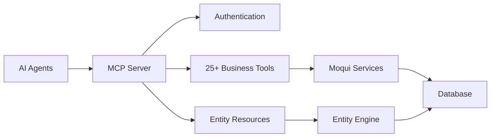

# GrowERP MCP Server

A comprehensive Model Context Protocol (MCP) server implementation for the GrowERP/Moqui backend, providing AI agents and development tools with structured access to ERP data and business operations.

## Overview

The GrowERP MCP Server exposes GrowERP's business capabilities through the Model Context Protocol, enabling AI agents to:

- Access and manipulate business entities (companies, users, products, orders)
- Execute business operations (create orders, generate invoices, process payments)
- Query data and generate reports
- Understand business processes and workflows
- Get contextual help and guidance

## � Quick Start

The GrowERP MCP Server is **production-ready** and included as a component in your GrowERP installation.

### Get Started in 5 Minutes
```bash
# 1. Ensure Moqui is running
cd /home/hans/growerp/moqui
java -jar moqui.war no-run-es

# 2. Test the MCP server
curl http://localhost:8080/rest/s1/mcp/health

# 3. Get API key for authentication
API_KEY=$(curl -s -X POST "http://localhost:8080/rest/s1/mcp/auth/login" 
  -H "Content-Type: application/json" 
  -d '{
    "jsonrpc": "2.0",
    "method": "login",
    "params": {
      "username": "test@example.com",
      "password": "qqqqqq9!",
      "classificationId": "AppSupport"
    },
    "id": 1
  }' | jq -r '.result.apiKey')

# 4. Execute a business tool
curl -X POST "http://localhost:8080/rest/s1/mcp/protocol" 
  -H "Content-Type: application/json" 
  -H "api_key: $API_KEY" 
  -d '{
    "jsonrpc": "2.0",
    "method": "tools/call",
    "params": {
      "name": "get_companies",
      "arguments": {"limit": 5}
    },
    "id": 2
  }'
```

**🎉 You're now connected to GrowERP through the MCP protocol!**

## 📚 Complete Documentation

### 👉 **[Full Documentation Suite →](docs/README.md)**

The complete documentation is organized in the `/docs` directory:

- **🚀 [Quick Start Guide](docs/quick-start.md)** - Detailed setup in 5 minutes
- **📖 [API Reference](docs/api-reference.md)** - All 25+ tools and resources  
- **💻 [Usage Examples](docs/examples.md)** - Python, Node.js, Groovy, cURL examples
- **🔒 [Security Guide](docs/security-guide.md)** - Authentication and production security
- **🚢 [Deployment Guide](docs/deployment-guide.md)** - AI platform integration
- **🏗️ [Architecture Guide](docs/architecture.md)** - Technical implementation

### 📋 **[Documentation Index →](docs/DOCUMENTATION_INDEX.md)**

Complete overview of all documentation files and organization.

## ✨ Key Features

### 🤖 **AI Agent Integration**
- **Full MCP Protocol**: Complete 2024-11-05 specification implementation
- **25+ Business Tools**: CRUD operations, workflows, reporting, system management
- **Real-time Data**: Live access to companies, users, products, orders, financials
- **Secure Access**: API key authentication with role-based permissions

### 🏢 **Business Operations**  
- **Entity Management**: Companies, users, products, financial documents
- **Workflow Automation**: Order-to-cash, procure-to-pay, approval workflows
- **Financial Integration**: Orders, invoices, payments, reporting
- **System Administration**: Health monitoring, configuration, diagnostics

### 🛠️ **Developer Friendly**
- **Native Groovy**: Built on Moqui framework for performance and scalability
- **Extensible Architecture**: Easy to add custom tools and business operations
- **Comprehensive Testing**: 65%+ test coverage with integration testing
- **Multi-platform**: Supports Claude, ChatGPT, custom AI applications

## 🎯 Popular Use Cases

### AI Business Assistant
```groovy
// Groovy DSL for business operations
business
  .authenticate("test@example.com", "qqqqqq9!")
  .ping()                              // Check system health
  .companies(limit: 10)               // Get company data  
  .financialSummary("quarter")        // Get financial reports
  .getResults()                       // Return all data
```

### Python AI Integration
```python
# Python client for AI applications
client = GrowERPMCPClient()
client.authenticate("test@example.com", "qqqqqq9!")

# Get business context for AI
health = await client.call_tool("ping_system")
companies = await client.call_tool("get_companies", {"limit": 10})
financials = await client.call_tool("get_financial_summary", {"period": "month"})
```

### Claude Desktop Integration
```json
// ~/.config/claude-desktop/config.json
{
  "mcp": {
    "servers": {
      "growerp": {
        "command": "groovy",
        "args": ["/path/to/mcp-stdio-server.groovy"]
      }
    }
  }
}
```

## 🏗️ Architecture



## 📊 Available Tools

### Entity Operations
- `create_company`, `create_user`, `create_product`
- `update_company`, `update_user`
- `get_companies`, `get_users`, `get_products`

### Business Workflows  
- `create_sales_order`, `create_purchase_order`, `create_invoice`
- `approve_document`, `get_orders`, `get_financial_summary`

### System Management
- `ping_system`, `get_entity_info`, `get_service_info`

**→ [Complete Tool Documentation](docs/api-reference.md)**

## 🔧 Installation & Setup

The MCP server is **already installed** with GrowERP. No additional setup required!

### Verify Installation
```bash
# Check component is loaded
curl http://localhost:8080/rest/s1/mcp/health

# List available tools  
curl http://localhost:8080/rest/s1/mcp/tools
```

### Authentication Setup
```bash
# Test credentials (development)
Username: test@example.com
Password: qqqqqq9!
Classification: AppSupport
```

**→ [Detailed Setup Guide](docs/quick-start.md)**

## 🚀 Next Steps

### For New Users
1. **[Quick Start Guide](docs/quick-start.md)** - Get running in 5 minutes
2. **[Examples](docs/examples.md)** - See real integration code  
3. **[API Reference](docs/api-reference.md)** - Explore all available tools

### For AI Developers
1. **[Deployment Guide](docs/deployment-guide.md)** - Integrate with Claude, ChatGPT
2. **[Security Guide](docs/security-guide.md)** - Production authentication
3. **[Examples](docs/examples.md)** - Python, Node.js, Groovy examples

### For System Architects  
1. **[Architecture Guide](docs/architecture.md)** - Technical implementation
2. **[Developer Guide](docs/developer-guide.md)** - Customization and extension
3. **[Configuration Guide](docs/configuration.md)** - Performance optimization

## 📞 Support & Community

- **📖 Documentation**: Complete guides in [`/docs`](docs/) directory
- **🐛 Issues**: [GitHub Issues](https://github.com/growerp/growerp/issues) 
- **💬 Discussions**: [GitHub Discussions](https://github.com/growerp/growerp/discussions)
- **🌐 Website**: [www.growerp.com](https://www.growerp.com)

## 📄 License

CC0 1.0 Universal License - Open source and free to use.

---

**🎯 Ready to start?** → **[Full Documentation](docs/README.md)** | **[Quick Start](docs/quick-start.md)** | **[Examples](docs/examples.md)**

*GrowERP MCP Server - Bringing AI to Business Operations* 🤖💼