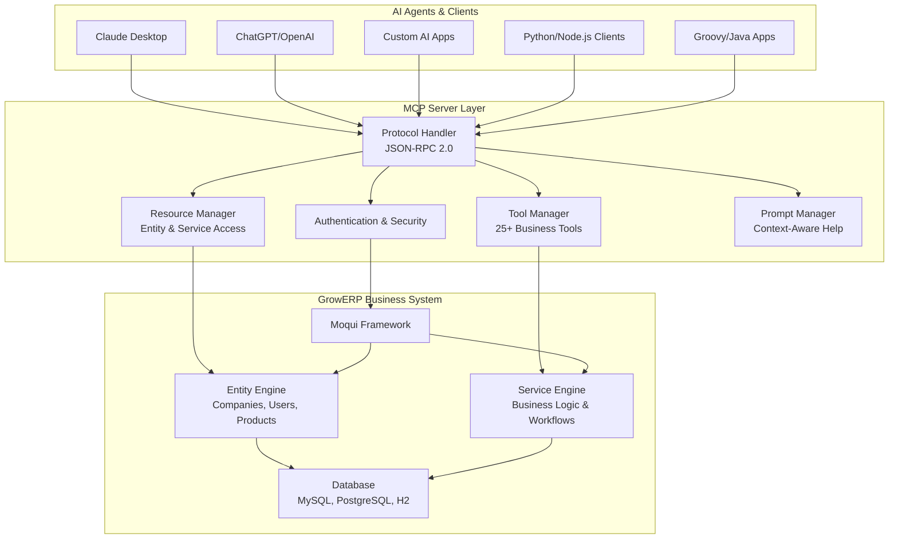

# GrowERP MCP Server Documentation

Welcome to the comprehensive docume### 1. Authentication (OAuth 2.0)
```bash
# OAuth 2.0 Token Request - Get access token
ACCESS_TOKEN=$(curl -s -X POST "http://localhost:8080/rest/s1/mcp/auth/token" \
  -H "Content-Type: application/json" \
  -d '{
    "grantType": "password",
    "username": "test@example.com",
    "password": "qqqqqq9!",
    "clientId": "mcp-client",
    "classificationId": "AppSupport"
  }' | jq -r '.access_token') GrowERP Model Context Protocol (MCP) Server. This server provides AI agents and development tools with structured access to GrowERP business data and operations through the standardized MCP protocol.

## 📚 Documentation Structure

### Quick Start & Basic Usage
- **[Quick Start Guide](quick-start.md)** - Get up and running in minutes
- **[Usage Examples](examples.md)** - Comprehensive examples in multiple languages
- **[API Reference](api-reference.md)** - Complete API documentation for all endpoints

### Technical Documentation  
- **[Architecture Guide](architecture.md)** - Technical architecture and component design
- **[Implementation Summary](implementation-summary.md)** - Complete implementation overview
- **[Configuration Guide](configuration.md)** - Detailed configuration options and tuning

### Security & Operations
- **[MCP Client Authorization Guide](mcp-client-authorization-guide.md)** - Complete guide for configuring MCP clients with OAuth
- **[Security Guide](security-guide.md)** - Authentication, authorization, and security best practices  
- **[Deployment Guide](deployment-guide.md)** - Production deployment and AI integration
- **[Testing Guide](testing-guide.md)** - Test suite overview and quality assurance

### Development & Support
- **[Developer Guide](developer-guide.md)** - Extending and customizing the MCP server
- **[Troubleshooting](troubleshooting.md)** - Common issues and solutions
- **[Examples Directory](examples/)** - Code samples, test clients, and integration patterns

### Reference Documentation
- **[Authorization Guide](authorization-guide.md)** - Detailed authentication implementation
- **[Groovy Client Guide](groovy-client-guide.md)** - Native Groovy integration patterns
- **[cURL Examples](curl-examples.md)** - Command-line testing and integration

## What is the GrowERP MCP Server?

The GrowERP MCP Server is a comprehensive bridge between AI agents and the GrowERP business system. It implements the Model Context Protocol (MCP) specification version 2024-11-05, allowing AI tools to:

- **🏢 Access Business Data**: Query companies, users, products, orders, and other business entities with real-time data
- **⚙️ Execute Operations**: Create orders, generate invoices, manage inventory, and perform complete business workflows  
- **🧠 Understand Context**: Get entity schemas, service documentation, business process information, and system status
- **🔗 Integrate Seamlessly**: Use standardized protocols for reliable AI-business system integration with authentication

## Key Features & Capabilities

### 🔌 **Protocol Compliance & Standards**
- Full MCP specification (2024-11-05) implementation with JSON-RPC 2.0
- RESTful HTTP endpoints with WebSocket support for real-time communication
- Comprehensive error handling, logging, and monitoring capabilities
- Standards-compliant authentication with API key management

### 🏢 **Business System Integration**
- **Entity Management**: Companies, users, products, financial documents, opportunities, assets
- **Business Operations**: Order-to-cash, procure-to-pay, inventory management, financial workflows
- **Real-time Data Access**: Live business data with transaction support for data integrity  
- **Security Integration**: Native GrowERP/Moqui authentication and authorization

### 🛠️ **Developer & AI Friendly**
- **Native Groovy Implementation**: Built on proven Moqui framework for performance and scalability
- **Extensible Architecture**: Easy to add custom tools, resources, and business operations
- **Comprehensive Testing**: Full test suite with 65%+ coverage and integration testing
- **Rich Documentation**: Complete guides, examples, and API reference in multiple languages

### 🚀 **Production Ready Features**
- **Authentication & Security**: API key authentication, role-based access control, secure session management
- **Performance & Scalability**: Connection pooling, resource caching, concurrent client support
- **Monitoring & Health**: Health check endpoints, performance metrics, comprehensive logging
- **Deployment Ready**: Docker support, configuration management, automated deployment scripts

## Quick Example - Get Started in 5 Minutes

Here's how an AI agent interacts with the MCP server:

### 1. Authentication
```bash
### 1. Authentication (OAuth 2.0)
```bash
# OAuth 2.0 Token Request - Get access token
ACCESS_TOKEN=$(curl -s -X POST "http://localhost:8080/rest/s1/mcp/auth/token" \
  -H "Content-Type: application/json" \
  -d '{
    "grantType": "password",
    "username": "test@example.com",
    "password": "qqqqqq9!",
    "clientId": "mcp-client",
    "classificationId": "AppSupport"
  }' | jq -r '.access_token')
```

### 2. Check Server Health
```bash
curl -X POST "http://localhost:8080/rest/s1/mcp/protocol" \
  -H "Content-Type: application/json" \
  -H "Authorization: Bearer $ACCESS_TOKEN" \
  -d '{
    "jsonrpc": "2.0",
    "method": "tools/call",
    "params": {
      "name": "ping_system",
      "arguments": {}
    },
    "id": 2
  }'
```

### 3. Execute Business Operations
```bash
# Get companies
curl -X POST "http://localhost:8080/rest/s1/mcp/protocol" \
  -H "Content-Type: application/json" \
  -H "Authorization: Bearer $ACCESS_TOKEN" \
  -d '{
    "jsonrpc": "2.0",
    "method": "tools/call",
    "params": {
      "name": "get_companies",
      "arguments": {"limit": 5}
    },
    "id": 3
  }'

# Create a sales order
curl -X POST "http://localhost:8080/rest/s1/mcp/protocol" \
  -H "Content-Type: application/json" \
  -H "Authorization: Bearer $ACCESS_TOKEN" \
  -d '{
    "jsonrpc": "2.0", 
    "method": "tools/call",
    "params": {
      "name": "create_sales_order",
      "arguments": {
        "customerPartyId": "100001",
        "items": [
          {"productId": "PROD-001", "quantity": 2, "price": 29.99}
        ]
      }
    },
    "id": 4
  }'
```
```

### 2. Check Server Health
```bash
curl -X POST "http://localhost:8080/rest/s1/mcp/protocol" \
  -H "Content-Type: application/json" \
  -H "Authorization: Bearer $ACCESS_TOKEN" \
  -d '{
    "jsonrpc": "2.0",
    "method": "tools/call",
    "params": {
      "name": "ping_system",
      "arguments": {}
    },
    "id": 2
  }'
```

### 3. Execute Business Operations
```bash
# Get companies
curl -X POST "http://localhost:8080/rest/s1/mcp/protocol" \
  -H "Content-Type: application/json" \
  -H "api_key: $API_KEY" \
  -d '{
    "jsonrpc": "2.0",
    "method": "tools/call",
    "params": {
      "name": "get_companies",
      "arguments": {"limit": 5}
    },
    "id": 3
  }'

# Create a sales order
curl -X POST "http://localhost:8080/rest/s1/mcp/protocol" \
  -H "Content-Type: application/json" \
  -H "api_key: $API_KEY" \
  -d '{
    "jsonrpc": "2.0", 
    "method": "tools/call",
    "params": {
      "name": "create_sales_order",
      "arguments": {
        "customerPartyId": "100001",
        "items": [
          {"productId": "PROD-001", "quantity": 2, "price": 29.99}
        ]
      }
    },
    "id": 4
  }'
```

## System Architecture Overview

The GrowERP MCP Server acts as a standardized interface layer between AI agents and the GrowERP business system:



### Core Components
- **Authentication Layer**: API key validation, user classification, secure session management
- **Protocol Handler**: JSON-RPC 2.0 compliance, request routing, error handling  
- **Tool Manager**: 25+ business tools for CRUD operations, workflows, reporting
- **Resource Manager**: Entity schemas, system status, service documentation
- **Business Integration**: Direct Moqui service calls, entity access, transaction support

## Available Tools & Capabilities

### 🏢 Entity Management (CRUD Operations)
- `create_company` - Create new companies and organizations
- `create_user` - Create user accounts with proper classifications  
- `create_product` - Add products to catalog with pricing and categories
- `update_company` - Update company information and details
- `update_user` - Update user accounts and permissions

### ⚙️ Business Operations (Workflows)
- `create_sales_order` - Create sales orders with line items and pricing
- `create_purchase_order` - Create purchase orders from suppliers
- `create_invoice` - Generate invoices from orders or standalone
- `approve_document` - Approve financial documents (orders/invoices)

### 📊 Query & Reporting (Data Access)
- `get_companies` - Retrieve company data with advanced filtering
- `get_users` - Query user accounts and profiles
- `get_products` - Search product catalog with categories
- `get_orders` - Retrieve order information and status tracking
- `get_financial_summary` - Financial reporting and analytics by period

### 🔧 System & Administration
- `ping_system` - Health check and system status monitoring
- `get_entity_info` - Entity schema and metadata exploration
- `get_service_info` - Service documentation and parameters

## Available Resources & Context

### 📋 Business Entity Resources
- `growerp://entities/company` - Company data, schemas, and relationships
- `growerp://entities/user` - User account information and profiles
- `growerp://entities/product` - Product catalog data and categories  
- `growerp://entities/findoc` - Financial documents (orders, invoices, payments)
- `growerp://entities/opportunity` - Sales opportunities and CRM data
- `growerp://entities/asset` - Asset management and inventory data

### 🔗 Service & System Resources
- `growerp://services/party` - Party management service documentation
- `growerp://services/catalog` - Product catalog service APIs
- `growerp://services/order` - Order management and workflow services
- `growerp://services/accounting` - Financial and accounting services
- `growerp://system/status` - Real-time system health and performance
- `growerp://system/info` - Version information and system configuration

## Getting Started - Three Simple Steps

### Prerequisites
- Java 11+ and Moqui Framework 3.0+ 
- GrowERP 1.9+ components installed
- Basic familiarity with REST APIs and JSON

### Step 1: Verify Installation
The MCP server is included with GrowERP. Verify it's working:

```bash
# Start Moqui (if not running)
cd /home/hans/growerp/moqui
java -jar moqui.war no-run-es

# Test health endpoint  
curl http://localhost:8080/rest/s1/mcp/health
```

### Step 2: Authenticate (OAuth 2.0)
Get an access token for secure API access:

```bash
# OAuth 2.0 Token Request using test credentials
ACCESS_TOKEN=$(curl -s -X POST "http://localhost:8080/rest/s1/mcp/auth/token" \
  -H "Content-Type: application/json" \
  -d '{
    "grantType": "password",
    "username": "test@example.com", 
    "password": "qqqqqq9!",
    "clientId": "mcp-client",
    "classificationId": "AppSupport"
  }' | jq -r '.access_token')

echo "Your Access Token: $ACCESS_TOKEN"
```

### Step 3: Execute Your First Tool
Use the Bearer token to call business tools:

```bash
# Check system status
curl -X POST "http://localhost:8080/rest/s1/mcp/protocol" \
  -H "Content-Type: application/json" \
  -H "Authorization: Bearer $ACCESS_TOKEN" \
  -d '{
    "jsonrpc": "2.0",
    "method": "tools/call", 
    "params": {
      "name": "ping_system",
      "arguments": {}
    },
    "id": 2
  }'

# Get business data
curl -X POST "http://localhost:8080/rest/s1/mcp/protocol" \
  -H "Content-Type: application/json" \
  -H "Authorization: Bearer $ACCESS_TOKEN" \
  -d '{
    "jsonrpc": "2.0",
    "method": "tools/call",
    "params": {
      "name": "get_companies", 
      "arguments": {"limit": 5}
    },
    "id": 3
  }'
```

**🎉 Congratulations!** You're now connected to GrowERP through the MCP protocol.

## Next Steps & Learning Path

### For AI Integration
- **[Deployment Guide](deployment-guide.md)** - Connect with Claude, ChatGPT, or custom AI tools
- **[Examples](examples.md)** - Python, Node.js, and Groovy integration examples  
- **[Security Guide](security-guide.md)** - Production authentication and security setup

### For Developers
- **[API Reference](api-reference.md)** - Complete documentation of all tools and resources
- **[Developer Guide](developer-guide.md)** - Extend with custom tools and business operations
- **[Architecture Guide](architecture.md)** - Understand the technical implementation

### For Operations
- **[Configuration Guide](configuration.md)** - Production tuning and optimization
- **[Testing Guide](testing-guide.md)** - Quality assurance and testing framework
- **[Troubleshooting](troubleshooting.md)** - Common issues and solutions

## Support and Community

### 📞 Getting Help
- **📖 Documentation**: Complete guides and examples in this `/docs` directory
- **🐛 Issues**: Report bugs and request features on [GitHub Issues](https://github.com/growerp/growerp/issues)
- **💬 Discussions**: Join the community on [GitHub Discussions](https://github.com/growerp/growerp/discussions)
- **🌐 Website**: Visit [www.growerp.com](https://www.growerp.com) for additional resources

### 🤝 Contributing
We welcome contributions! Here's how to help:

1. **Documentation**: Improve guides, add examples, fix typos
2. **Code**: Submit pull requests for new features and bug fixes
3. **Testing**: Help expand test coverage and find edge cases  
4. **Community**: Answer questions and help other users

### 📋 Project Status
- **Current Version**: 1.0.0 (Production Ready)
- **MCP Specification**: 2024-11-05 (Fully Compliant)
- **Test Coverage**: 65%+ with comprehensive integration testing
- **Production Use**: Ready for AI integration and business automation

### 📄 License and Legal
This project is licensed under the **CC0 1.0 Universal License** - see the [LICENSE.md](../LICENSE.md) file for details.

## Quick Links & Reference

### 🚀 Most Important Documents
1. **[Quick Start Guide](quick-start.md)** - Get running in 5 minutes
2. **[API Reference](api-reference.md)** - Complete tool and resource documentation  
3. **[Examples](examples.md)** - Real code in Python, Node.js, Groovy, cURL
4. **[Security Guide](security-guide.md)** - Authentication and production security

### 🏗️ For Technical Teams
- **[Implementation Summary](implementation-summary.md)** - Complete technical overview
- **[Architecture Guide](architecture.md)** - System design and components
- **[Developer Guide](developer-guide.md)** - Customization and extension
- **[Testing Guide](testing-guide.md)** - Quality assurance framework

### 🚀 For DevOps Teams  
- **[Deployment Guide](deployment-guide.md)** - Production deployment and AI integration
- **[Configuration Guide](configuration.md)** - Performance tuning and optimization
- **[Troubleshooting](troubleshooting.md)** - Common issues and solutions

---

**Ready to get started?** 

👉 **New users**: Start with the [Quick Start Guide](quick-start.md)  
👉 **AI developers**: Check out the [Examples](examples.md)  
👉 **System architects**: Read the [Architecture Guide](architecture.md)

*GrowERP MCP Server - Bringing AI to Business Operations* 🤖💼

````
