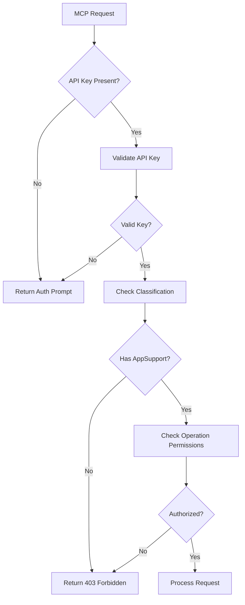

# MCP Authorization and Security Guide

This document describes the security implementation for the GrowERP MCP (Model Context Protocol) component, including API key authentication, authorization levels, and security best practices.

## Overview

The MCP component implements comprehensive security controls that integrate with GrowERP's existing authentication system. All MCP endpoints require API key authentication, and users must have appropriate classifications and permissions.

## Authentication System

### Authentication Flow

1. **Frontend Login**: Client logs in with username/password through GrowERP
2. **API Key Generation**: Upon successful login, GrowERP returns a secure API key
3. **MCP Access**: Client includes API key in headers for all MCP requests
4. **Authorization Validation**: MCP validates the API key and checks user permissions

### API Key Format
- **Header Name**: `api_key`
- **Key Length**: 40 characters
- **Format**: Alphanumeric string generated by GrowERP authentication system
- **Expiration**: Configurable (default: 24 hours)

## User Classifications and Permissions

### Required Classification
- **AppSupport**: Required for all MCP access
- Additional classifications can be configured for specific operations

### Permission Levels
1. **Read Access**: Query entities, read resources, list tools
2. **Execute Access**: Run tools, perform business operations
3. **Admin Access**: System management, configuration changes

## API Key Usage

### Authentication Headers
```bash
# Include in all MCP requests
api_key: <your_api_key_here>
```

### Test Credentials
For development and testing:
- **Username**: `test@example.com`
- **Password**: `qqqqqq9!`
- **Classification**: `AppSupport`

## Protected Endpoints

All MCP REST endpoints require authentication:

### Core MCP Endpoints
- `POST /rest/s1/mcp/protocol` - Main MCP JSON-RPC endpoint
- `POST /rest/s1/mcp/mcp` - Legacy MCP endpoint
- `GET /rest/s1/mcp/health` - Health check endpoint
- `GET /rest/s1/mcp/tools` - List available tools
- `GET /rest/s1/mcp/resources` - List available resources
- `GET /rest/s1/mcp/prompts` - List available prompts

### Authentication Endpoints
- `POST /rest/s1/mcp/auth/login` - Login and get API key
- `POST /rest/s1/mcp/auth/prompt` - Get authentication prompt
- `POST /rest/s1/mcp/auth/validate` - Validate API key

## Authentication Implementation

### Services Created

#### 1. McpAuthServices.validate#McpApiKey
Validates API key against GrowERP authentication system:
- Checks API key validity and expiration
- Verifies user account status
- Validates required classifications
- Returns authentication status and user details

#### 2. McpAuthServices.check#McpAuthorization  
Comprehensive authorization check:
- Validates API key using validate#McpApiKey
- Checks operation-specific permissions
- Handles different authorization levels
- Used by all MCP service operations

#### 3. McpAuthServices.create#AuthenticationPrompt
Generates authentication prompts for unauthorized requests:
- Creates user-friendly authentication messages
- Includes test credentials for development
- Provides guidance for obtaining API keys

### Authorization Flow



## Error Responses

### 401 Unauthorized - Missing/Invalid API Key
```json
{
  "jsonrpc": "2.0",
  "id": 1,
  "error": {
    "code": -32001,
    "message": "Authentication required: API key required for MCP access",
    "data": {
      "authPrompt": {
        "type": "login",
        "message": "Please log in to GrowERP to get an API key",
        "testCredentials": {
          "username": "test@example.com",
          "password": "qqqqqq9!",
          "classification": "AppSupport"
        }
      }
    }
  }
}
```

### 403 Forbidden - Insufficient Permissions
```json
{
  "jsonrpc": "2.0", 
  "id": 1,
  "error": {
    "code": -32001,
    "message": "Authorization failed: Insufficient permissions for requested operation"
  }
}
```

## Testing Authentication

### 1. Test Unauthenticated Request
```bash
curl -X POST "http://localhost:8080/rest/s1/mcp/protocol" \
  -H "Content-Type: application/json" \
  -d '{
    "jsonrpc": "2.0",
    "method": "tools/call",
    "params": {
      "name": "get_companies",
      "arguments": {}
    },
    "id": 1
  }'
```

Expected: Authentication prompt with login details

### 2. Login and Get API Key
```bash
# Login to get API key
API_KEY=$(curl -s -X POST "http://localhost:8080/rest/s1/mcp/auth/login" \
  -H "Content-Type: application/json" \
  -d '{
    "jsonrpc": "2.0",
    "method": "login",
    "params": {
      "username": "test@example.com",
      "password": "qqqqqq9!",
      "classificationId": "AppSupport"
    },
    "id": 2
  }' | jq -r '.result.apiKey')

echo "API Key: $API_KEY"
```

### 3. Use API Key for Protected Access
```bash
curl -X POST "http://localhost:8080/rest/s1/mcp/protocol" \
  -H "Content-Type: application/json" \
  -H "api_key: $API_KEY" \
  -d '{
    "jsonrpc": "2.0",
    "method": "tools/call",
    "params": {
      "name": "get_companies",
      "arguments": {}
    },
    "id": 3
  }'
```

Expected: Successful response with company data

### 4. Test Invalid API Key
```bash
curl -X POST "http://localhost:8080/rest/s1/mcp/protocol" \
  -H "Content-Type: application/json" \
  -H "api_key: invalid-key-123" \
  -d '{
    "jsonrpc": "2.0",
    "method": "tools/call",
    "params": {
      "name": "get_companies",
      "arguments": {}
    },
    "id": 4
  }'
```

Expected: Authentication prompt due to invalid key

## Security Configuration

### Environment Variables
```bash
# API Key Security
API_KEY_EXPIRATION=86400000  # 24 hours in milliseconds
API_KEY_REQUIRED=true        # Require API keys for all endpoints
API_KEY_ALLOW_REFRESH=true   # Allow API key refresh

# Session Security
SESSION_TIMEOUT=86400000     # 24 hours
REQUIRE_HTTPS=false          # Set true in production
```

### Classification Requirements
Configure in `MoquiConf.xml`:
```xml
<moqui-conf>
  <tools-conf>
    <mcp-security>
      <required-classification>AppSupport</required-classification>
      <admin-classification>AppAdmin</admin-classification>
    </mcp-security>
  </tools-conf>
</moqui-conf>
```

## Security Best Practices

### Production Security

1. **HTTPS Only**
   - Always use HTTPS in production
   - API keys transmitted over secure connections only
   - Configure proper SSL certificates

2. **API Key Management**
   - Implement API key rotation policies
   - Monitor API key usage and abuse
   - Provide key revocation mechanisms

3. **Network Security**
   - Use firewalls to limit MCP server access
   - Consider VPN for sensitive operations
   - Implement rate limiting

4. **Audit Logging**
   - Log all MCP operations with user context
   - Monitor authentication failures
   - Track unusual access patterns

### Client Security

1. **Secure Storage**
   - Store API keys securely on client side
   - Use encrypted storage for sensitive data
   - Implement secure session management

2. **Error Handling**
   - Handle 401/403 errors gracefully
   - Redirect to login on authentication failure
   - Provide clear error messages to users

3. **Key Lifecycle**
   - Refresh API keys before expiration
   - Handle key rotation seamlessly
   - Clear keys on logout

## Advanced Security Features

### Multi-Factor Authentication
Future enhancement to support MFA:
```json
{
  "authentication": {
    "type": "mfa",
    "factors": ["password", "totp"],
    "required": true
  }
}
```

### Role-Based Access Control
Granular permissions by role:
```json
{
  "roles": {
    "business_user": ["read:entities", "execute:basic_tools"],
    "business_admin": ["read:entities", "execute:all_tools", "admin:system"],
    "developer": ["read:all", "execute:all", "debug:system"]
  }
}
```

### OAuth Integration
Future support for OAuth 2.0:
```json
{
  "oauth": {
    "provider": "growerp",
    "scope": "mcp.read mcp.execute",
    "redirect_uri": "https://app.growerp.com/mcp/callback"
  }
}
```

## Migration and Compatibility

### Migrating Existing Clients
Clients without authentication will receive prompts:
1. Client makes unauthenticated request
2. Server returns authentication prompt with credentials
3. Client can implement login flow or use provided test credentials

### Backward Compatibility
- Old endpoints continue to work but require authentication
- Error messages provide clear upgrade guidance
- Test credentials available for development

## Troubleshooting

### Common Issues

1. **"API key required"**
   - Ensure `api_key` header is included
   - Verify header name spelling (case-sensitive)

2. **"Invalid API key"**
   - Check API key value is correct
   - Verify user account is active
   - Ensure key hasn't expired

3. **"User not authorized for classification"**
   - Verify user has `AppSupport` classification
   - Check user account permissions

4. **"Authentication validation failed"**
   - Check Moqui logs for detailed error messages
   - Verify GrowERP authentication service is running

### Debug Commands
```bash
# Test authentication service directly
curl -X POST "http://localhost:8080/rest/s1/mcp/auth/validate" \
  -H "Content-Type: application/json" \
  -d '{"apiKey": "your-key-here"}'

# Check user classifications
curl -X GET "http://localhost:8080/rest/s1/growerp/100/User" \
  -H "api_key: your-key-here"
```

### Debug Logging
Enable in `MoquiDevConf.xml`:
```xml
<logger name="McpAuthServices" level="DEBUG"/>
<logger name="McpServices" level="DEBUG"/>
<logger name="McpToolManager" level="DEBUG"/>
```

## Support and Documentation

- **Security Issues**: Report to security@growerp.com
- **Configuration Help**: See [Configuration Guide](configuration.md)
- **API Reference**: See [API Reference](api-reference.md)
- **Community**: [GitHub Discussions](https://github.com/growerp/growerp/discussions)

---

This security implementation ensures that MCP access is properly controlled while maintaining usability for legitimate users and AI agents.
