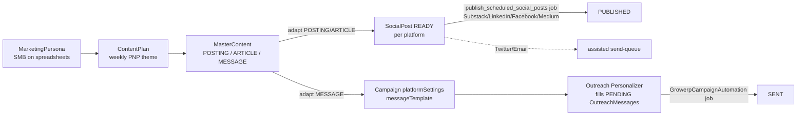

# GrowERP Content Marketing Plan (6 platforms, agent-driven)

Companion to `plans/marketing-sales-plan.md` and `docs/Marketing_Sales_Process_Flow.md`.
This plan describes **how GrowERP makes the best use of its 6 supported platforms** by
authoring content once and adapting it per platform, reusing the outreach package's
posting pattern (queue → AI-adapt per platform → scheduled drain within daily limits →
status tracking). It is delivered as **agent tools in the control center** — the
`growerp_sales` (CRM), `growerp_outreach` and `growerp_marketing` packages are three tool
domains that both ADK agents and Flutter menus drive over the same REST services.

## 1. The 6 platforms

| Platform | Role in the funnel | Native format | Publish method |
|---|---|---|---|
| **LINKEDIN** | authority + warm the DM-sending profile | short post (~1300 char) + article | API (UGC v2) ✅ |
| **SUBSTACK** | owned newsletter | article / note | API (`{pub}/api/v1/drafts`) ✅ |
| **FACEBOOK** | community + retargeting | short post + link | Graph API page post ✅ (added) |
| **MEDIUM** | evergreen SEO long-form | full article | Medium API draft/post ✅ (added) |
| **TWITTER/X** | reach + distribution | thread (280/tweet) | **assisted send-queue** (no safe write API) |
| **EMAIL** | owned 1:1 + broadcast | newsletter + DM | **assisted send-queue** for broadcast posts; 1:1 via existing `send#OutreachEmail` |

*As-built: the `publish_scheduled_social_posts` job auto-publishes SUBSTACK/LINKEDIN/FACEBOOK/MEDIUM;
TWITTER/EMAIL posts stay READY for the assisted copy-paste send-queue.*

## 2. Content model — author once, three content types

Content is authored as one platform-neutral **MasterContent** piece, then fanned out.
Two orthogonal axes:

- **Content type** (drives length/format on adaptation): `POSTING` (short social),
  `ARTICLE` (long-form), `MESSAGE` (1:1 outreach).
- **PNP theme** (drives the angle, reuses the existing weekly plan):
  **PAIN** → **NEWS** → **PRIZE**.

## 3. Per-platform adaptation rules

The rules the `adapt#ContentForPlatform` AI prompt encodes (generalised from the existing
`GeminiAiUtil.generatePlatformMessage`):

| Platform | Max length | Hashtags / mentions | Link policy | Tone / CTA |
|---|---|---|---|---|
| LINKEDIN | ~1300 char post; article up to long | 3–5 topical hashtags; @mention sparingly | link OK in post; **DM = no URL until reply** | professional, end on a question |
| TWITTER/X | 280 char/tweet; thread the rest | 1–2 hashtags; @mention where natural | link in last tweet | punchy, hook-first |
| FACEBOOK | ~400 char + link preview | minimal hashtags | link with preview | conversational, community |
| MEDIUM | full article, 700–1500 words | tags (up to 5) | inline + canonical | in-depth, SEO headline |
| SUBSTACK | article or short note | none/minimal | inline + subscribe CTA | newsletter voice, sign-off |
| EMAIL | newsletter ~200–400 words; DM ~120 words | none | assessment link + one-line sign-off (Hans, GrowERP) | direct, single CTA |

## 4. Weekly operating rhythm (agent-driven, human-gated publish)

Aligned to the existing cron schedules and `GROWERP_*` agents:

| When | Agent / job | Action |
|---|---|---|
| Mon 08:00 | **Content Studio** (`GROWERP_CONTENT_SOCIAL`) | ensure persona → `generate#ContentPlan` → `generate#MasterContent` for the week's PNP slots → `adapt#ContentForPlatform` to all enabled platforms → queue READY/PENDING (publish **approval-gated**) |
| every 15 min | `publish_scheduled_social_posts` job | publish READY posts whose `scheduledDate` has passed (Substack/LinkedIn/Facebook/Medium; Twitter/Email via assisted queue) |
| hourly 09–17 | **Outreach Personalizer** + `GrowerpCampaignAutomation` | personalise then send PENDING `OutreachMessage`s within daily limits |
| every 30 min 09–18 | **Lead Triage** | rank replies + new opportunities, draft follow-ups to team chat |
| daily 09:00 | **Marketing Ops Digest** | sends-by-channel, reply rate, pipeline, progress to goal |

Optional **Marketing Control Center coordinator** can route ad-hoc requests
("plan the week", "chase replies", "publish drafts") to the right specialist while each
keeps its own scoped tool allowlist.

## 5. Seed content set for GrowERP (author-once examples)

Starter library for persona *"SMB owner running the business on spreadsheets"* — 3 per PNP
theme, each authored once as MasterContent and adapted to all 6 platforms.

- **PAIN**
  1. "Your spreadsheet is a single point of failure." (POSTING)
  2. "The hidden cost of re-keying the same order 3 times." (ARTICLE)
  3. "5 signs you've outgrown spreadsheets." (POSTING)
- **NEWS**
  1. "GrowERP free 2-week trial — full ERP, no card." (POSTING)
  2. "How one SMB replaced 6 tools with one system." (ARTICLE)
  3. "New: AI marketing control center in GrowERP." (POSTING)
- **PRIZE**
  1. "Run your whole company from one screen — here's the demo." (ARTICLE)
  2. "From quote to paid invoice without leaving GrowERP." (POSTING)
  3. "Start the free assessment → see your ERP fit in 2 min." (MESSAGE/EMAIL)

Each links to the assessment landing page (`https://growerp.com/landing/erp-landing-page`),
except LinkedIn/DM which withholds the URL until the prospect replies (per adaptation rules).

## 6. How this maps to the system (as-built)

- **Author-once → adapt:** `MasterContent` entity + `adapt#ContentForPlatform` (mini-language
  loop; AI call isolated in `adapt#PlatformContent`). POSTING/ARTICLE → READY `SocialPost`
  per platform (idempotent, stamps `masterContentId`); MESSAGE → merges the adapted template
  into the campaign's `platformSettings` (via `merge#CampaignPlatformMessage`, JSON), which
  the existing Outreach Personalizer then uses to fill PENDING `OutreachMessage`s.
- **Publishing:** `SocialPostPublishingServices100.xml` gained **Facebook (Graph API)** and
  **Medium (API)** publishers alongside the existing Substack/LinkedIn; the 15-min job
  publishes those four. **Twitter and Email** have no safe write API here → left READY for
  the **assisted send-queue** (the manual `publish#SocialPost` returns a clear "use the
  assisted send-queue" message for them).
- **AI-key safety:** `adapt#ContentForPlatform` preflights the Gemini key (user preference →
  env → system property) and returns a clear error if unset; a post-loop guard errors if
  every platform's AI call failed.
- **One "Content" menu (hub):** `MasterContent` is the single content menu (admin +
  freelance backend seed, marketing example router). Drilling into a piece shows its adapted
  `SocialPost` variants inline (tap → existing Social Post dialog to edit/publish). The
  standalone "Social Posts" menu was removed; `OutreachMessage` stays its own menu.
- **Agent tools + menus:** every service is a scoped, idempotent, REST-registered
  `verb#Noun`; `*MasterContent`, `*adapt#ContentForPlatform`, `*publish#SocialPost` added to
  the `GROWERP_CONTENT_SOCIAL` agent allowlist. Same services drive agent and menu.

Build details and file-level changes: see the implementation plan
(`create-a-comprehensive-content-sorted-lovelace.md`).
